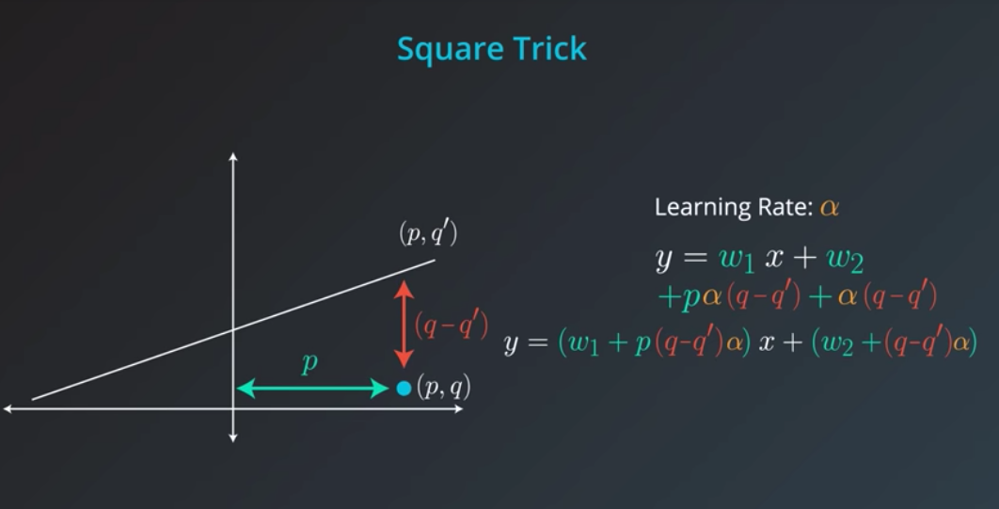
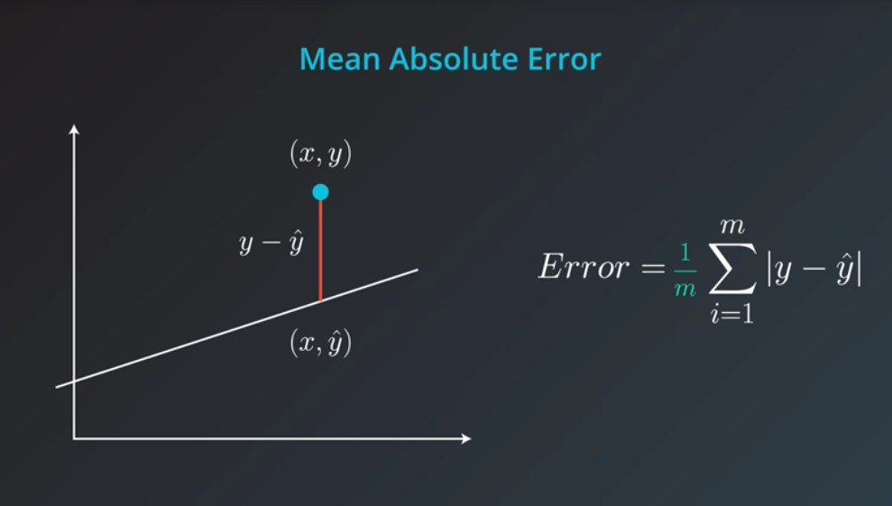
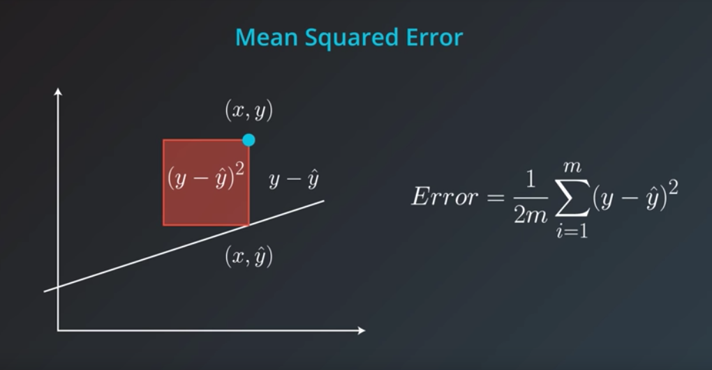

# Regression

## 1. Intro

## 5. Moving a Line

## 6. Absolute Trick

## 7. Square Trick

## 8. Gradient Descent

## 9. Mean Absolute Error

## 10. Mean Squared Error

## 18. Closed Form Solution

