## Training the Network - Wrong Formula

| Iterations | Learning Rate | Hidden Nodes | Loss Graph | Predictions |
| ---------- | ------------- | ------------ | ---------- | ----------- |
| 100 | 0.1 | 2 |  |  |
| 500 | 0.1 | 2 | 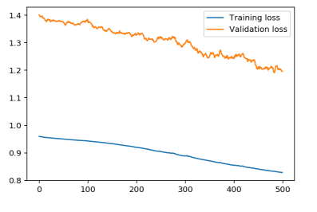 | 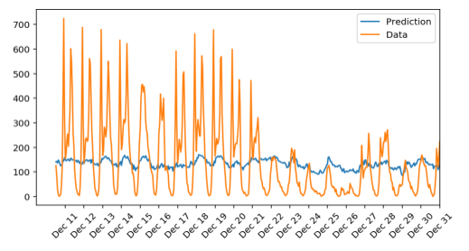 |
| 100 | 0.5 | 2 | 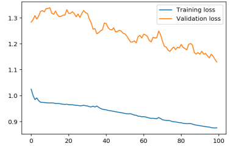 | 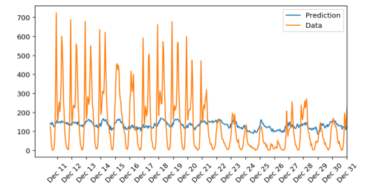 |
| 100 | 0.1 | 5 | 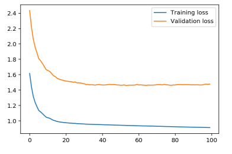 | 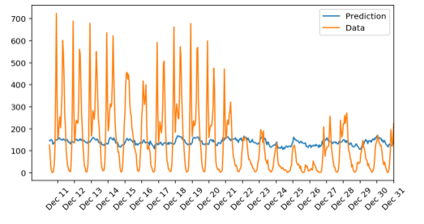 |
| 500 | 0.01 | 4 | 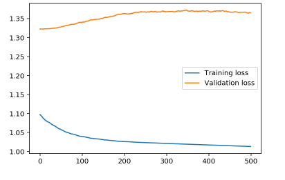 | 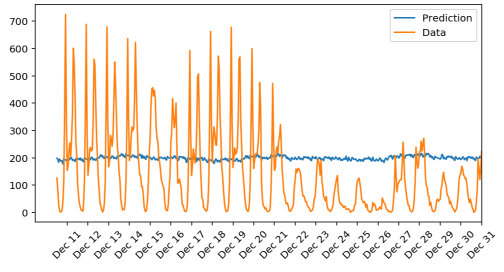 |
| 400 | 0.2 | 8 |  | 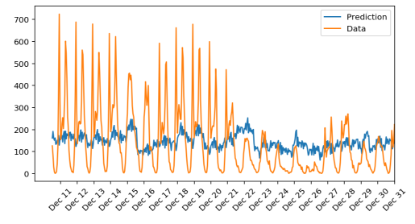 |
| 400 | 0.3 | 6 | 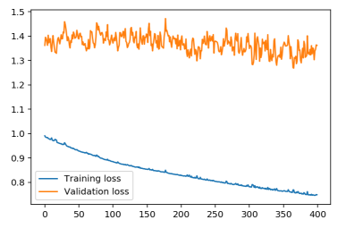 | 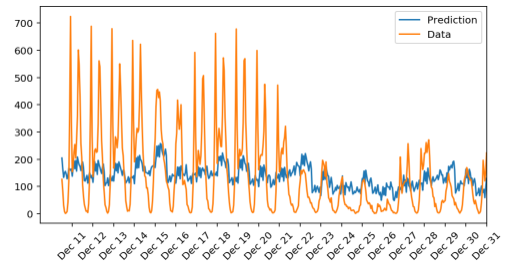 |
| 500 | 0.2 | 12 | 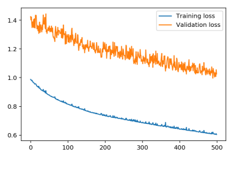 | 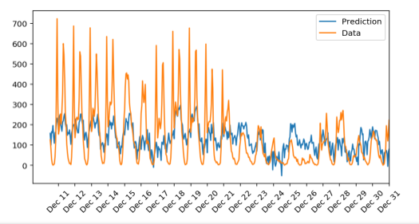 |

## Training the Network - Correct Formula

| Iterations | Learning Rate | Hidden Nodes | Loss Graph | Predictions |
| ---------- | ------------- | ------------ | ---------- | ----------- |
| 500 | 0.2 | 24 |  | 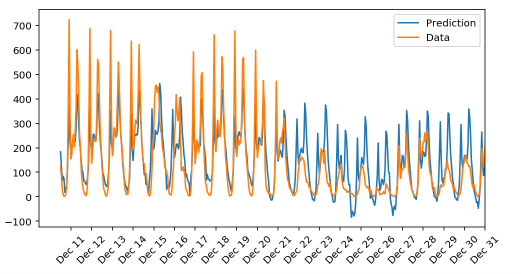 |
 