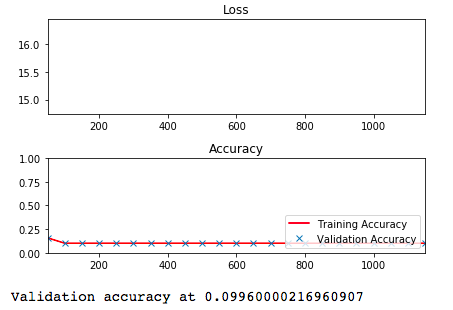
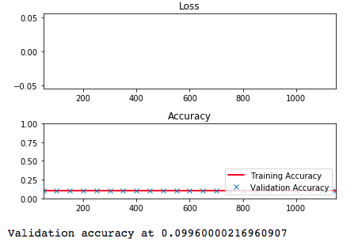
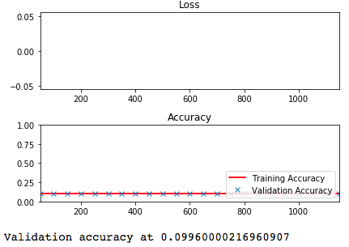
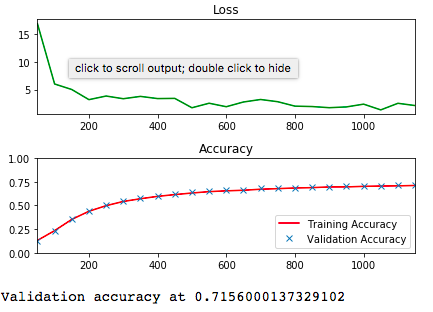
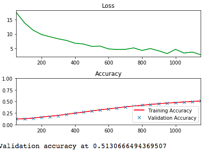
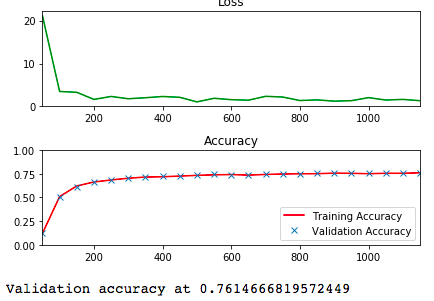
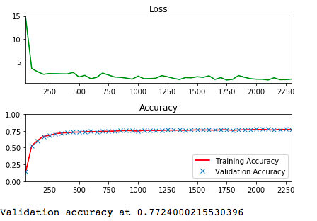
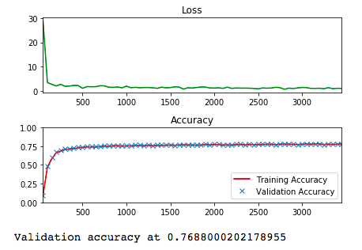
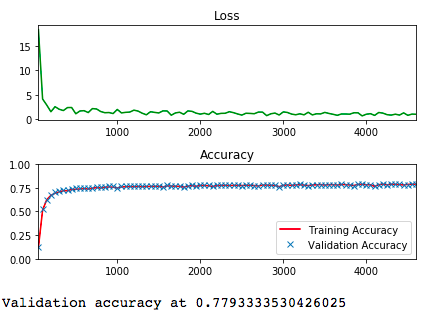
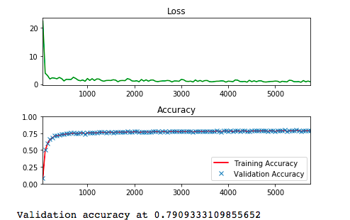

# Tensorflow

## Part 11 NotMNIST in tensorflow - training

| epochs | learning rate | output |
| ------ | ------------- | ------ |
| 1      | 0.8           |  |
| 1      | 0.5           |  |
| 1      | 0.1           |  |
| 1      | 0.05          |  |
| 1      | 0.01          |  |
| 1      | 0.2           |  |
| 2      | 0.2           |  |
| 3      | 0.2           |  |
| 4      | 0.2           |  |
| 5      | 0.2           |  |

