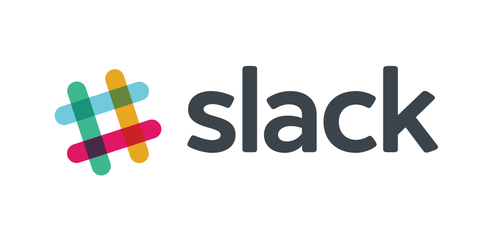

 # Welcome
 
 ## 1. Welcome to the Deep Learning Nanodegree Program
 
 
 
## 2. Projects you will build 

 
 
### Deadlines

We provide deadlines for these projects to help you stay on track. You will find these deadlines posted in the classroom. The deadlines aren't mandatory, and there are no consequences for missing them. But, do try to stick to them so you complete the program in time.

## 3. Meet your Instructors

 
 
## 4. Program Structure

### Program Structure

The Deep Learning Nanodegree program is divided into five parts, giving you a thorough understanding of deep learning, and covering some of the major topics. Please read more in our [Student Handbook](https://s3-us-west-2.amazonaws.com/udacity-email/Documents/Deep+Learning+Nanodegree+Student+Handbook+Feb+2018.pdf).

### Introduction

The first part is an introduction to the program as well as a couple lessons covering tools you'll be using. You'll also get a chance to apply some deep learning models to do cool things like transferring the style of artwork to another image.

We’ll start off with a simple introduction to linear regression and machine learning. This will give you the vocabulary you need to understand recent advancements, and make clear where deep learning fits into the broader picture of Machine Learning techniques.

### Neural Networks

In this part, you'll learn how to build a simple neural network from scratch using python. We'll cover the algorithms used to train networks such as gradient descent and backpropagation.

The **first project** is also available this week. In this project, you'll predict bike ridership using a simple neural network.

You'll also learn about model evaluation and validation, an important technique for training and assessing neural networks. We also have guest instructor Andrew Trask, author of [Grokking Deep Learning](https://www.manning.com/books/grokking-deep-learning), developing a neural network for processing text and predicting sentiment.

### Convolutional Networks

Convolutional networks have achieved state of the art results in computer vision. These types of networks can detect and identify objects in images. You'll learn how to build convolutional networks in TensorFlow.

You'll also get the **second project**, where you'll build a convolutional network to classify dog breeds in pictures.

You'll also use convolutional networks to build an autoencoder, a network architecture used for image compression and denoising. Then, you'll use a pretrained neural network (VGGnet), to classify images of flowers the network has never seen before, a technique known as transfer learning.

### Recurrent Neural Networks

In this part, you’ll learn about Recurrent Neural Networks (RNNs) — a type of network architecture particularly well suited to data that forms sequences like text, music, and time series data. You'll build a recurrent neural network that can generate new text character by character.

Then, you'll learn about word embeddings and implement the [Word2Vec](https://en.wikipedia.org/wiki/Word2vec) model, a network that can learn about semantic relationships between words. These are used to increase the efficiency of networks when you're processing text.

You'll combine embeddings and an RNN to predict the sentiment of movie reviews, an example of common tasks in natural language processing.

In the **third project**, you'll use what you've learned here to generate new TV scripts from episodes of The Simpson's.

### Generative Adversarial Networks

Generative adversarial networks (GANs) are one of the newest and most exciting deep learning architectures, showing incredible capacity for understanding real-world data. The networks can be used for generating images such as the [CycleGAN](https://github.com/junyanz/CycleGAN) project.

The inventor of GANs, Ian Goodfellow, will show you how GANs work and how to implement them. You'll also learn about semi-supervised learning, a technique for training classifiers with data mostly missing labels.

In the **fourth project**, you'll use a deep convolutional GAN to generate completely new images of human faces.

### Deep Reinforcement Learning

Deep reinforcement learning has been in the center of some of the most recent advances in artificial intelligence. For example, it was widely used in the construction of AlphaGo by DeepMind.

In this section you'll use deep neural networks to design agents that can learn to take actions in a simulated environment. You'll then apply it to complex control tasks like video games and robotics.

In the **fifth project**, you will design a Deep Reinforcement Learning agent to control several quadcopter flying tasks, including take-off, hover, and landing.
 
## 5. Community Support

### Getting Support

There are several ways in which you will receive support during the program from Udacity's network of Mentors and Reviewers, as well as your fellow students.

### Forum Q&A
The [forums](https://discussions.udacity.com/c/nd101-Project-1/) are a great place to ask in-depth and technical questions. Questions in the forums will be answered by both **our trained forum mentors** and other students. Make sure to like answers as you read them, and feel free to post answers yourself!

We will be using Discourse for the forums, and you should be able to access these forums anytime by following the forum link on the left hand side of the classroom. Once you are there, check out the different categories and subcategories, and post a question if you have one!

### Slack Community

Slack is the best place for live discussion and interaction with your community of students. If you haven't joined already, you can sign up [here](https://deep-learning-slack.udacity.com/). Here are the main channels you will be able to take advantage of:

 * `#introductions`
   * A place to introduce yourself to your fellow peers.
 * `#announcements`
   * A place to hear important announcements about the program.
 * `#project-1`
   * A place to discuss issues and ideas around the first Udacity project.
 * `#feedback`
   * A place to provide Udacity feedback on the program and report any issues.

### Reviews

For each project you submit, you will receive detailed feedback from a project Reviewer.

Sometimes, a reviewer might ask you to resubmit a project to meet specifications. In that case, an indication of needed changes will also be provided. Note that you can submit a project as many times as needed to pass.

### Feedback

In order to keep our content up-to-date and address issues quickly, we've set up a [Waffle board](https://waffle.io/udacity/dlnd-issue-reports) to track error reports and suggestions.

If you find an error, check there to see if it has already been filed. If it hasn't, you can file an issue by clicking on the "Add issue" button, adding a title, and entering a description in the details (you will need a GitHub account for this).

Links and screenshots, if available, are always appreciated!
 

 
## 6.Prerequisites

We've designed this program such that you only require the following prerequisite knowledge:

 * Required
   * [Intermediate Python experience](https://www.udacity.com/course/programming-foundations-with-python--ud036).
 * Optional
   * [Multivariable Calculus](https://www.khanacademy.org/math/multivariable-calculus) and [Linear Algebra](https://www.khanacademy.org/math/linear-algebra) if possible.

That being said, we've included a lot of the detailed mathematics for those of you who do want to go in depth and understand the theory behind these concepts. Such content is optional and shouldn't prevent you from doing the projects. However, it is encouraged for a theoretical understanding.
 
## 7. Deadline Policy

The program is project-based, and each project has a deadline. It is strongly recommended that you complete each project on time, in order to ensure you meet graduation requirements.

An example of a deadline shown in your classroom.

### Project Deadlines by Cohort

We highly recommend adding these deadlines to your calendar. You can do this in two ways:
 * Download this ICS file and import it into whatever calendar you use.
 * Open up this Project Deadlines Google Calendar, and click the + button in the bottom right hand corner.

We highly recommend adding these deadlines to your calendar. You can do this in two ways:
 * Download this ICS file and import it into whatever calendar you use.
 * Open up this Project Deadlines Google Calendar, and click the + button in the bottom right hand corner.

We highly recommend adding these deadlines to your calendar. You can do this in two ways:
 * Download this ICS file and import it into whatever calendar you use.
 * Open up this Project Deadlines Google Calendar, and click the + button in the bottom right hand corner.

 * _This date includes the two-week extension provided for the delay in releasing the Quadcopter project._

We highly recommend adding these deadlines to your calendar. You can do this in two ways:
 * Download this ICS file and import it into whatever calendar you use.
 * Open up this Project Deadlines Google Calendar, and click the + button in the bottom right hand corner.

### FAQ

#### What happens if I don’t complete a project on time?

It is strongly recommended that you complete each project on time to ensure you meet graduation requirements. To graduate, you must complete, submit, and meet expectations for all required projects within four months of your start date. While there is no penalty for missing a project deadline, missing one puts you at risk to be removed from the program if you do not stay on track and complete all required projects before the term ends. Finally, by keeping pace with your fellow students, you'll gain much more value from forums and Slack channels!

#### What are my options if I don’t complete the program within four months?

If you do not complete the term by the term deadline, you will receive one free four-week extension, which will be automatically applied to your account. If you do not complete the term within the extension period, you will be removed from the program and will no longer be able to access course content. To resume access to the course, you would need to re-enroll in a new term and pay the associated enrollment fees again. Your progress will carry over to the new term, so you will be able to continue. You are also welcome to apply to either the Artificial Intelligence, Robotics Software Engineer, or Self-Driving Car Nanodegree programs, but your admission is not guaranteed. This is a benefit reserved only for graduates of this program.
 
## 8. Getting setup

If you haven't used Numpy, Pandas, or Matplotlib before, please take our [Intro to Data Analysis](https://www.udacity.com/course/intro-to-data-analysis--ud170) course. These are the main tools for working with and visualizing data in Python, so you'll need some experience with them.
 