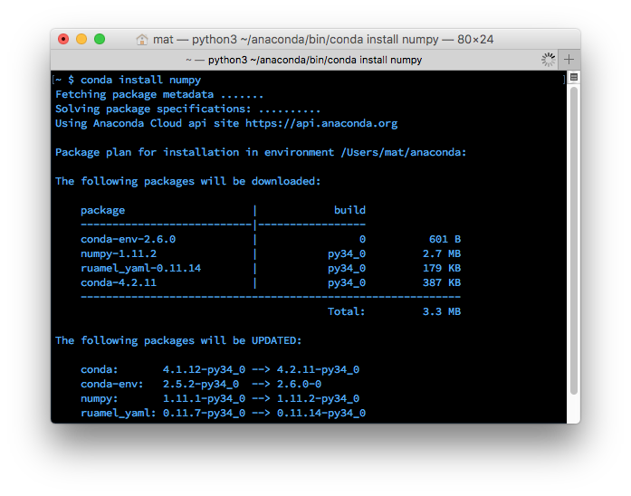
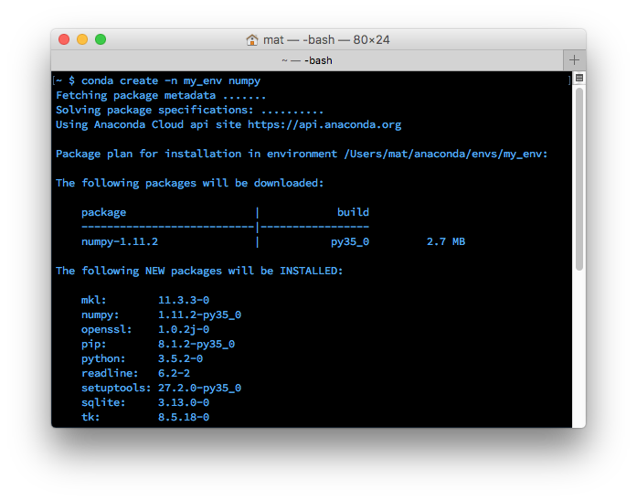
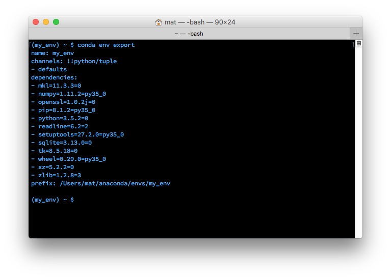

# Anaconda

## 1. Introduction

[](http://scrier.myqnapcloud.com:8080/share.cgi?ssid=0MZqBkd&ep=&path=%2FDeep.Learning%2F1.Introduction%2F3.Anaconda%2Freadme&filename=1%20-%20Why%20Anaconda%3F.mp4&fid=0MZqBkd&open=normal)
 
[Anaconda](https://anaconda.org/) is a distribution of packages built for data science. It comes with conda, a package 
and environment manager. You'll be using conda to create environments for isolating your projects that use different 
versions of Python and/or different packages. You'll also use it to install, uninstall, and update packages in your 
environments. Using Anaconda has made my life working with data much more pleasant.

## 2. What is Anaconda?

Welcome to this lesson on using [Anaconda](https://www.continuum.io/why-anaconda) to manage packages and environments 
for use with Python. With Anaconda, it's simple to install the packages you'll often use in data science work. You'll 
also use it to create virtual environments that make working on multiple projects much less mind-twisting. Anaconda has 
simplified my workflow and solved a lot of issues I had dealing with packages and multiple Python versions.

Anaconda is actually a distribution of software that comes with `conda`, Python, and over 150 scientific packages and 
their dependencies. The application `conda` is a package and environment manager. Anaconda is a fairly large download 
(~500 MB) because it comes with the most common data science packages in Python. If you don't need all the packages or 
need to conserve bandwidth or storage space, there is also **Miniconda**, a smaller distribution that includes only 
`conda` and Python. You can still install any of the available packages with `conda`, it just doesn't come with them.

`conda` is a program you'll be using exclusively from the command line, so if you aren't comfortable using it, check 
out this [command prompt tutorial for Windows](https://www.lynda.com/-tutorials/Windows-command-line-basics/497312/513424-4.html) 
or our [Linux Command Line Basics](https://www.udacity.com/course/linux-command-line-basics--ud595) course for 
OSX/Linux.

You probably already have Python installed and wonder why you need this at all. Firstly, since Anaconda comes with a 
bunch of data science packages, you'll be all set to start working with data. Secondly, using `conda` to manage your 
packages and environments will reduce future issues dealing with the various libraries you'll be using.

### Managing Packages



Package managers are used to install libraries and other software on your computer. You’re probably already familiar 
with pip, it’s the default package manager for Python libraries. Conda is similar to pip except that the available 
packages are focused around data science while pip is for general use. However, conda is not Python specific like pip 
is, it can also install non-Python packages. It is a package manager for any software stack. That being said, not all 
Python libraries are available from the Anaconda distribution and conda. You can (and will) still use pip alongside 
conda to install packages.

Conda installs precompiled packages. For example, the Anaconda distribution comes with Numpy, Scipy and Scikit-learn 
compiled with the [MKL library](https://docs.continuum.io/mkl-optimizations/), speeding up various math operations. 
The packages are maintained by contributors to the distribution which means they usually lag behind new releases. But 
because someone needed to build the packages for many systems, they tend to be more stable (and more convenient for 
you).

### Environments



Along with managing packages, Conda is also a virtual environment manager. It's similar to [virtualenv](https://virtualenv.pypa.io/en/stable/) 
and [pyenv](https://github.com/yyuu/pyenv), other popular environment managers.

Environments allow you to separate and isolate the packages you are using for different projects. Often you’ll be 
working with code that depends on different versions of some library. For example, you could have code that uses new 
features in Numpy, or code that uses old features that have been removed. It’s practically impossible to have two 
versions of Numpy installed at once. Instead, you should make an environment for each version of Numpy then work in 
the appropriate environment for the project.

This issue also happens a lot when dealing with Python 2 and Python 3. You might be working with old code that doesn’t 
run in Python 3 and new code that doesn’t run in Python 2. Having both installed can lead to a lot of confusion and 
bugs. It’s much better to have separate environments.

You can also export the list of packages in an environment to a file, then include that file with your code. This 
allows other people to easily load all the dependencies for your code. Pip has similar functionality with 
`pip freeze > requirements.txt`.

### Where we go from here

Next, I'll get into the details of using Anaconda. First I'll cover installing it, then using the package manager, 
and finally creating and managing environments.

## 3.Installing Anaconda

Anaconda is available for Windows, Mac OS X, and Linux. You can find the installers and installation instructions at 
https://www.continuum.io/downloads.

If you already have Python installed on your computer, this won't break anything. Instead, the default Python used by 
your scripts and programs will be the one that comes with Anaconda.

Choose the Python 3.6 version, you can install Python 2 versions later. (For Machine Learning Engineer Nanodegree you 
need Python 2 version) Also, choose the 64-bit installer if you have a 64-bit operating system, otherwise go with the 
32-bit installer. Go ahead and choose the appropriate version, then install it. Continue on afterwards!

After installation, you’re automatically in the default conda environment with all packages installed which you can 
see below. You can check out your own install by entering `conda list` into your terminal.

### On Windows

A bunch of applications are installed along with Anaconda:

 * **Anaconda Navigator**, a GUI for managing your environments and packages
 * **Anaconda Prompt**, a terminal where you can use the command line interface to manage your environments and packages
 * **Spyder**, an IDE geared toward scientific development

To avoid errors later, it's best to update all the packages in the default environment. Open the Anaconda Prompt 
application. In the prompt, run the following commands:

```bash
conda upgrade conda
conda upgrade --all
```

and answer yes when asked if you want to install the packages. The packages that come with the initial install tend 
to be out of date, so updating them now will prevent future errors from out of date software.

**Note:** In the previous step, running `conda upgrade conda` should not be necessary because --all includes the 
conda package itself, but some users have encountered errors without it.

In the rest of this lesson, I'll be asking you to use commands in your terminal. I highly suggest you start working 
with Anaconda this way, then later use the GUI if you'd like.

### Troubleshooting

If you are seeing the following "conda command not found" and are using ZShell, you have to do the following:

 * Add `export PATH="/Users/username/anaconda/bin:$PATH"` to your .zsh_config file.

## 4.Managing Packages

Once you have Anaconda installed, managing packages is fairly straightforward. To install a package, type 
`conda install package_name` in your terminal. For example, to install numpy, type `conda install numpy`.

You can install multiple packages at the same time. Something like `conda install numpy scipy pandas` will install 
all those packages simultaneously. It's also possible to specify which version of a package you want by adding the 
version number such as `conda install numpy=1.10`.

Conda also automatically installs dependencies for you. For example `scipy` depends on `numpy`, it uses and requires 
`numpy`. If you install just `scipy` (`conda install scipy`), Conda will also install `numpy` if it isn't already 
installed.

Most of the commands are pretty intuitive. To uninstall, use `conda remove package_name`. To update a package 
`conda update package_name`. If you want to update all packages in an environment, which is often useful, use 
`conda update --all`. And finally, to list installed packages, it's `conda list` which you've seen before.

If you don't know the exact name of the package you're looking for, you can try searching with `conda search search_term`. 
For example, I know I want to install Beautiful Soup, but I'm not sure of the exact package name. So, I try 
`conda search beautifulsoup`.

It returns a list of the Beautiful Soup packages available with the appropriate package name, beautifulsoup4.

## 5.Managing environments

As I mentioned before, conda can be used to create environments to isolate your projects. To create an environment, use 
`conda create -n env_name list of packages` in your terminal. Here `-n env_name` sets the name of your environment (`-n` for 
name) and `list of packages` is the list of packages you want installed in the environment. For example, to create an 
environment named `my_env` and install numpy in it, type `conda create -n my_env numpy`.

When creating an environment, you can specify which version of Python to install in the environment. This is useful when 
you're working with code in both Python 2.x and Python 3.x. To create an environment with a specific Python version, do 
something like `conda create -n py3 python=3` or `conda create -n py2 python=2`. I actually have both of these environments 
on my personal computer. I use them as general environments not tied to any specific project, but rather for general 
work with each Python version easily accessible. These commands will install the most recent version of Python 3 and 2, 
respectively. To install a specific version, use `conda create -n py python=3.3` for Python 3.3.

### Entering an environment

Once you have an environment created, use `source activate my_env` to enter it on OSX/Linux. On Windows, use `activate 
my_env`.

When you're in the environment, you'll see the environment name in the terminal prompt. Something like `(my_env) ~ $`. 
The environment has only a few packages installed by default, plus the ones you installed when creating it. You can 
check this out with `conda list`. Installing packages in the environment is the same as before: `conda install 
package_name`. Only this time, the specific packages you install will only be available when you're in the environment. 
To leave the environment, type `source deactivate` (on OSX/Linux). On Windows, use `deactivate`.

## 6.Saving and loading environments

A really useful feature is sharing environments so others can install all the packages used in your code, with the 
correct versions. You can save the packages to a [YAML](http://www.yaml.org/) file with `conda env export > environment.yaml`. The first part 
`conda env export` writes out all the packages in the environment, including the Python version.



Above you can see the name of the environment and all the dependencies (along with versions) are listed. The second part 
of the export command, > `environment.yaml` writes the exported text to a YAML file `environment.yaml`. This file can now be 
shared and others will be able to create the same environment you used for the project.

To create an environment from an environment file use `conda env create -f environment.yaml`. This will create a new 
environment with the same name listed in `environment.yaml`.

### Listing environments

If you forget what your environments are named (happens to me sometimes), use `conda env list` to list out all the 
environments you've created. You should see a list of environments, there will be an asterisk next to the environment 
you're currently in. The default environment, the environment used when you aren't in one, is called `root`.

### Removing environments

 If there are environments you don't use anymore, `conda env remove -n env_name` will remove the specified environment 
(here, named `env_name`).

## 7.Best practices

### Using environments

One thing that’s helped me tremendously is having separate environments for Python 2 and Python 3. I used `conda create 
-n py2 python=2` and `conda create -n py3 python=3` to create two separate environments, `py2` and `py3`. Now I have a general 
use environment for each Python version. In each of those environments, I've installed most of the standard data science 
packages (numpy, scipy, pandas, etc.). Remember that when you set up an environment initially, you'll only start with 
the standard packages and whatever packages you specify in your `conda create` statement.

I’ve also found it useful to create environments for each project I’m working on. It works great for non-data related 
projects too like web apps with Flask. For example, I have an environment for my personal blog using [Pelican](http://docs.getpelican.com/en/stable/).

### Sharing environments

When sharing your code on GitHub, it's good practice to make an environment file and include it in the repository. This 
will make it easier for people to install all the dependencies for your code. I also usually include a pip 
`requirements.txt` file using `pip freeze` ([learn more here](https://pip.pypa.io/en/stable/reference/pip_freeze/)) for people not using conda.

### More to learn

To learn more about conda and how it fits in the Python ecosystem, check out this article by Jake Vanderplas: [Conda 
myths and misconceptions](https://jakevdp.github.io/blog/2016/08/25/conda-myths-and-misconceptions/). And here's the 
[conda documentation](http://conda.pydata.org/docs/using/index.html) you can reference later.

## 8.Python versions at Udacity

Most Nanodegree programs at Udacity will be (or are already) using Python 3 almost exclusively.

### Why we're using Python 3
 * Jupyter is [switching to Python 3 only](http://blog.jupyter.org/2016/07/08/ipython-5-0-released/)
 * Python 2.7 is [being retired](https://pythonclock.org/)
 * Python 3 has been out for almost 10 years, and there are very few dependencies (and none in this program) that are incompatible.

At this point, there are enough new features in Python 3 that it doesn't make much sense to stick with Python 2 unless 
you're working with old code. All new Python code should be written for version 3. Read more [here](https://wiki.python.org/moin/Python2orPython3).

### The main breakage between Python 2 and 3

For the most part, Python 2 code will work with Python 3. Of course, most new features introduced with Python 3 versions 
won't be backwards compatible. The place where your Python 2 code will fail most often is the `print` statement.

For most of Python's history including Python 2, printing was done like so:

```python
print "Hello", "world!"
> Hello world!
```

This was changed in Python 3 to a function.

```python
print("Hello", "world!")
> Hello world!
```

The `print` function was back-ported to Python 2 in version 2.6 through the `__future__` module:

```python
# In Python 2.6+
from __future__ import print_function
print("Hello", "world!")
> Hello world!
```

The `print` statement doesn't work in Python 3. If you want to print something and have it work in both Python versions, 
you'll need to import `print_function` in your Python 2 code.
