# Jupyter Notebooks

## 1.What are Jupyter notebooks?


Welcome to this lesson on using [Jupyter](http://jupyter.org/) notebooks. The notebook is a web application that allows 
you to combine explanatory text, math equations, code, and visualizations all in one easily sharable document. For 
example, here's one of my favorite notebooks shared recently, the analysis of [gravitational waves from two colliding 
blackholes](https://losc.ligo.org/s/events/GW150914/GW150914_tutorial.html) detected by the [LIGO experiment](https://www.ligo.caltech.edu/news/ligo20160211). You could download the data, run the code in the notebook, and repeat the 
analysis, in effect detecting the gravitational waves yourself!

Notebooks have quickly become an essential tool when working with data. You'll find them being used for [data cleaning 
and exploration](http://nbviewer.jupyter.org/github/jmsteinw/Notebooks/blob/master/IndeedJobs.ipynb), visualization, [machine learning](http://nbviewer.jupyter.org/github/masinoa/machine_learning/blob/master/04_Neural_Networks.ipynb), and [big data analysis](http://nbviewer.jupyter.org/github/tdhopper/rta-pyspark-presentation/blob/master/slides.ipynb). Here's [an example notebook](https://github.com/mcleonard/blog_posts/blob/master/body_fat_percentage.ipynb) I made for my 
personal blog that shows off many of the features of notebooks. Typically you'd be doing this work in a terminal, 
either the normal Python shell or with IPython. Your visualizations would be in separate windows, any documentation 
would be in separate documents, along with various scripts for functions and classes. However, with notebooks, all of 
these are in one place and easily read together.

Notebooks are also rendered automatically on GitHub. It’s a great feature that lets you easily share your work. There 
is also [http://nbviewer.jupyter.org/](http://nbviewer.jupyter.org/) that renders the notebooks from your GitHub repo or from notebooks stored 
elsewhere.

### Literate programming

Notebooks are a form of [literate programming](http://www.literateprogramming.com/) proposed by Donald Knuth in 1984. With literate programming, the 
documentation is written as a narrative alongside the code instead of sitting off by its own. In Donald Knuth's 
words,

 > Instead of imagining that our main task is to instruct a computer what to do, let us concentrate rather on explaining 
 > to human beings what we want a computer to do.

After all, code is written for humans, not for computers. Notebooks provide exactly this capability. You are able to 
write documentation as narrative text, along with code. This is not only useful for the people reading your notebooks, 
but for your future self coming back to the analysis.

Just a small aside: recently, this idea of literate programming has been extended to a whole programming language, [Eve](http://www.witheve.com/).

### How notebooks work

Jupyter notebooks grew out of the [IPython project](https://ipython.org/) started by Fernando Perez. IPython is an interactive shell, similar 
to the normal Python shell but with great features like syntax highlighting and code completion. Originally, notebooks 
worked by sending messages from the web app (the notebook you see in the browser) to an IPython kernel (an IPython 
application running in the background). The kernel executed the code, then sent it back to the notebook. The current 
architecture is similar, drawn out below.


The central point is the notebook server. You connect to the server through your browser and the notebook is rendered 
as a web app. Code you write in the web app is sent through the server to the kernel. The kernel runs the code and 
sends it back to the server, then any output is rendered back in the browser. When you save the notebook, it is written 
to the server as a JSON file with a `.ipynb` file extension.

The great part of this architecture is that the kernel doesn't need to run Python. Since the notebook and the kernel 
are separate, code in any language can be sent between them. For example, two of the earlier non-Python kernels were 
for the [R](https://www.r-project.org/) and [Julia](http://julialang.org/) languages. With an R kernel, code written in R will be sent to the R kernel where it is executed, 
exactly the same as Python code running on a Python kernel. IPython notebooks were renamed because notebooks became 
language agnostic. The new name **Jupyter** comes from the combination of **Ju**lia, **Py**thon, and **R**. If you're interested, 
here's a [list of available kernels](https://github.com/jupyter/jupyter/wiki/Jupyter-kernels).

Another benefit is that the server can be run anywhere and accessed via the internet. Typically you'll be running the 
server on your own machine where all your data and notebook files are stored. But, you could also [set up a server](http://jupyter-notebook.readthedocs.io/en/latest/public_server.html) on a 
remote machine or cloud instance like Amazon's EC2. Then, you can access the notebooks in your browser from anywhere 
in the world.

## 2.Installing Jupyter Notebook

By far the easiest way to install Jupyter is with Anaconda. Jupyter notebooks automatically come with the distribution. 
You'll be able to use notebooks from the default environment.

To install Jupyter notebooks in a conda environment, use `conda install jupyter notebook`.

Jupyter notebooks are also available through pip with `pip install jupyter notebook`.

## 3.Launching the notebook server

To start a notebook server, enter `jupyter notebook` in your terminal or console. This will start the server in the 
directory you ran the command in. That means any notebook files will be saved in that directory. Typically you'd want 
to start the server in the directory where your notebooks live. However, you can navigate through your file system to 
where the notebooks are.

When you run the command (try it yourself!), the server home should open in your browser. By default, the notebook 
server runs at `http://localhost:8888`. If you aren't familiar with this, `localhost` means your computer and `8888` is the 
port the server is communicating on. As long as the server is still running, you can always come back to it by going 
to http://localhost:8888 in your browser.

If you start another server, it'll try to use port `8888`, but since it is occupied, the new server will run on port 
`8889`. Then, you'd connect to it at `http://localhost:8889`. Every additional notebook server will increment the port 
number like this.

If you tried starting your own server, it should look something like this:


You might see some files and folders in the list here, it depends on where you started the server from.

Over on the right, you can click on "New" to create a new notebook, text file, folder, or terminal. The list under 
"Notebooks" shows the kernels you have installed. Here I'm running the server in a Python 3 environment, so I have a 
Python 3 kernel available. You might see Python 2 here. I've also installed kernels for Scala 2.10 and 2.11 which you 
see in the list.

The tabs at the top show Files, Running, and Cluster. Files shows all the files and folders in the current directory. 
Clicking on the Running tab will list all the currently running notebooks. From there you can manage them.

Clusters previously was where you'd create multiple kernels for use in parallel computing. Now that's been taken over 
by [ipyparallel](https://ipyparallel.readthedocs.io/en/latest/intro.html) so there isn't much to do there.

You should consider installing Notebook Conda to help manage your environments. Run the following command:

`conda install nb_conda`

Then if you run the notebook server from a conda environment, you'll also have access to the "Conda" tab shown below. 
Here you can manage your environments from within Jupyter. You can create new environments, install packages, update 
packages, export environments and more.

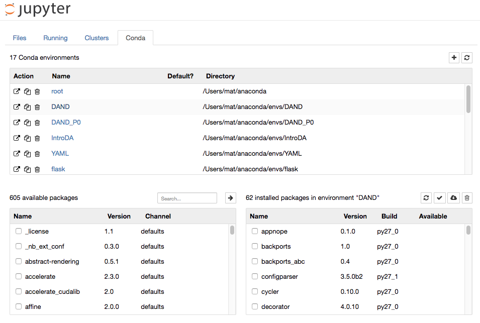

Additionally, with `nb_conda` installed you will be able to access any of your conda environments when choosing a 
kernel. For example, the image below shows an example of creating a new notebook on a machine with several different 
conda environments:

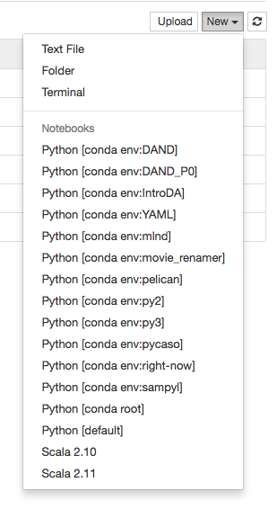

### Shutting down Jupyter

You can shutdown individual notebooks by marking the checkbox next to the notebook on the server home and clicking 
"Shutdown." Make sure you've saved your work before you do this though! Any changes since the last time you saved will 
be lost. You'll also need to rerun the code the next time you run the notebook.

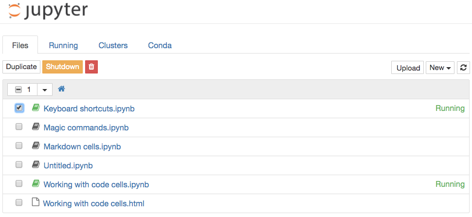

You can shutdown the entire server by pressing control + C twice in the terminal. Again, this will immediately shutdown 
all the running notebooks, so make sure your work is saved!


##4.Notebook interface

When you create a new notebook, you should see something like this:

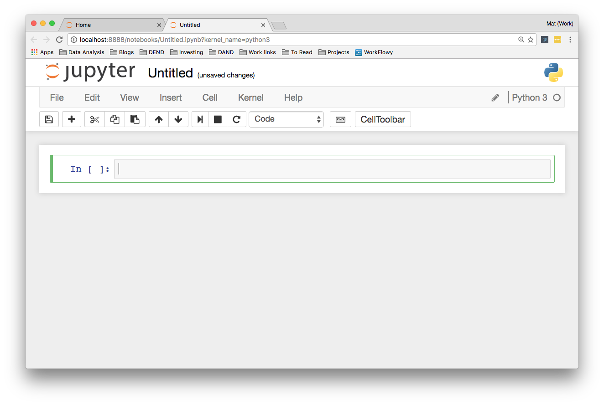

Feel free to try this yourself and poke around a bit.

You’ll see a little box outlined in green. This is called a cell. Cells are where you write and run your code. You can 
also change it to render Markdown, a popular formatting syntax for writing web content. I'll cover Markdown in more 
detail later. In the toolbar, click “Code” to change it to Markdown and back. The little play button runs the cell, 
and the up and down arrows move cells up and down.


When you run a code cell, the output is displayed below the cell. The cell also gets numbered, you see `In [1]:` on the 
left. This lets you know the code was run and the order if you run multiple cells. Running the cell in Markdown mode 
renders the Markdown as text.

### The tool bar

Elsewhere on the tool bar, starting from the left:

 * The anachronistic symbol for "save," the floppy disk. Saves the notebook!
 * The + button creates a new cell
 * Then, buttons to cut, copy, and paste cells.
 * Run, stop, restart the kernel
 * Cell type: code, Markdown, raw text, and header
 * Command palette (see next)
 * Cell toolbar, gives various options for cells such as using them as slides

### Command palette

The little keyboard is the command palette. This will bring up a panel with a search bar where you can search for 
various commands. This is really helpful for speeding up your workflow as you don't need to search around in the menus 
with your mouse. Just open the command palette and type in what you want to do. For instance, if you want to merge two 
cells:


##More things

At the top you see the title. Click on this to rename the notebook.

Over on the right is the kernel type (Python 3 in my case) and next to it, a little circle. When the kernel is running 
a cell, it'll fill in. For most operations which run quickly, it won't fill in. It's a little indicator to let you know 
longer running code is actually running.

Along with the save button in the toolbar, notebooks are automatically saved periodically. The most recent save is 
noted to the right of the title. You can save manually with the save button, or by pressing `escape` then `s` on your 
keyboard. The `escape` key changes to command mode and s is the shortcut for "save." I'll cover command mode and keyboard 
shortcuts later.

In the "File" menu, you can download the notebook in multiple formats. You'll often want to download it as an HTML file 
to share with others who aren't using Jupyter. Also, you can download the notebook as a normal Python file where all 
the code will run like normal. The [Markdown](https://daringfireball.net/projects/markdown/) and [reST](http://docutils.sourceforge.net/rst.html) formats are great for using notebooks in blogs or documentation.

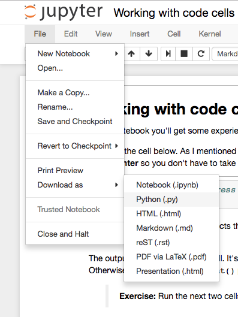

## 5.Code cells

Most of your work in notebooks will be done in code cells. This is where you write your code and it gets executed. In 
code cells you can write any code, assigning variables, defining functions and classes, importing packages, and more. 
Any code executed in one cell is available in all other cells.

To give you some practice, I created a notebook you can work through. Download the notebook **Working With Code Cells** 
below then run it from your own notebook server. (In your terminal, change to the directory with the notebook file, 
then enter `jupyter notebook`) Your browser might try to open the notebook file without downloading it. If that happens, 
right click on the link then choose "Save Link As..."

Supporting Materials
[Working With Code Cells](http://video.udacity-data.com.s3.amazonaws.com/topher/2016/December/58474202_working-with-code-cells/working-with-code-cells.ipynb)

## 6.Markdown cells

As mentioned before, cells can also be used for text written in Markdown. Markdown is a formatting syntax that allows 
you to include links, style text as bold or italicized, and format code. As with code cells, you press **Shift + Enter** or 
**Control + Enter** to run the Markdown cell, where it will render the Markdown to formatted text. Including text allows 
you to write a narrative along side your code, as well as documenting your code and the thoughts that went into it.

You can find the [documentation here](https://daringfireball.net/projects/markdown/basics), but I'll provide a short primer.

### Headers

You can write headers using the pound/hash/[octothorpe](http://www.worldwidewords.org/weirdwords/ww-oct1.htm) symbol `#` 
placed before the text. One `#` renders as an `h1` header, two `#`s is an h2, and so on. Looks like this:

> # Header 1
> ## Header 2
> ### Header 3
renders as

# Header 1
## Header 2
### Header 3

## Links

Linking in Markdown is done by enclosing text in square brackets and the URL in parentheses, like this 
`[Udacity's home page](https://www.udacity.com)` for a link to [Udacity's home page](https://www.udacity.com).

## Emphasis

You can add emphasis through bold or italics with asterisks or underscores (`*` or `_`). For italics, wrap the text in one 
asterisk or underscore, `_gelato_` or `*gelato*` renders as _gelato_.

Bold text uses two symbols, **aardvark** or __aardvark__ looks like **aardvark**.

Either asterisks or underscores are fine as long as you use the same symbol on both sides of the text.

## Code

There are two different ways to display code, inline with text and as a code block separated from the text. To format 
inline code, wrap the text in backticks. For example, string.punctuation renders as `string.punctuation`.

To create a code block, start a new line and wrap the text in three backticks

```
import requests
response = requests.get('https://www.udacity.com')
```

or indent each line of the code block with four spaces.

    import requests
    response = requests.get('https://www.udacity.com')

## Math expressions

You can create math expressions in Markdown cells using [LaTeX](https://www.latex-project.org/) symbols. Notebooks use MathJax to render the LaTeX 
symbols as math symbols. To start math mode, wrap the LaTeX in dollar signs `$y = mx + b$` for inline math. For a math 
block, use double dollar signs,

```markdown
$$
y = \frac{a}{b+c}
$$
```

This is a really useful feature, so if you don't have experience with LaTeX [please read this primer](http://data-blog.udacity.com/posts/2016/10/latex-primer/) on using it to 
create math expressions.


## Wrapping up

Here's [a cheatsheet](https://github.com/adam-p/markdown-here/wiki/Markdown-Cheatsheet) you can use as a reference for writing Markdown. My advice is to make use of the Markdown cells. 
Your notebooks will be much more readable compared to a bunch of code blocks.

## 7.Keyboard shortcuts

Notebooks come with a bunch of keyboard shortcuts that let you use your keyboard to interact with the cells, instead of 
using the mouse and toolbars. They take a bit of time to get used to, but when you're proficient with the shortcuts 
you'll be much faster at working in notebooks. To learn more about the shortcuts and get practice using them, download 
the notebook **Keyboard Shortcuts** below. Again, your browser might try to open it, but you want to save it to your 
computer. Right click on the link, then choose "Save Link As..."

Supporting Materials
[Keyboard-Shortcuts](http://video.udacity-data.com.s3.amazonaws.com/topher/2017/April/58e412d0_keyboard-shortcuts/keyboard-shortcuts.ipynb)

## 8.Magic keywords

Magic keywords are special commands you can run in cells that let you control the notebook itself or perform system 
calls such as changing directories. For example, you can set up matplotlib to work interactively in the notebook with 
`%matplotlib`.

Magic commands are preceded with one or two percent signs (`%` or `%%`) for line magics and cell magics, respectively. Line 
magics apply only to the line the magic command is written on, while cell magics apply to the whole cell.

**NOTE:** These magic keywords are specific to the normal Python kernel. If you are using other kernels, these most likely 
won't work.

### Timing code

At some point, you'll probably spend some effort optimizing code to run faster. Timing how quickly your code runs is 
essential for this optimization. You can use the `timeit` magic command to time how long it takes for a function to run, 
like so:

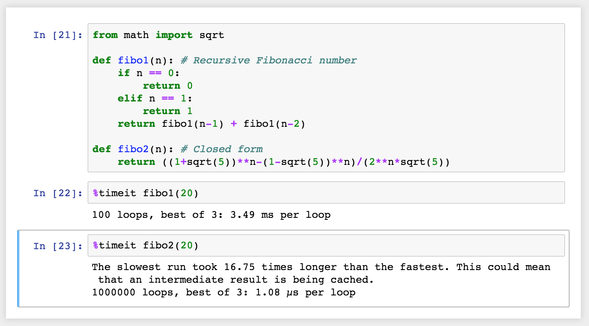

If you want to time how long it takes for a whole cell to run, you’d use `%%timeit` like so:

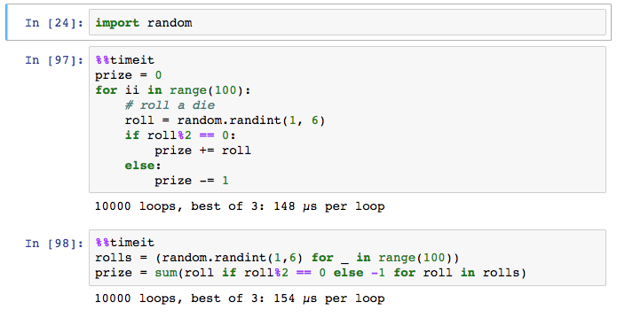

### Embedding visualizations in notebooks

As mentioned before, notebooks let you embed images along with text and code. This is most useful when you’re using 
`matplotlib` or other plotting packages to create visualizations. You can use `%matplotlib` to set up `matplotlib` for 
interactive use in the notebook. By default figures will render in their own window. However, you can pass arguments 
to the command to select a specific ["backend"](http://matplotlib.org/faq/usage_faq.html#what-is-a-backend), the software that renders the image. To render figures directly in the 
notebook, you should use the inline backend with the command `%matplotlib inline`.

> **Tip:** On higher resolution screens such as Retina displays, the default images in notebooks can look blurry. Use `%config 
> InlineBackend.figure_format = 'retina'` after `%matplotlib inline` to render higher resolution images.


### Debugging in the Notebook

With the Python kernel, you can turn on the interactive debugger using the magic command `%pdb`. When you cause an error, 
you'll be able to inspect the variables in the current namespace.

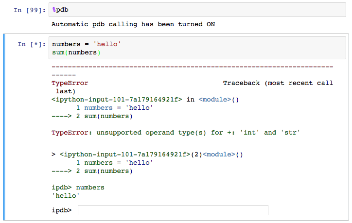

Above you can see I tried to sum up a string which gives an error. The debugger raises the error and provides a prompt 
for inspecting your code.

Read more about `pdb` in [the documentation](https://docs.python.org/3/library/pdb.html). To quit the debugger, simply enter `q` in the prompt.

### More reading
There are a whole bunch of other magic commands, I just touched on a few of the ones you'll use the most often. To 
learn more about them, [here's the list](http://ipython.readthedocs.io/en/stable/interactive/magics.html) of all available magic commands.

## 9.Converting notebooks

Notebooks are just big [JSON](http://www.json.org/) files with the extension `.ipynb`.

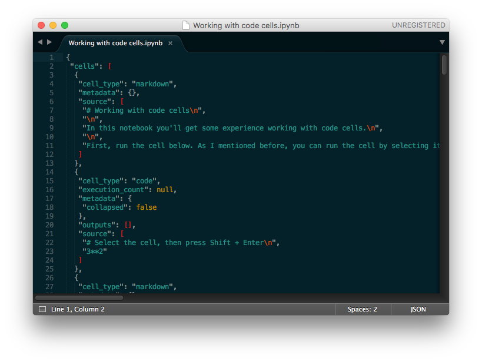

Since notebooks are JSON, it is simple to convert them to other formats. Jupyter comes with a utility called `nbconvert` 
for converting to HTML, Markdown, slideshows, etc.

For example, to convert a notebook to an HTML file, in your terminal use

```bash
jupyter nbconvert --to html notebook.ipynb
```

Converting to HTML is useful for sharing your notebooks with others who aren't using notebooks. Markdown is great for 
including a notebook in blogs and other text editors that accept Markdown formatting.

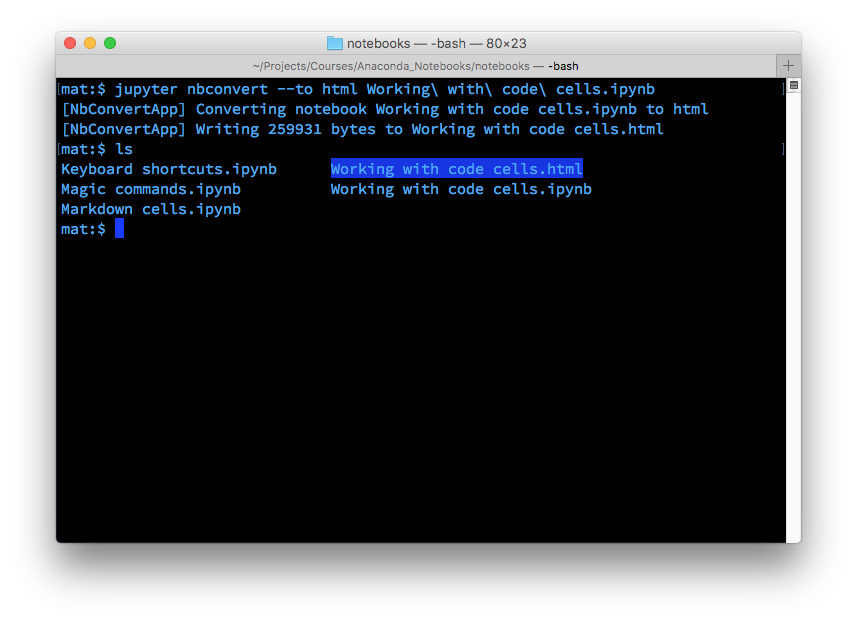

As always, learn more about `nbconvert` from the [documentation](https://nbconvert.readthedocs.io/en/latest/usage.html).

## 10.Creating a slideshow

Create slideshows from notebooks is one of my favorite features. You can see an [example of a slideshow here](http://nbviewer.jupyter.org/format/slides/github/jorisvandenbossche/2015-PyDataParis/blob/master/pandas_introduction.ipynb#/) introducing 
Pandas for working with data.

The slides are created in notebooks like normal, but you'll need to designate which cells are slides and the type of slide the cell will be. In the menu bar, click View > Cell Toolbar > Slideshow to bring up the slide cell menu on each cell.

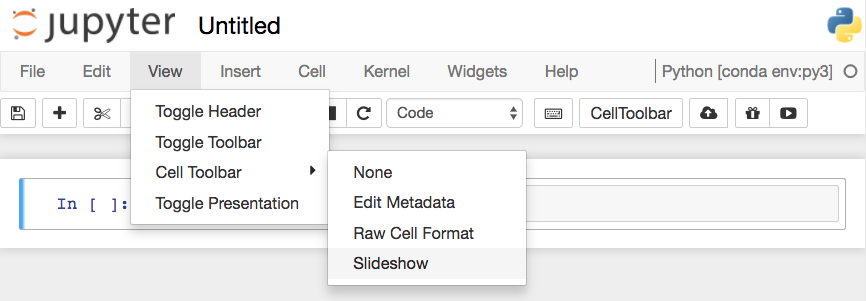

This will show a menu dropdown on each cell that lets you choose how the cell shows up in the slideshow.


**Slides** are full slides that you move through left to right. **Sub-slides** show up in the slideshow by pressing up 
or down. **Fragments** are hidden at first, then appear with a button press. You can skip cells in the slideshow with 
**Skip** and **Notes** leaves the cell as speaker notes.

### Running the slideshow

To create the slideshow from the notebook file, you'll need to use `nbconvert`:

    jupyter nbconvert notebook.ipynb --to slides

This just converts the notebook to the necessary files for the slideshow, but you need to serve it with an HTTP server 
to actually see the presentation.

To convert it and immediately see it, use

    jupyter nbconvert notebook.ipynb --to slides --post serve
    
This will open up the slideshow in your browser so you can present it.

## 11.Finishing up

You've made it to the end of this short course on tools in the Python data science workflow. Making good use of 
Anaconda and Jupyter Notebooks will increase your productivity and general well-being. There is a lot to learn to get 
the most out of these, Markdown and LaTeX for instance, but after a bit you'll be wondering why data analysis is done 
any other way.

Again, congratulations and good luck!
