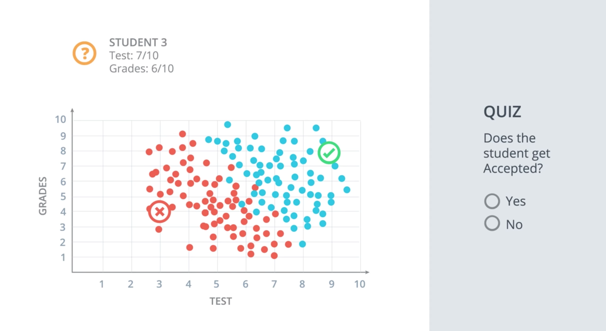
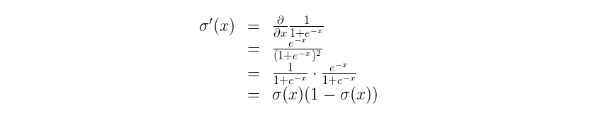

# Neural Networks

## 1. Instructor


Hello and welcome to Introduction to Neural Networks, given by Luis!

Luis was formerly a Machine Learning Engineer at Google. He holds a PhD in mathematics from the University of Michigan, 
and a Postdoctoral Fellowship at the University of Quebec at Montreal.

## 2. Introduction

Welcome to Intro to Deep Learning, where you'll find some of the concepts covered in the our paid Nanodegree program.

[](http://scrier.myqnapcloud.com:8080/share.cgi?ssid=0MZqBkd&ep=&path=%2FDeep.Learning%2F2.Neural-Networks%2F1.Introduction-to-Neural-Networks%2Freadme&filename=1_-_Introduction.mp4&fid=0MZqBkd&open=normal)

## 3. Classification Problems 1

We'll start by defining what we mean by classification problems, and applying it to a simple example.

[](http://scrier.myqnapcloud.com:8080/share.cgi?ssid=0MZqBkd&ep=&path=%2FDeep.Learning%2F2.Neural-Networks%2F1.Introduction-to-Neural-Networks%2Freadme&filename=2_-_Classsification_Example.mp4&fid=0MZqBkd&open=normal)




## 4. Classification Problems 2

[](http://scrier.myqnapcloud.com:8080/share.cgi?ssid=0MZqBkd&ep=&path=%2FDeep.Learning%2F2.Neural-Networks%2F1.Introduction-to-Neural-Networks%2Freadme&filename=3_-_Classification_Example.mp4&fid=0MZqBkd&open=normal)

## 5. Linear Boundaries

[](http://scrier.myqnapcloud.com:8080/share.cgi?ssid=0MZqBkd&ep=&path=%2FDeep.Learning%2F2.Neural-Networks%2F1.Introduction-to-Neural-Networks%2Freadme&filename=4_-_Linear_Boundaries.mp4&fid=0MZqBkd&open=normal)

## 6. Higher Dimensions

[](http://scrier.myqnapcloud.com:8080/share.cgi?ssid=0MZqBkd&ep=&path=%2FDeep.Learning%2F2.Neural-Networks%2F1.Introduction-to-Neural-Networks%2Freadme&filename=5_-_09_Higher_Dimensions.mp4&fid=0MZqBkd&open=normal)

## 7. Perceptrons

[](http://scrier.myqnapcloud.com:8080/share.cgi?ssid=0MZqBkd&ep=&path=%2FDeep.Learning%2F2.Neural-Networks%2F1.Introduction-to-Neural-Networks%2Freadme&filename=6_-_DL_06_Perceptron_Definition_Fix_V2.mp4&fid=0MZqBkd&open=normal)

Corrections:

 * At 3:07, the title says "Set Function". It should be "Step Function".
 * At 3:12, the second option for y should be "0 if x<0".

## 8. Why "Neural Networks"?

[](http://scrier.myqnapcloud.com:8080/share.cgi?ssid=0MZqBkd&ep=&path=%2FDeep.Learning%2F2.Neural-Networks%2F1.Introduction-to-Neural-Networks%2Freadme&filename=7_-_Why_Neural_Networks.mp4&fid=0MZqBkd&open=normal)

## 9. Perceptrons as Logical Operators

In this lesson, we'll see one of the many great applications of perceptrons. As logical operators! You'll have the 
chance to create the perceptrons for the most common of these, the AND, OR, and NOT operators. And then, we'll see what 
to do about the elusive XOR operator. Let's dive in!

### AND Perceptron

[](http://scrier.myqnapcloud.com:8080/share.cgi?ssid=0MZqBkd&ep=&path=%2FDeep.Learning%2F2.Neural-Networks%2F1.Introduction-to-Neural-Networks%2Freadme&filename=8_-_AND_And_OR_Perceptrons.mp4&fid=0MZqBkd&open=normal)


### What are the weights and bias for the AND perceptron?

Set the weights (weight1, weight2) and bias bias to the correct values that calculate AND operation as shown above.

```python
import pandas as pd

# TODO: Set weight1, weight2, and bias
weight1 = 1.0
weight2 = 1.0
bias = -1.5


# DON'T CHANGE ANYTHING BELOW
# Inputs and outputs
test_inputs = [(0, 0), (0, 1), (1, 0), (1, 1)]
correct_outputs = [False, False, False, True]
outputs = []

# Generate and check output
for test_input, correct_output in zip(test_inputs, correct_outputs):
    linear_combination = weight1 * test_input[0] + weight2 * test_input[1] + bias
    output = int(linear_combination >= 0)
    is_correct_string = 'Yes' if output == correct_output else 'No'
    outputs.append([test_input[0], test_input[1], linear_combination, output, is_correct_string])

# Print output
num_wrong = len([output[4] for output in outputs if output[4] == 'No'])
output_frame = pd.DataFrame(outputs, columns=['Input 1', '  Input 2', '  Linear Combination', '  Activation Output', '  Is Correct'])
if not num_wrong:
    print('Nice!  You got it all correct.\n')
else:
    print('You got {} wrong.  Keep trying!\n'.format(num_wrong))
print(output_frame.to_string(index=False))
```

### OR Perceptron


The OR perceptron is very similar to an AND perceptron. In the image below, the OR perceptron has the same line as the 
AND perceptron, except the line is shifted down. What can you do to the weights and/or bias to achieve this? Use the 
following AND perceptron to create an OR Perceptron.


### NOT Perceptron

Unlike the other perceptrons we looked at, the NOT operation only cares about one input. The operation returns a `0` if 
the input is `1` and a `1` if it's a `0`. The other inputs to the perceptron are ignored.

In this quiz, you'll set the weights (`weight1`, `weight2`) and bias `bias` to the values that calculate the NOT operation on 
the second input and ignores the first input.

```python
import pandas as pd

# TODO: Set weight1, weight2, and bias
weight1 = 1.0
weight2 = -2.0
bias = 0.0


# DON'T CHANGE ANYTHING BELOW
# Inputs and outputs
test_inputs = [(0, 0), (0, 1), (1, 0), (1, 1)]
correct_outputs = [True, False, True, False]
outputs = []

# Generate and check output
for test_input, correct_output in zip(test_inputs, correct_outputs):
    linear_combination = weight1 * test_input[0] + weight2 * test_input[1] + bias
    output = int(linear_combination >= 0)
    is_correct_string = 'Yes' if output == correct_output else 'No'
    outputs.append([test_input[0], test_input[1], linear_combination, output, is_correct_string])

# Print output
num_wrong = len([output[4] for output in outputs if output[4] == 'No'])
output_frame = pd.DataFrame(outputs, columns=['Input 1', '  Input 2', '  Linear Combination', '  Activation Output', '  Is Correct'])
if not num_wrong:
    print('Nice!  You got it all correct.\n')
else:
    print('You got {} wrong.  Keep trying!\n'.format(num_wrong))
print(output_frame.to_string(index=False))
```

[](http://scrier.myqnapcloud.com:8080/share.cgi?ssid=0MZqBkd&ep=&path=%2FDeep.Learning%2F2.Neural-Networks%2F1.Introduction-to-Neural-Networks%2Freadme&filename=9_-_XOR_Perceptron.mp4&fid=0MZqBkd&open=normal)

### XOR Perceptron


### Quiz: Build an XOR Multi-Layer Perceptron

Now, let's build a multi-layer perceptron from the AND, NOT, and OR perceptrons to create XOR logic!

The neural network below contains 3 perceptrons, A, B, and C. The last one (AND) has been given for you. The input to 
the neural network is from the first node. The output comes out of the last node.

The multi-layer perceptron above calculates XOR. Each perceptron is a logic operation of AND, OR, and NOT. However, the 
perceptrons A, B, and C don't indicate their operation. In the following quiz, set the correct operations for the four 
perceptrons to calculate XOR.


## 10. Perceptron Trick

In the last section you used your logic and your mathematical knowledge to create perceptrons for some of the most 
common logical operators. In real life, though, we can't be building these perceptrons ourselves. The idea is that we 
give them the result, and they build themselves. For this, here's a pretty neat trick that will help us.

[](http://scrier.myqnapcloud.com:8080/share.cgi?ssid=0MZqBkd&ep=&path=%2FDeep.Learning%2F2.Neural-Networks%2F1.Introduction-to-Neural-Networks%2Freadme&filename=10_-_Perceptron_Algorithm.mp4&fid=0MZqBkd&open=normal)


[](http://scrier.myqnapcloud.com:8080/share.cgi?ssid=0MZqBkd&ep=&path=%2FDeep.Learning%2F2.Neural-Networks%2F1.Introduction-to-Neural-Networks%2Freadme&filename=11_-_DL_10_S__Perceptron_Algorithm.mp4&fid=0MZqBkd&open=normal)

### Time for some math!
Now that we've learned that the points that are misclassified, want the line to move closer to them, let's do some 
math. The following video shows a mathematical trick that modifies the equation of the line, so that it comes closer 
to a particular point.

[](http://scrier.myqnapcloud.com:8080/share.cgi?ssid=0MZqBkd&ep=&path=%2FDeep.Learning%2F2.Neural-Networks%2F1.Introduction-to-Neural-Networks%2Freadme&filename=12_-_07_Perceptron_Algorithm_Trick.mp4&fid=0MZqBkd&open=normal)

## 11. Perceptron Algoritm

And now, with the perceptron trick in our hands, we can fully develop the perceptron algorithm! The following video 
will show you the pseudocode, and in the quiz below, you'll have the chance to code it in Python.

[](http://scrier.myqnapcloud.com:8080/share.cgi?ssid=0MZqBkd&ep=&path=%2FDeep.Learning%2F2.Neural-Networks%2F1.Introduction-to-Neural-Networks%2Freadme&filename=13_-_Perceptron_Agorithm_Pseudocode.mp4&fid=0MZqBkd&open=normal)

### Coding the Perceptron Algorithm

Time to code! In this quiz, you'll have the chance to implement the perceptron algorithm to separate the following data 
(given in the file data.csv).


<object data="http://scrier.myqnapcloud.com:8080/share.cgi/part1-11.pdf?ssid=0MZqBkd&fid=0MZqBkd&path=%2FDeep.Learning%2F2.Neural-Networks%2F1.Introduction-to-Neural-Networks%2Freadme&filename=part1-11.pdf&openfolder=normal&ep=" type="application/pdf" width="700px" height="700px">
    <embed src="http://scrier.myqnapcloud.com:8080/share.cgi/part1-11.pdf?ssid=0MZqBkd&fid=0MZqBkd&path=%2FDeep.Learning%2F2.Neural-Networks%2F1.Introduction-to-Neural-Networks%2Freadme&filename=part1-11.pdf&openfolder=normal&ep=">
        This browser does not support PDFs. Please download the PDF to view it: <a href="http://scrier.myqnapcloud.com:8080/share.cgi/part1-11.pdf?ssid=0MZqBkd&fid=0MZqBkd&path=%2FDeep.Learning%2F2.Neural-Networks%2F1.Introduction-to-Neural-Networks%2Freadme&filename=part1-11.pdf&openfolder=normal&ep=">Download PDF</a>.</p>
    </embed>
</object>

Then click on `test run` to graph the solution that the perceptron algorithm gives you. It'll actually draw a set of 
dotted lines, that show how the algorithm approaches to the best solution, given by the black solid line.

Feel free to play with the parameters of the algorithm (number of epochs, learning rate, and even the randomizing of 
the initial parameters) to see how your initial conditions can affect the solution!

```python
import numpy as np
# Setting the random seed, feel free to change it and see different solutions.
np.random.seed(42)

def stepFunction(t):
    if t >= 0:
        return 1
    return 0

def prediction(X, W, b):
    return stepFunction((np.matmul(X,W)+b)[0])

# TODO: Fill in the code below to implement the perceptron trick.
# The function should receive as inputs the data X, the labels y,
# the weights W (as an array), and the bias b,
# update the weights and bias W, b, according to the perceptron algorithm,
# and return W and b.
def perceptronStep(X, y, W, b, learn_rate = 0.01):
    for i in range(len(X)):
        pred = prediction(X[i], W, b)
        if y[i]-pred == 1:
            W[0] += X[i][0]*learn_rate
            W[1] += X[i][1]*learn_rate
            b += learn_rate
        elif y[i]-pred == -1:
            W[0] -= X[i][0]*learn_rate
            W[1] -= X[i][1]*learn_rate
            b -= learn_rate
    return W, b
    
# This function runs the perceptron algorithm repeatedly on the dataset,
# and returns a few of the boundary lines obtained in the iterations,
# for plotting purposes.
# Feel free to play with the learning rate and the num_epochs,
# and see your results plotted below.
def trainPerceptronAlgorithm(X, y, learn_rate = 0.05, num_epochs = 250):
    x_min, x_max = min(X.T[0]), max(X.T[0])
    y_min, y_max = min(X.T[1]), max(X.T[1])
    W = np.array(np.random.rand(2,1))
    b = np.random.rand(1)[0] + x_max
    # These are the solution lines that get plotted below.
    boundary_lines = []
    for i in range(num_epochs):
        # In each epoch, we apply the perceptron step.
        W, b = perceptronStep(X, y, W, b, learn_rate)
        boundary_lines.append((-W[0]/W[1], -b/W[1]))
    return boundary_lines
```

[Perception Algorithm](part10-perceptron.md) 

## 12. Non-Linear Regions

[](http://scrier.myqnapcloud.com:8080/share.cgi?ssid=0MZqBkd&ep=&path=%2FDeep.Learning%2F2.Neural-Networks%2F1.Introduction-to-Neural-Networks%2Freadme&filename=14_-_Non-Linear_Regions.mp4&fid=0MZqBkd&open=normal)

## 13. Error Functions

[](http://scrier.myqnapcloud.com:8080/share.cgi?ssid=0MZqBkd&ep=&path=%2FDeep.Learning%2F2.Neural-Networks%2F1.Introduction-to-Neural-Networks%2Freadme&filename=15_-_Error_Functions.mp4&fid=0MZqBkd&open=normal)

## 14. Log-loss Error Function

[](http://scrier.myqnapcloud.com:8080/share.cgi?ssid=0MZqBkd&ep=&path=%2FDeep.Learning%2F2.Neural-Networks%2F1.Introduction-to-Neural-Networks%2Freadme&filename=16_-_Error_Functions.mp4&fid=0MZqBkd&open=normal)

The next lecture several lectures actually cover other topics related to this lecture. We pick back up on log-loss 
error with the gradient descent concept.

## 15. Discrete vs. Continouos

In the last few videos, we learned that continuous error functions are better than discrete error functions, when it 
comes to optimizing. For this, we need to switch from discrete to continuous predictions. The next two videos will 
guide us for doing that.

[](http://scrier.myqnapcloud.com:8080/share.cgi?ssid=0MZqBkd&ep=&path=%2FDeep.Learning%2F2.Neural-Networks%2F1.Introduction-to-Neural-Networks%2Freadme&filename=17_-_Discrete_vs_Continuous.mp4&fid=0MZqBkd&open=normal)

[](http://scrier.myqnapcloud.com:8080/share.cgi?ssid=0MZqBkd&ep=&path=%2FDeep.Learning%2F2.Neural-Networks%2F1.Introduction-to-Neural-Networks%2Freadme&filename=18_-_Discrete_vs._Continuous.mp4&fid=0MZqBkd&open=normal)

## 16. Softmax

[](http://scrier.myqnapcloud.com:8080/share.cgi?ssid=0MZqBkd&ep=&path=%2FDeep.Learning%2F2.Neural-Networks%2F1.Introduction-to-Neural-Networks%2Freadme&filename=19_-_Quiz_-_Softmax.mp4&fid=0MZqBkd&open=normal)

### The Softmax Function

In the next video, we'll learn about the softmax function, which is the equivalent of the sigmoid activation function, 
but when the problem has 3 or more classes.

[](http://scrier.myqnapcloud.com:8080/share.cgi?ssid=0MZqBkd&ep=&path=%2FDeep.Learning%2F2.Neural-Networks%2F1.Introduction-to-Neural-Networks%2Freadme&filename=20_-_DL_18_Q_Softmax_V2.mp4&fid=0MZqBkd&open=normal)

[](http://scrier.myqnapcloud.com:8080/share.cgi?ssid=0MZqBkd&ep=&path=%2FDeep.Learning%2F2.Neural-Networks%2F1.Introduction-to-Neural-Networks%2Freadme&filename=21_-_DL_18_S_Softmax.mp4&fid=0MZqBkd&open=normal)

### Quiz: Coding Softmax

And now, your time to shine! Let's code the formula for the Softmax function in Python.

```python
import numpy as np

# Write a function that takes as input a list of numbers, and returns
# the list of values given by the softmax function.
def softmax(L):
    divisor = sum(np.exp(i) for i in L)
    return list(np.exp(i)/divisor for i in L)
```

## 17. One-Hot Encoding

[](http://scrier.myqnapcloud.com:8080/share.cgi?ssid=0MZqBkd&ep=&path=%2FDeep.Learning%2F2.Neural-Networks%2F1.Introduction-to-Neural-Networks%2Freadme&filename=22_-_One-Hot_Encoding.mp4&fid=0MZqBkd&open=normal)

## 18. Maximum Likelihood

Probability will be one of our best friends as we go through Deep Learning. In this lesson, we'll see how we can use 
probability to evaluate (and improve!) our models.

[](http://scrier.myqnapcloud.com:8080/share.cgi?ssid=0MZqBkd&ep=&path=%2FDeep.Learning%2F2.Neural-Networks%2F1.Introduction-to-Neural-Networks%2Freadme&filename=23_-_Maximum_Likelihood_1.mp4&fid=0MZqBkd&open=normal)

[](http://scrier.myqnapcloud.com:8080/share.cgi?ssid=0MZqBkd&ep=&path=%2FDeep.Learning%2F2.Neural-Networks%2F1.Introduction-to-Neural-Networks%2Freadme&filename=24_-_Maximum_Likelihood_2.mp4&fid=0MZqBkd&open=normal)

## 19. Maximizing Probabilities

In this lesson and quiz, we will learn how to maximize a probability, using some math. Nothing more than high school 
math, so get ready for a trip down memory lane!

[](http://scrier.myqnapcloud.com:8080/share.cgi?ssid=0MZqBkd&ep=&path=%2FDeep.Learning%2F2.Neural-Networks%2F1.Introduction-to-Neural-Networks%2Freadme&filename=25_-_Quiz_-_Cross_1.mp4&fid=0MZqBkd&open=normal)

[](http://scrier.myqnapcloud.com:8080/share.cgi?ssid=0MZqBkd&ep=&path=%2FDeep.Learning%2F2.Neural-Networks%2F1.Introduction-to-Neural-Networks%2Freadme&filename=26_-_Quiz_Cross_Entropy.mp4&fid=0MZqBkd&open=normal)

## 20. Cross-Entropy 1

[](http://scrier.myqnapcloud.com:8080/share.cgi?ssid=0MZqBkd&ep=&path=%2FDeep.Learning%2F2.Neural-Networks%2F1.Introduction-to-Neural-Networks%2Freadme&filename=27_-_Cross_Entropy_1.mp4&fid=0MZqBkd&open=normal)

_Correction:_ At 2:18, the top right point should be labelled `-log(0.7)` instead of `-log(0.2)`.

## 21. Cross-Entropy 2

So we're getting somewhere, there's definitely a connection between probabilities and error functions, and it's called 
**Cross-Entropy**. This concept is tremendously popular in many fields, including Machine Learning. Let's dive more 
into the formula, and actually code it!

[](http://scrier.myqnapcloud.com:8080/share.cgi?ssid=0MZqBkd&ep=&path=%2FDeep.Learning%2F2.Neural-Networks%2F1.Introduction-to-Neural-Networks%2Freadme&filename=28_-_Formula_For_Cross_1.mp4&fid=0MZqBkd&open=normal)

[](http://scrier.myqnapcloud.com:8080/share.cgi?ssid=0MZqBkd&ep=&path=%2FDeep.Learning%2F2.Neural-Networks%2F1.Introduction-to-Neural-Networks%2Freadme&filename=29_-_CrossEntropy_V1.mp4&fid=0MZqBkd&open=normal)

```python
import numpy as np

# Write a function that takes as input two lists Y, P,
# and returns the float corresponding to their cross-entropy.
def cross_entropy(Y, P):
    sum = 0
    for y,p in zip(Y,P):
        if y == 1:
            sum += -np.log(p)
        elif y == 0:
            sum += -np.log(1-p)
    return sum
```

## 22. Multi-Class Cross-Entropy

[](http://scrier.myqnapcloud.com:8080/share.cgi?ssid=0MZqBkd&ep=&path=%2FDeep.Learning%2F2.Neural-Networks%2F1.Introduction-to-Neural-Networks%2Freadme&filename=30_-_DL_27_Multi-Class_Cross_Entropy_2_Fix.mp4&fid=0MZqBkd&open=normal)

## 23. Logistic Regression

Now, we're finally ready for one of the most popular and useful algorithms in Machine Learning, and the building block 
of all that constitutes Deep Learning. The **Logistic Regression** Algorithm. And it basically goes like this:

 * Take your data
 * Pick a random model
 * Calculate the error
 * Minimize the error, and obtain a better model
 * Enjoy!

### Calculating the Error Function

Let's dive into the details. The next video will show you how to calculate an error function.

[](http://scrier.myqnapcloud.com:8080/share.cgi?ssid=0MZqBkd&ep=&path=%2FDeep.Learning%2F2.Neural-Networks%2F1.Introduction-to-Neural-Networks%2Freadme&filename=31_-_Error_Function.mp4&fid=0MZqBkd&open=normal)

### Minimizing the error function

And this video will show us how to minimize the error function.

[](http://scrier.myqnapcloud.com:8080/share.cgi?ssid=0MZqBkd&ep=&path=%2FDeep.Learning%2F2.Neural-Networks%2F1.Introduction-to-Neural-Networks%2Freadme&filename=32_-_DL_29_Logistic_Regression-Minimizing_The_Error_Function.mp4&fid=0MZqBkd&open=normal)

## 24. Gradient Descent

In this lesson, we'll learn the principles and the math behind the gradient descent algorithm.

[](http://scrier.myqnapcloud.com:8080/share.cgi?ssid=0MZqBkd&ep=&path=%2FDeep.Learning%2F2.Neural-Networks%2F1.Introduction-to-Neural-Networks%2Freadme&filename=33_-_Gradient_Descent_V2.mp4&fid=0MZqBkd&open=normal)

<object data="http://scrier.myqnapcloud.com:8080/share.cgi/part1-24.pdf?ssid=0MZqBkd&fid=0MZqBkd&path=%2FDeep.Learning%2F2.Neural-Networks%2F1.Introduction-to-Neural-Networks%2Freadme&filename=part1-24.pdf&openfolder=normal&ep=" type="application/pdf" width="700px" height="700px">
    <embed src="http://scrier.myqnapcloud.com:8080/share.cgi/part1-24.pdf?ssid=0MZqBkd&fid=0MZqBkd&path=%2FDeep.Learning%2F2.Neural-Networks%2F1.Introduction-to-Neural-Networks%2Freadme&filename=part1-24.pdf&openfolder=normal&ep=">
        This browser does not support PDFs. Please download the PDF to view it: <a href="http://scrier.myqnapcloud.com:8080/share.cgi/part1-24.pdf?ssid=0MZqBkd&fid=0MZqBkd&path=%2FDeep.Learning%2F2.Neural-Networks%2F1.Introduction-to-Neural-Networks%2Freadme&filename=part1-24.pdf&openfolder=normal&ep=">Download PDF</a>.</p>
    </embed>
</object>

## 25. Logistic Regression Algoritm

[](http://scrier.myqnapcloud.com:8080/share.cgi?ssid=0MZqBkd&ep=&path=%2FDeep.Learning%2F2.Neural-Networks%2F1.Introduction-to-Neural-Networks%2Freadme&filename=34_-_Gradient_Descent_Algorithm.mp4&fid=0MZqBkd&open=normal)

## 26: Pre-Lab Gradient Descent

In the following lab, you'll be able to implement the gradient descent algorithm on the following sample dataset with 
two classes.


### Workspace

To open this notebook, you have two options:

 * Go to the next page in the classroom (recommended)
 * Clone the repo from [Github](https://github.com/udacity/deep-learning) and open the notebook **GradientDescent.ipynb** 
 in the **gradient-descent** folder. You can either download the repository with `git clone 
 https://github.com/udacity/deep-learning.git`, or download it as an archive file from [this link](https://github.com/udacity/deep-learning/archive/master.zip).

### Instructions

In this notebook, you'll be implementing the functions that build the gradient descent algorithm, namely:

 * `sigmoid`: The sigmoid activation function.
 * `output_formula`: The formula for the prediction.
 * `error_formula`: The formula for the error at a point.
 * `update_weights`: The function that updates the parameters with one gradient descent step.

When you implement them, run the `train` function and this will graph the several of the lines that are drawn in 
successive gradient descent steps. It will also graph the error function, and you can see it decreasing as the number 
of epochs grows.

This is a self-assessed lab. If you need any help or want to check your answers, feel free to check out the solutions 
notebook in the same folder, or by clicking [here](https://github.com/udacity/deep-learning/blob/master/gradient-descent/GradientDescentSolutions.ipynb).

## 28. Perceptron vs Gradient Descent

[](http://scrier.myqnapcloud.com:8080/share.cgi?ssid=0MZqBkd&ep=&path=%2FDeep.Learning%2F2.Neural-Networks%2F1.Introduction-to-Neural-Networks%2Freadme&filename=35_-_Gradient_Descent_Vs_Perceptron_Algorithm.mp4&fid=0MZqBkd&open=normal)

## 29. Continuous Perceptrons

[](http://scrier.myqnapcloud.com:8080/share.cgi?ssid=0MZqBkd&ep=&path=%2FDeep.Learning%2F2.Neural-Networks%2F1.Introduction-to-Neural-Networks%2Freadme&filename=36_-_Continuous_Perceptrons.mp4&fid=0MZqBkd&open=normal)

## 30. Non-linear Data

[](http://scrier.myqnapcloud.com:8080/share.cgi?ssid=0MZqBkd&ep=&path=%2FDeep.Learning%2F2.Neural-Networks%2F1.Introduction-to-Neural-Networks%2Freadme&filename=37_-_Non-Linear_Data.mp4&fid=0MZqBkd&open=normal)

## 31. Non-Linear Models

[](http://scrier.myqnapcloud.com:8080/share.cgi?ssid=0MZqBkd&ep=&path=%2FDeep.Learning%2F2.Neural-Networks%2F1.Introduction-to-Neural-Networks%2Freadme&filename=38_-_Non-Linear_Models.mp4&fid=0MZqBkd&open=normal)

## 32. Neural Network Architecture

Ok, so we're ready to put these building blocks together, and build great Neural Networks! (Or Multi-Layer Perceptrons, 
however you prefer to call them.)

This first two videos will show us how to combine two perceptrons into a third, more complicated one.

[](http://scrier.myqnapcloud.com:8080/share.cgi?ssid=0MZqBkd&ep=&path=%2FDeep.Learning%2F2.Neural-Networks%2F1.Introduction-to-Neural-Networks%2Freadme&filename=39_-_Combinando_modelos.mp4&fid=0MZqBkd&open=normal)

[](http://scrier.myqnapcloud.com:8080/share.cgi?ssid=0MZqBkd&ep=&path=%2FDeep.Learning%2F2.Neural-Networks%2F1.Introduction-to-Neural-Networks%2Freadme&filename=40_-_29_Neural_Network_Architecture_2.mp4&fid=0MZqBkd&open=normal)

### QUESTION 1 OF 2

Based on the above video, let's define the combination of two new perceptrons as w1*0.4 + w2*0.6 + b. Which of the 
following values for the weights and the bias would result in the final probability of the point to be 0.88?

 1. w1: 2, w2: 6, b: -2
 1. w1: 3, w2: 5, b: -2.2
 1. w1: 5, w2: 4, b: -3

### Multiple layers

Now, not all neural networks look like the one above. They can be way more complicated! In particular, we can do the 
following things:

 * Add more nodes to the input, hidden, and output layers.
 * Add more layers.

We'll see the effects of these changes in the next video.

[](http://scrier.myqnapcloud.com:8080/share.cgi?ssid=0MZqBkd&ep=&path=%2FDeep.Learning%2F2.Neural-Networks%2F1.Introduction-to-Neural-Networks%2Freadme&filename=41_-_Layers.mp4&fid=0MZqBkd&open=normal)

### Multi-Class Classification

And here we elaborate a bit more into what can be done if our neural network needs to model data with more than one 
output.

[](http://scrier.myqnapcloud.com:8080/share.cgi?ssid=0MZqBkd&ep=&path=%2FDeep.Learning%2F2.Neural-Networks%2F1.Introduction-to-Neural-Networks%2Freadme&filename=42_-_Multiclass_Classification.mp4&fid=0MZqBkd&open=normal)

### QUESTION 2 OF 2

How many nodes in the output layer would you require if you were trying to classify all the letters in the English 
alphabet?

## 33. Feedforward

Feedforward is the process neural networks use to turn the input into an output. Let's study it more carefully, before 
we dive into how to train the networks.

[](http://scrier.myqnapcloud.com:8080/share.cgi?ssid=0MZqBkd&ep=&path=%2FDeep.Learning%2F2.Neural-Networks%2F1.Introduction-to-Neural-Networks%2Freadme&filename=43_-_DL_41_Feedforward_FIX_V2.mp4&fid=0MZqBkd&open=normal)

### Error Function

Just as before, neural networks will produce an error function, which at the end, is what we'll be minimizing. The 
following video shows the error function for a neural network.

[](http://scrier.myqnapcloud.com:8080/share.cgi?ssid=0MZqBkd&ep=&path=%2FDeep.Learning%2F2.Neural-Networks%2F1.Introduction-to-Neural-Networks%2Freadme&filename=44_-_DL_42_Neural_Network_Error_Function_(1).mp4&fid=0MZqBkd&open=normal)

## 34. Backpropagation

Now, we're ready to get our hands into training a neural network. For this, we'll use the method known as 
backpropagation. In a nutshell, **backpropagation** will consist of:

 * Doing a feedforward operation.
 * Comparing the output of the model with the desired output.
 * Calculating the error.
 * Running the feedforward operation backwards (backpropagation) to spread the error to each of the weights.
 * Use this to update the weights, and get a better model.
 * Continue this until we have a model that is good.
 
Sounds more complicated than what it actually is. Let's take a look in the next few videos. The first video, will show 
us a conceptual interpretation of what backpropagation is.

[](http://scrier.myqnapcloud.com:8080/share.cgi?ssid=0MZqBkd&ep=&path=%2FDeep.Learning%2F2.Neural-Networks%2F1.Introduction-to-Neural-Networks%2Freadme&filename=45_-_Backpropagation_V2.mp4&fid=0MZqBkd&open=normal)

### Backpropagation Math

And the next few videos will go deeper into the math. Feel free to tune out, since this part gets handled by Keras 
pretty well. If you'd like to go start training networks right away, go to the next section. But if you enjoy 
calculating lots of derivatives, let's dive in!

In the video below at 1:24, the edges should be directed to the sigmoid function and the not the bias at that last 
layer, the edges of the last layer point to the bias currently which is incorrect.

[](http://scrier.myqnapcloud.com:8080/share.cgi?ssid=0MZqBkd&ep=&path=%2FDeep.Learning%2F2.Neural-Networks%2F1.Introduction-to-Neural-Networks%2Freadme&filename=46_-_Calculating_The_Gradient_1_.mp4&fid=0MZqBkd&open=normal)

### Chain Rule

We'll need to recall the chain rule to help us calculate derivatives.

[](http://scrier.myqnapcloud.com:8080/share.cgi?ssid=0MZqBkd&ep=&path=%2FDeep.Learning%2F2.Neural-Networks%2F1.Introduction-to-Neural-Networks%2Freadme&filename=47_-_Chain_Rule_.mp4&fid=0MZqBkd&open=normal)

[](http://scrier.myqnapcloud.com:8080/share.cgi?ssid=0MZqBkd&ep=&path=%2FDeep.Learning%2F2.Neural-Networks%2F1.Introduction-to-Neural-Networks%2Freadme&filename=48_-_DL_46_Calculating_The_Gradient_2_V2_(2).mp4&fid=0MZqBkd&open=normal)

### Calculation of the derivative of the sigmoid function

Recall that the sigmoid function has a beautiful derivative, which we can see in the following calculation. This will 
make our backpropagation step much cleaner.



## 35. Outro

### Great job!

You now know how neural networks work and how they get trained. In the next lesson, Mat will guide you through 
implementing this training process in Numpy. See you soon!

## Links

 * [Gradient Descent Notebook](GradientDescent.ipynb)
 * [And Model](part8-and.py)
 * [Not Model](part8-not.py)
 * [Or Model](part8-or.py)
 * [Softmax Function](part15-softmax.py)
 * [Cross Entropy Function](part20-cross_entropy.py)
 * [Sigmoid](part31-sigmoid.py)

