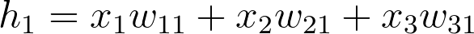

# Implementing Gradient Descent

## 1. Mean Squared Error Function

### Log-Loss vs Mean Squared Error

In the previous section, Luis taught you about the log-loss function. There are many other error functions used for 
neural networks. Let me teach you another one, called the mean squared error. As the name says, this one is the mean 
of the squares of the differences between the predictions and the labels. In the following section I'll go over it in 
detail, then we'll get to implement backpropagation with it on the same student admissions dataset.

And as a bonus, we'll be implementing this in a very effective way using matrix multiplication with Numpy!

## 2. Gradient Descent

<object data="http://scrier.myqnapcloud.com:8080/share.cgi/part2-2.pdf?ssid=0MZqBkd&fid=0MZqBkd&path=%2FDeep.Learning%2F2.Neural-Networks%2F2.Implementing-Gradient-Scale%2Freadme&filename=part2-2.pdf&openfolder=normal&ep=" type="application/pdf" width="700px" height="700px">
    <embed src="http://scrier.myqnapcloud.com:8080/share.cgi/part2-2.pdf?ssid=0MZqBkd&fid=0MZqBkd&path=%2FDeep.Learning%2F2.Neural-Networks%2F2.Implementing-Gradient-Scale%2Freadme&filename=part2-2.pdf&openfolder=normal&ep=">
        This browser does not support PDFs. Please download the PDF to view it: <a href="http://scrier.myqnapcloud.com:8080/share.cgi/part2-2.pdf?ssid=0MZqBkd&fid=0MZqBkd&path=%2FDeep.Learning%2F2.Neural-Networks%2F2.Implementing-Gradient-Scale%2Freadme&filename=part2-2.pdf&openfolder=normal&ep=">Download PDF</a>.</p>
    </embed>
</object>

[](http://scrier.myqnapcloud.com:8080/share.cgi?ssid=0MZqBkd&ep=&path=%2FDeep.Learning%2F2.Neural-Networks%2F2.Implementing-Gradient-Scale%2Freadme&filename=1_-_Gradient_Descent.mp4&fid=0MZqBkd&open=normal)

## 3. Gradient Descent: The Math

[](http://scrier.myqnapcloud.com:8080/share.cgi?ssid=0MZqBkd&ep=&path=%2FDeep.Learning%2F2.Neural-Networks%2F2.Implementing-Gradient-Scale%2Freadme&filename=2_-_Gradient_Descent-Math.mp4&fid=0MZqBkd&open=normal)

### Notes

Check out Khan Academy's [Multivariable calculus lessons](https://www.khanacademy.org/math/multivariable-calculus) if you are unfamiliar with the subject.

## 4. Gradient Descent: The Code

<object data="http://scrier.myqnapcloud.com:8080/share.cgi/part2-4.pdf?ssid=0MZqBkd&fid=0MZqBkd&path=%2FDeep.Learning%2F2.Neural-Networks%2F2.Implementing-Gradient-Scale%2Freadme&filename=part2-4.pdf&openfolder=normal&ep=" type="application/pdf" width="700px" height="700px">
    <embed src="http://scrier.myqnapcloud.com:8080/share.cgi/part2-4.pdf?ssid=0MZqBkd&fid=0MZqBkd&path=%2FDeep.Learning%2F2.Neural-Networks%2F2.Implementing-Gradient-Scale%2Freadme&filename=part2-4.pdf&openfolder=normal&ep=">
        This browser does not support PDFs. Please download the PDF to view it: <a href="http://scrier.myqnapcloud.com:8080/share.cgi/part2-4.pdf?ssid=0MZqBkd&fid=0MZqBkd&path=%2FDeep.Learning%2F2.Neural-Networks%2F2.Implementing-Gradient-Scale%2Freadme&filename=part2-4.pdf&openfolder=normal&ep=">Download PDF</a>.</p>
    </embed>
</object>

```python
# Defining the sigmoid function for activations
def sigmoid(x):
    return 1/(1+np.exp(-x))

# Derivative of the sigmoid function
def sigmoid_prime(x):
    return sigmoid(x) * (1 - sigmoid(x))

# Input data
x = np.array([0.1, 0.3])
# Target
y = 0.2
# Input to output weights
weights = np.array([-0.8, 0.5])

# The learning rate, eta in the weight step equation
learnrate = 0.5

# the linear combination performed by the node (h in f(h) and f'(h))
h = x[0]*weights[0] + x[1]*weights[1]
# or h = np.dot(x, weights)

# The neural network output (y-hat)
nn_output = sigmoid(h)

# output error (y - y-hat)
error = y - nn_output

# output gradient (f'(h))
output_grad = sigmoid_prime(h)

# error term (lowercase delta)
error_term = error * output_grad

# Gradient descent step 
del_w = [ learnrate * error_term * x[0],
          learnrate * error_term * x[1]]
# or del_w = learnrate * error_term * x
```

```python
import numpy as np

def sigmoid(x):
    """
    Calculate sigmoid
    """
    return 1/(1+np.exp(-x))

def sigmoid_prime(x):
    """
    # Derivative of the sigmoid function
    """
    return sigmoid(x) * (1 - sigmoid(x))

learnrate = 0.5
x = np.array([1, 2, 3, 4])
y = np.array(0.5)

# Initial weights
w = np.array([0.5, -0.5, 0.3, 0.1])

### Calculate one gradient descent step for each weight
### Note: Some steps have been consilated, so there are
###       fewer variable names than in the above sample code

# TODO: Calculate the node's linear combination of inputs and weights
h = np.dot(x, w)

# TODO: Calculate output of neural network
nn_output = sigmoid(h)

# TODO: Calculate error of neural network
error = y - nn_output

# TODO: Calculate the error term
#       Remember, this requires the output gradient, which we haven't
#       specifically added a variable for.
error_term = error * sigmoid_prime(h)

# TODO: Calculate change in weights
del_w = learnrate * error_term * x

print('Neural Network output:')
print(nn_output)
print('Amount of Error:')
print(error)
print('Change in Weights:')
print(del_w)
```

## 5. Implementing Gradient Descent

<object data="http://scrier.myqnapcloud.com:8080/share.cgi/part2-5.pdf?ssid=0MZqBkd&fid=0MZqBkd&path=%2FDeep.Learning%2F2.Neural-Networks%2F2.Implementing-Gradient-Scale%2Freadme&filename=part2-5.pdf&openfolder=normal&ep=" type="application/pdf" width="700px" height="700px">
    <embed src="http://scrier.myqnapcloud.com:8080/share.cgi/part2-5.pdf?ssid=0MZqBkd&fid=0MZqBkd&path=%2FDeep.Learning%2F2.Neural-Networks%2F2.Implementing-Gradient-Scale%2Freadme&filename=part2-5.pdf&openfolder=normal&ep=">
        This browser does not support PDFs. Please download the PDF to view it: <a href="http://scrier.myqnapcloud.com:8080/share.cgi/part2-5.pdf?ssid=0MZqBkd&fid=0MZqBkd&path=%2FDeep.Learning%2F2.Neural-Networks%2F2.Implementing-Gradient-Scale%2Freadme&filename=part2-5.pdf&openfolder=normal&ep=">Download PDF</a>.</p>
    </embed>
</object>

## 6. Multilayer Perceptrons

[](http://scrier.myqnapcloud.com:8080/share.cgi?ssid=0MZqBkd&ep=&path=%2FDeep.Learning%2F2.Neural-Networks%2F2.Implementing-Gradient-Scale%2Freadme&filename=3_-_Multilayer_perceptrons.mp4&fid=0MZqBkd&open=normal)

### Implementing the hidden layer

**Prerequisites**

Below, we are going to walk through the math of neural networks in a multilayer perceptron. With multiple perceptrons, 
we are going to move to using vectors and matrices. To brush up, be sure to view the following:

 * Khan Academy's [introduction to vectors](https://www.khanacademy.org/math/linear-algebra/vectors-and-spaces/vectors/v/vector-introduction-linear-algebra).
 * Khan Academy's [introduction to matrices](https://www.khanacademy.org/math/precalculus/precalc-matrices).

**Derivation**

Before, we were dealing with only one output node which made the code straightforward. However now that we have 
multiple input units and multiple hidden units, the weights between them will require two indices: _Wij_ where _i_ 
denotes input units and _j_ are the hidden units.

For example, the following image shows our network, with its input units labeled _x1_, _x2_ and _x3_ and its hidden 
nodes labeled _h1_ and _h2_:


The lines indicating the weights leading to _h1_ have been colored differently from those leading to _h2_ just to make 
it easier to read.

Now to index the weights, we take the input unit number for the _i_ and the hidden unit number for the _j_. That gives 
us

_w11_

for the weight leading from _x1_ to _h1_, and

_w12_
​	 
for the weight leading from _x1_ to _h2_.

The following image includes all of the weights between the input layer and the hidden layer, labeled with their 
appropriate _Wij_ indices:


Before, we were able to write the weights as an array, indexed as _Wi_.

But now, the weights need to be stored in a **matrix**, indexed as _Wij_. Each **row** in the matrix will correspond 
to the weights **leading out** of a **single input unit**, and each **column** will correspond to the weights **leading 
in** to a **single hidden unit**. For our three input units and two hidden units, the weights matrix looks like this:


Be sure to compare the matrix above with the diagram shown before it so you can see where the different weights in the 
network end up in the matrix.

To initialize these weights in Numpy, we have to provide the shape of the matrix. If `features` is a 2D array containing 
the input data:

```python
# Number of records and input units
n_records, n_inputs = features.shape
# Number of hidden units
n_hidden = 2
weights_input_to_hidden = np.random.normal(0, n_inputs**-0.5, size=(n_inputs, n_hidden))
```

This creates a 2D array (i.e. a matrix) named `weights_input_to_hidden` with dimensions `n_inputs` by `n_hidden`. Remember 
how the input to a hidden unit is the sum of all the inputs multiplied by the hidden unit's weights. So for each hidden 
layer unit, _hj_, we need to calculate the following:


To do that, we now need to use [matrix multiplication](https://en.wikipedia.org/wiki/Matrix_multiplication). If your linear algebra is rusty, I suggest taking a look at the 
suggested resources in the prerequisites section. For this part though, you'll only need to know how to multiply a 
matrix with a vector.

In this case, we're multiplying the inputs (a row vector here) by the weights. To do this, you take the dot (inner) 
product of the inputs with each column in the weights matrix. For example, to calculate the input to the first hidden 
unit, _j = 1_, you'd take the dot product of the inputs with the first column of the weights matrix, like so:




And for the second hidden layer input, you calculate the dot product of the inputs with the second column. And so on 
and so forth.

In Numpy, you can do this for all the inputs and all the outputs at once using `np.dot`

```python
hidden_inputs = np.dot(inputs, weights_input_to_hidden)
```

You could also define your weights matrix such that it has dimensions `n_hidden` by `n_inputs` then multiply like so where 
the inputs form a _column vector_:


**Note:** The weight indices have changed in the above image and no longer match up with the labels used in the earlier 
diagrams. That's because, in matrix notation, the row index always precedes the column index, so it would be misleading 
to label them the way we did in the neural net diagram. Just keep in mind that this is the same weight matrix as 
before, but rotated so the first column is now the first row, and the second column is now the second row. If we were 
to use the labels from the earlier diagram, the weights would fit into the matrix in the following locations:


Remember, the above is **not** a correct view of the **indices**, but it uses the labels from the earlier neural net 
diagrams to show you where each weight ends up in the matrix.

The important thing with matrix multiplication is that the _dimensions match_. For matrix multiplication to work, there 
has to be the same number of elements in the dot products. In the first example, there are three columns in the input 
vector, and three rows in the weights matrix. In the second example, there are three columns in the weights matrix and 
three rows in the input vector. If the dimensions don't match, you'll get this:

```python
# Same weights and features as above, but swapped the order
hidden_inputs = np.dot(weights_input_to_hidden, features)
---------------------------------------------------------------------------
ValueError                                Traceback (most recent call last)
<ipython-input-11-1bfa0f615c45> in <module>()
----> 1 hidden_in = np.dot(weights_input_to_hidden, X)

ValueError: shapes (3,2) and (3,) not aligned: 2 (dim 1) != 3 (dim 0)
```

The dot product can't be computed for a 3x2 matrix and 3-element array. That's because the 2 columns in the matrix 
don't match the number of elements in the array. Some of the dimensions that could work would be the following:


The rule is that if you're multiplying an array from the left, the array must have the same number of elements as there 
are rows in the matrix. And if you're multiplying the matrix from the left, the number of columns in the matrix must 
equal the number of elements in the array on the right.

### Making a column vector

You see above that sometimes you'll want a column vector, even though by default Numpy arrays work like row vectors. 
It's possible to get the transpose of an array like so `arr.T`, but for a 1D array, the transpose will return a row 
vector. Instead, use `arr[:,None]` to create a column vector:

```python
print(features)
> array([ 0.49671415, -0.1382643 ,  0.64768854])

print(features.T)
> array([ 0.49671415, -0.1382643 ,  0.64768854])

print(features[:, None])
> array([[ 0.49671415],
       [-0.1382643 ],
       [ 0.64768854]])
```

Alternatively, you can create arrays with two dimensions. Then, you can use `arr.T` to get the column vector.

```python
np.array(features, ndmin=2)
> array([[ 0.49671415, -0.1382643 ,  0.64768854]])

np.array(features, ndmin=2).T
> array([[ 0.49671415],
       [-0.1382643 ],
       [ 0.64768854]])
```

I personally prefer keeping all vectors as 1D arrays, it just works better in my head.

### Programming quiz

Below, you'll implement a forward pass through a 4x3x2 network, with sigmoid activation functions for both layers.

Things to do:

 * Calculate the input to the hidden layer.
 * Calculate the hidden layer output.
 * Calculate the input to the output layer.
 * Calculate the output of the network.
 
```python
import numpy as np

def sigmoid(x):
    """
    Calculate sigmoid
    """
    return 1/(1+np.exp(-x))

# Network size
N_input = 4
N_hidden = 3
N_output = 2

np.random.seed(42)
# Make some fake data
X = np.random.randn(4)

weights_input_to_hidden = np.random.normal(0, scale=0.1, size=(N_input, N_hidden))
weights_hidden_to_output = np.random.normal(0, scale=0.1, size=(N_hidden, N_output))


# TODO: Make a forward pass through the network

hidden_layer_in = np.dot(X, weights_input_to_hidden)
hidden_layer_out = sigmoid(hidden_layer_in)

print('Hidden-layer Output:')
print(hidden_layer_out)

output_layer_in = np.dot(hidden_layer_out, weights_hidden_to_output)
output_layer_out = sigmoid(output_layer_in)

print('Output-layer Output:')
print(output_layer_out)
```

## 7. Backpropagation

[](http://scrier.myqnapcloud.com:8080/share.cgi?ssid=0MZqBkd&ep=&path=%2FDeep.Learning%2F2.Neural-Networks%2F2.Implementing-Gradient-Scale%2Freadme&filename=4_-_Backpropagation.mp4&fid=0MZqBkd&open=normal)

<object data="http://scrier.myqnapcloud.com:8080/share.cgi/part2-7.pdf?ssid=0MZqBkd&fid=0MZqBkd&path=%2FDeep.Learning%2F2.Neural-Networks%2F2.Implementing-Gradient-Scale%2Freadme&filename=part2-7.pdf&openfolder=normal&ep=" type="application/pdf" width="700px" height="700px">
    <embed src="http://scrier.myqnapcloud.com:8080/share.cgi/part2-7.pdf?ssid=0MZqBkd&fid=0MZqBkd&path=%2FDeep.Learning%2F2.Neural-Networks%2F2.Implementing-Gradient-Scale%2Freadme&filename=part2-7.pdf&openfolder=normal&ep=">
        This browser does not support PDFs. Please download the PDF to view it: <a href="http://scrier.myqnapcloud.com:8080/share.cgi/part2-7.pdf?ssid=0MZqBkd&fid=0MZqBkd&path=%2FDeep.Learning%2F2.Neural-Networks%2F2.Implementing-Gradient-Scale%2Freadme&filename=part2-7.pdf&openfolder=normal&ep=">Download PDF</a>.</p>
    </embed>
</object>

```python
import numpy as np


def sigmoid(x):
    """
    Calculate sigmoid
    """
    return 1 / (1 + np.exp(-x))


x = np.array([0.5, 0.1, -0.2])
target = 0.6
learnrate = 0.5

weights_input_hidden = np.array([[0.5, -0.6],
                                 [0.1, -0.2],
                                 [0.1, 0.7]])

weights_hidden_output = np.array([0.1, -0.3])

## Forward pass
hidden_layer_input = np.dot(x, weights_input_hidden)
hidden_layer_output = sigmoid(hidden_layer_input)

output_layer_in = np.dot(hidden_layer_output, weights_hidden_output)
output = sigmoid(output_layer_in)

## Backwards pass
## TODO: Calculate output error
error = target - output

# TODO: Calculate error term for output layer
output_error_term = error * output * (1 - output)

# TODO: Calculate error term for hidden layer
hidden_error_term = np.dot(output_error_term, weights_hidden_output) * \
                    hidden_layer_output * (1 - hidden_layer_output)
print(hidden_error_term)
# TODO: Calculate change in weights for hidden layer to output layer
delta_w_h_o = learnrate * output_error_term * hidden_layer_output

# TODO: Calculate change in weights for input layer to hidden layer
delta_w_i_h = learnrate * hidden_error_term * x[:, None]

print('Change in weights for hidden layer to output layer:')
print(delta_w_h_o)
print('Change in weights for input layer to hidden layer:')
print(delta_w_i_h)
```

## 8. Implementing Backpropagation

<object data="http://scrier.myqnapcloud.com:8080/share.cgi/part2-8.pdf?ssid=0MZqBkd&fid=0MZqBkd&path=%2FDeep.Learning%2F2.Neural-Networks%2F2.Implementing-Gradient-Scale%2Freadme&filename=part2-8.pdf&openfolder=normal&ep=" type="application/pdf" width="700px" height="700px">
    <embed src="http://scrier.myqnapcloud.com:8080/share.cgi/part2-8.pdf?ssid=0MZqBkd&fid=0MZqBkd&path=%2FDeep.Learning%2F2.Neural-Networks%2F2.Implementing-Gradient-Scale%2Freadme&filename=part2-8.pdf&openfolder=normal&ep=">
        This browser does not support PDFs. Please download the PDF to view it: <a href="http://scrier.myqnapcloud.com:8080/share.cgi/part2-8.pdf?ssid=0MZqBkd&fid=0MZqBkd&path=%2FDeep.Learning%2F2.Neural-Networks%2F2.Implementing-Gradient-Scale%2Freadme&filename=part2-8.pdf&openfolder=normal&ep=">Download PDF</a>.</p>
    </embed>
</object>

```python
import numpy as np
from data_prep import features, targets, features_test, targets_test

np.random.seed(21)

def sigmoid(x):
    """
    Calculate sigmoid
    """
    return 1 / (1 + np.exp(-x))


# Hyperparameters
n_hidden = 2  # number of hidden units
epochs = 900
learnrate = 0.005

n_records, n_features = features.shape
last_loss = None
# Initialize weights
weights_input_hidden = np.random.normal(scale=1 / n_features ** .5,
                                        size=(n_features, n_hidden))
weights_hidden_output = np.random.normal(scale=1 / n_features ** .5,
                                         size=n_hidden)

for e in range(epochs):
    del_w_input_hidden = np.zeros(weights_input_hidden.shape)
    del_w_hidden_output = np.zeros(weights_hidden_output.shape)
    for x, y in zip(features.values, targets):
        ## Forward pass ##
        # TODO: Calculate the output
        hidden_input = np.dot(x, weights_input_hidden)
        hidden_output = sigmoid(hidden_input)
        output = sigmoid(np.dot(hidden_output, weights_hidden_output))

        ## Backward pass ##
        # TODO: Calculate the network's prediction error
        error = y - output

        # TODO: Calculate error term for the output unit
        output_error_term = error * output * (1 - output)

        ## propagate errors to hidden layer

        # TODO: Calculate the hidden layer's contribution to the error
        hidden_error = np.dot(output_error_term, weights_hidden_output)

        # TODO: Calculate the error term for the hidden layer
        hidden_error_term = hidden_error * hidden_output * (1 - hidden_output)

        # TODO: Update the change in weights
        del_w_hidden_output += output_error_term * hidden_output
        del_w_input_hidden += hidden_error_term * x[:,None]

    # TODO: Update weights
    weights_input_hidden += learnrate * del_w_input_hidden / n_records
    weights_hidden_output += learnrate * del_w_hidden_output / n_records

    # Printing out the mean square error on the training set
    if e % (epochs / 10) == 0:
        hidden_output = sigmoid(np.dot(x, weights_input_hidden))
        out = sigmoid(np.dot(hidden_output,
                             weights_hidden_output))
        loss = np.mean((out - targets) ** 2)

        if last_loss and last_loss < loss:
            print("Train loss: ", loss, "  WARNING - Loss Increasing")
        else:
            print("Train loss: ", loss)
        last_loss = loss

# Calculate accuracy on test data
hidden = sigmoid(np.dot(features_test, weights_input_hidden))
out = sigmoid(np.dot(hidden, weights_hidden_output))
predictions = out > 0.5
accuracy = np.mean(predictions == targets_test)
print("Prediction accuracy: {:.3f}".format(accuracy))

```

**Note:** This code takes a while to execute, so Udacity's servers sometimes return with an error saying it took too long. 
If that happens, it usually works if you try again.

## 9. Further Reading

 * [Column Vector Example](part6-column-vector.py)
 * [Multilayer Perceptron Example](part6-multilayer-perceptron.py)
 * [Backpropagation Example](part7-backpropagation.py)

Backpropagation is fundamental to deep learning. TensorFlow and other libraries will perform the backprop for you, but you should really really understand the algorithm. We'll be going over backprop again, but here are some extra resources for you:

 * From Andrej Karpathy: [Yes, you should understand backprop](https://medium.com/@karpathy/yes-you-should-understand-backprop-e2f06eab496b#.vt3ax2kg9)
 * Also from Andrej Karpathy, [a lecture from Stanford's CS231n course](https://www.youtube.com/watch?v=59Hbtz7XgjM)
 