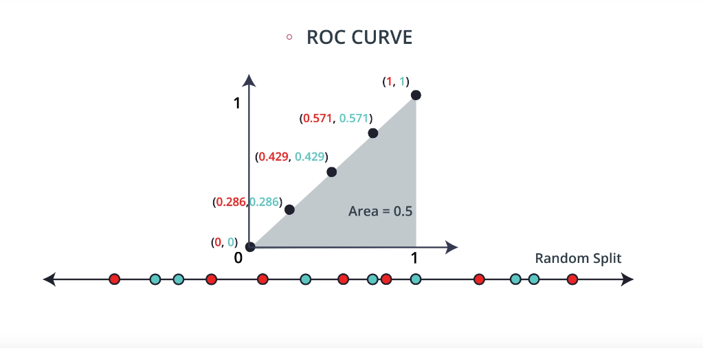
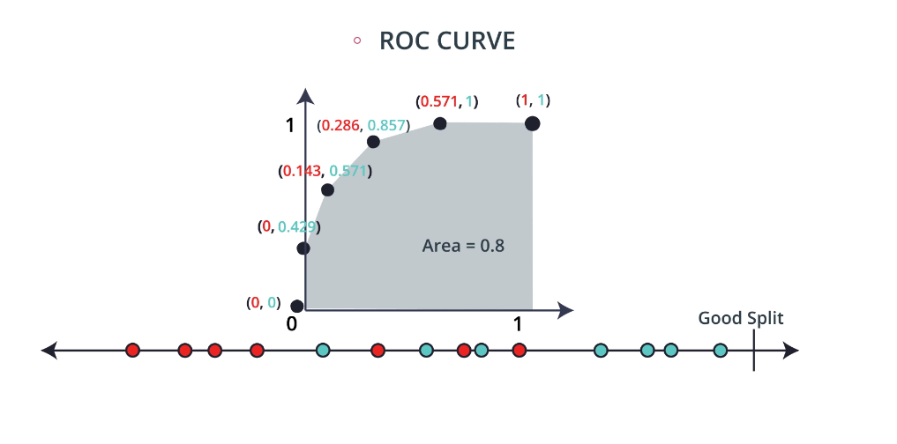
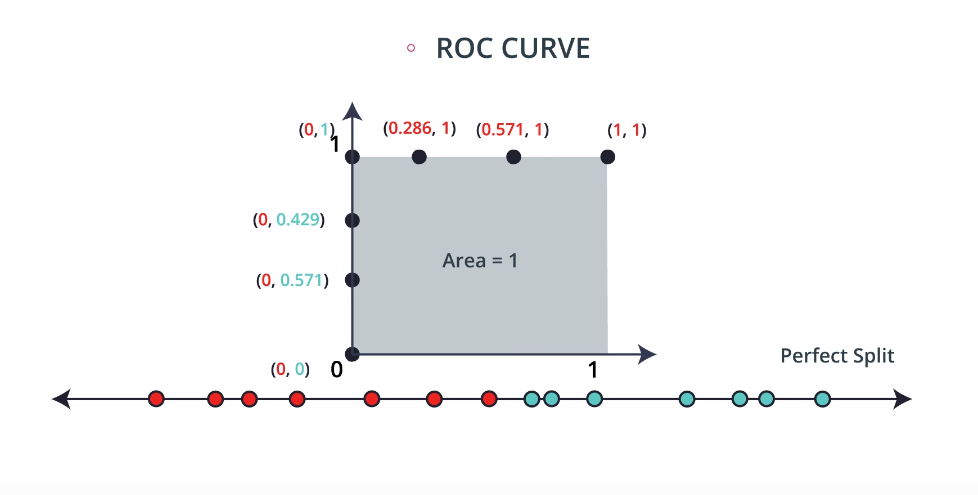
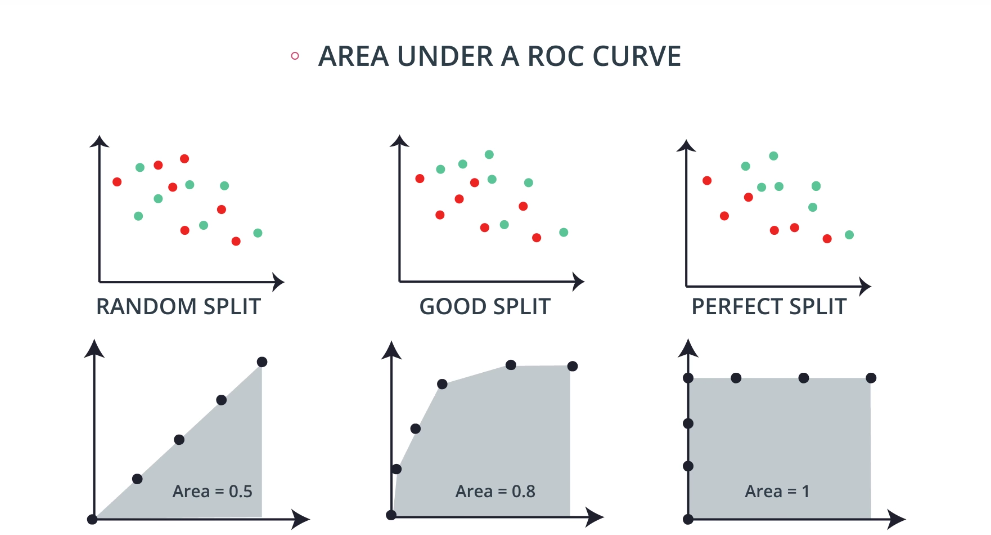

# Evaluation Metrics

## 1. Intro

## 2. Confusion Matrix

## 3. Confusion Matrix 2

## 4. Accuracy 

## 5. Accuracy 2

## 6. When accuracy won't work

## 7. False Negatives and Positives

## 8. Precision and Recall

## 9. Precision

## 10. Recall

## 11. ROC Curve

True Positive Rate = True Positives / All Positives

False Positive Rate = False Positives / All Negatives

