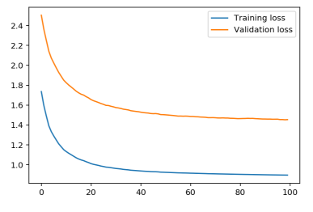
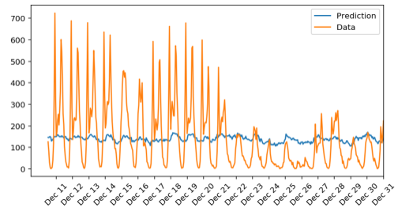
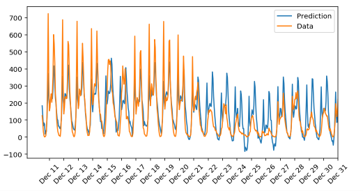

# Predicting Bike Sharing Data

 * [Your First Neural Network](Your_first_neural_network.ipynb)

## Training the Network - Wrong Formula

| Iterations | Learning Rate | Hidden Nodes | Loss Graph | Predictions |
| ---------- | ------------- | ------------ | ---------- | ----------- |
| 100 | 0.1 | 2 |  |  |
| 500 | 0.1 | 2 |  |  |
| 100 | 0.5 | 2 |  |  |
| 100 | 0.1 | 5 |  |  |
| 500 | 0.01 | 4 |  |  |
| 400 | 0.2 | 8 |  |  |
| 400 | 0.3 | 6 |  |  |
| 500 | 0.2 | 12 |  |  |

## Training the Network - Correct Formula

| Iterations | Learning Rate | Hidden Nodes | Loss Graph | Predictions |
| ---------- | ------------- | ------------ | ---------- | ----------- |
| 100 | 0.1 | 2 |  |  |
| 500 | 0.2 | 24 |  |  |
 
 ## With Loss output.
 
 Goal is Training Loss on *0.09* and Validation Loss on *0.18*
 
| Iterations | Learning Rate | Hidden Nodes | Training Loss | Validation Loss |
| ---------- | ------------- | ------------ | ---------- | ----------- |
| 500 | 0.1 | 40 | 0.417 | 0.685 |
| 750 | 0.1 | 40 | 0.336 | 0.554 |
| 750 | 0.15 | 45 | 0.324 | 0.489 |
| 1000 | 0.15 | 45 | 0.297 | 0.464 |
| 1000 | 0.25 | 45 | 0.262 | 0.441 |
| 2000 | 0.08 | 20 | 0.324 | 0.527 |
| 20000 | 0.01 | 25 | 0.286 | 0.452 |
| 20000 | 0.1 | 25 | 0.077 | 0.171 |
| 20000 | 0.1 | 30 | 0.073 | 0.169 |
| 20000 | 0.15 | 25 | 0.066 | 0.159 |
| 15000 | 0.15 | 25 | 0.068 | 0.155 |
| 12500 | 0.15 | 25 | 0.074 | 0.173 |
| 10000 | 0.16 | 25 | 0.081 | 0.219 |
| 10000 | 0.18 | 25 | 0.085 | 0.223 |
| 10000 | 0.2 | 25 | 0.077 | 0.175 |
| 10000 | 0.23 | 25 | 0.083 | 0.232 |
| 10000 | 0.2 | 27 | 0.090 | 0.187 |
| 12000 | 0.2 | 25 | 0.058 | 0.158 |
| 11000 | 0.2 | 25 | 0.071 | 0.210 |
| 10000 | 0.21 | 25 | 0.072 | 0.152 |
| 10000 | 0.22 | 25 | 0.073 | 0.170 |
| 10000 | 0.215 | 25 | 0.073 | 0.165 |
| 10000 | 0.205 | 25 | 0.088 | 0.169 |
| 10000 | 0.212 | 25 | 0.080 | 0.190 |
| 15000 | 0.18 | 15 | 0.069 | 0.187 |
| 15000 | 0.2 | 15 | 0.057 | 0.138 |
| 13000 | 0.2 | 15 | 0.062 | 0.144 |
| 10000 | 0.2 | 15 | 0.070 | 0.169 |
| 10000 | 0.22 | 15 | 0.070 | 0.152 |
| 11000 | 0.23 | 15 | 0.067 | 0.140 |
