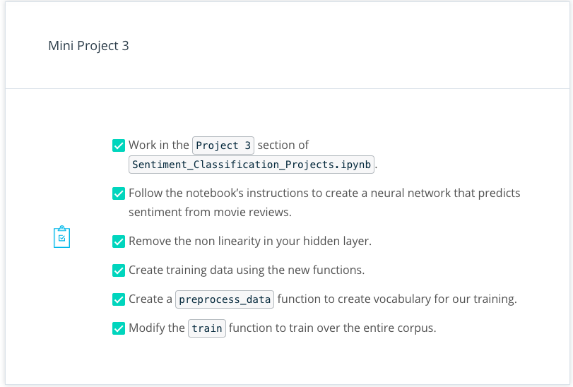
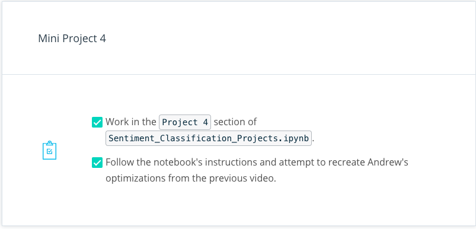
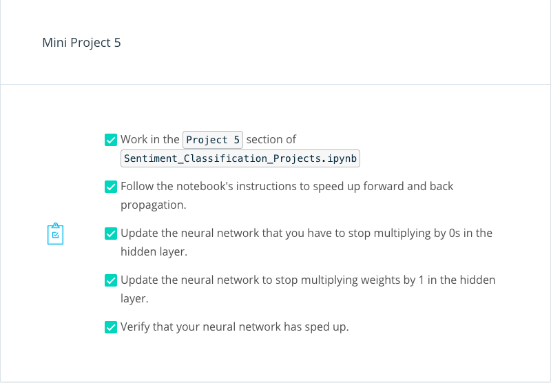
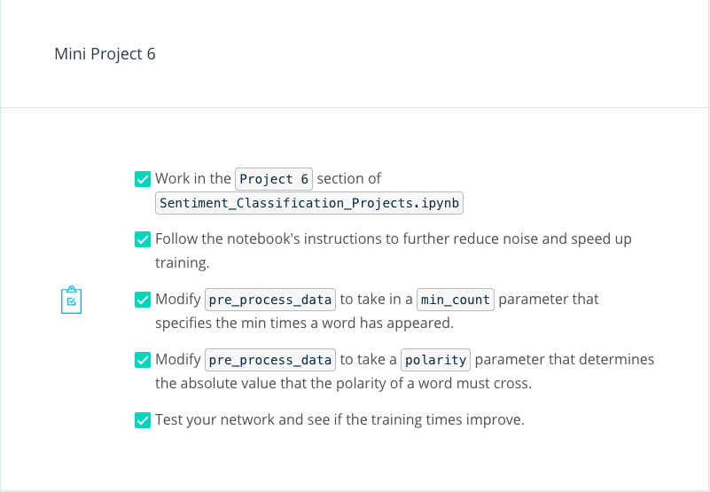

# Sentiment Analysis

 * [Sentimand Classification Notebook](Sentiment_Classification_Projects.ipynb)
 * [Sentimand Classification Solution Notebook](Sentiment_Classification_Solutions.ipynb)

## 1. Introducing Andrew Trask

[](http://scrier.myqnapcloud.com:8080/share.cgi?ssid=0MZqBkd&ep=&path=%2FDeep.Learning%2F2.Neural-Networks%2F7.Sentiment-Analysis%2Freadme&filename=1_-_Introducing_Andrew_Trask.mp4&fid=0MZqBkd&open=normal)

## 2. Meet Andrew

[](http://scrier.myqnapcloud.com:8080/share.cgi?ssid=0MZqBkd&ep=&path=%2FDeep.Learning%2F2.Neural-Networks%2F7.Sentiment-Analysis%2Freadme&filename=2_-_Andrew_Trask_-_Intro.mp4&fid=0MZqBkd&open=normal)

## 3. Materials

As you follow along this lesson, it's extremely important that you open the Jupyter notebook and attempt the exercises. 
Much of the value in this experience will come from seeing how your solution is different from Andrew's and playing 
around with the code in your own way. Make this lesson count!

### Workspace

The best way to open the notebook is to click [here](https://classroom.udacity.com/nanodegrees/nd101/parts/73a7fe8e-4354-4362-939d-a8bf2bae870d/modules/e6a4e4a1-98a9-4afe-a744-7ae6a59c01b8/lessons/5c99d8a0-1f9a-4eac-b610-759cf639d9a5/concepts/3cc08c9f-50e9-4650-a67e-179a3cbb9dcf), which will open it in a new window. We recommend you to work on the 
notebook in that window, and watch the videos in this one. You can also get to the notebook by clicking the "Next" 
button in the classroom.

If you want to download the notebooks yourself, you can clone them from [our GitHub repository](https://github.com/udacity/deep-learning). You can either download 
the repository with `git clone https://github.com/udacity/deep-learning.git`, or download it as an archive file from [this 
link](https://github.com/udacity/deep-learning/archive/master.zip).

This lesson uses the following files:

 * `Sentiment_Classification_Projects.ipynb` - a notebook you will use to following along and work on lesson mini 
 projects.
 * `Sentiment_Classification_Solutions.ipynb` - a notebook that includes Andrew’s solutions to the lesson projects, 
 which you can use for reference
 * A notebook for the solution for each mini project.
 * `reviews.txt` - a collection of 25 thousand movie reviews
 * `labels.txt` - positive/negative sentiment labels for the associated reviews in reviews.txt

**Note:** the notebooks for these lessons have been updated since the videos were recorded. In most cases that just means 
your notebook will contain more hints and explanatory text than what you see in the videos, but there may be some minor 
differences in the code as well. With these changes, you still will be able to follow along with the lessons, and 
should have an easier time understanding the project material.

### Solutions

If you need help, feel free to look at the solutions in the same folder.

## 5. Framing the Problem

[](http://scrier.myqnapcloud.com:8080/share.cgi?ssid=0MZqBkd&ep=&path=%2FDeep.Learning%2F2.Neural-Networks%2F7.Sentiment-Analysis%2Freadme&filename=3_-_Framing_the_Problem.mp4&fid=0MZqBkd&open=normal)

## 7. Mini Project 1 Solution

[](http://scrier.myqnapcloud.com:8080/share.cgi?ssid=0MZqBkd&ep=&path=%2FDeep.Learning%2F2.Neural-Networks%2F7.Sentiment-Analysis%2Freadme&filename=4_-_Mini_Project_1_Solution.mp4&fid=0MZqBkd&open=normal)

## 8. Transforming Text into Numbers 

[](http://scrier.myqnapcloud.com:8080/share.cgi?ssid=0MZqBkd&ep=&path=%2FDeep.Learning%2F2.Neural-Networks%2F7.Sentiment-Analysis%2Freadme&filename=5_-_Transforming_Text_into_Numbers.mp4&fid=0MZqBkd&open=normal)

## 9. Mini Project 2

### Instructions

In the following mini project, you'll convert the inputs and outputs of the dataset into numbers. Namely, you will 
convert each review string into a vector, and each label into a 0 or 1. You’ll need to make a few additions to the 
notebook, but the main work will be implementing two functions, whose signatures are shown below:

```python
def update_input_layer(review):
    """ Modify the global layer_0 to represent the vector form of review.
    The element at a given index of layer_0 should represent \
    how many times the given word occurs in the review.
    Args:
        review(string) - the string of the review
    Returns:
        None
    """
    global layer_0
    # clear out previous state, reset the layer to be all 0s
    layer_0 *= 0
    ## Your code here
    pass
```

```python
def get_target_for_label(label):
    """Convert a label to `0` or `1`.
    Args:
        label(string) - Either "POSITIVE" or "NEGATIVE".
    Returns:
        `0` or `1`.
    """
    pass
```

## 10. Mini Project 2 Solution

[](http://scrier.myqnapcloud.com:8080/share.cgi?ssid=0MZqBkd&ep=&path=%2FDeep.Learning%2F2.Neural-Networks%2F7.Sentiment-Analysis%2Freadme&filename=6_-_Mini_Project_2_Solution.mp4&fid=0MZqBkd&open=normal)

## 11. Building a Neural Network

[](http://scrier.myqnapcloud.com:8080/share.cgi?ssid=0MZqBkd&ep=&path=%2FDeep.Learning%2F2.Neural-Networks%2F7.Sentiment-Analysis%2Freadme&filename=7_-_Building_a_Neural_Network.mp4&fid=0MZqBkd&open=normal)

## 12. Mini Project 3

### Instructions

In this mini project, you'll modify your old neural network for this specific problem. Here are the specific steps 
you'll be doing:



## 13. Mini Project 3 Solution

[](http://scrier.myqnapcloud.com:8080/share.cgi?ssid=0MZqBkd&ep=&path=%2FDeep.Learning%2F2.Neural-Networks%2F7.Sentiment-Analysis%2Freadme&filename=8_-_Mini_Project_3_Solution.mp4&fid=0MZqBkd&open=normal)

## 14. Understanding Neural Noise

[](http://scrier.myqnapcloud.com:8080/share.cgi?ssid=0MZqBkd&ep=&path=%2FDeep.Learning%2F2.Neural-Networks%2F7.Sentiment-Analysis%2Freadme&filename=9_-_Understanding_Neural_Noise.mp4&fid=0MZqBkd&open=normal)

## 15. Mini Project 4

### Instructions

In this mini-project, you'll recreate Andrew's work from the previous video to reduce the noise in the neural network. 
Follow the instructions in the notebook and you should have no problems.



## 16. Understanding Inefficiencies in our Network

[](http://scrier.myqnapcloud.com:8080/share.cgi?ssid=0MZqBkd&ep=&path=%2FDeep.Learning%2F2.Neural-Networks%2F7.Sentiment-Analysis%2Freadme&filename=10_-_Understanding_Inefficiencies_in_our_Network.mp4&fid=0MZqBkd&open=normal)

## 17. Mini Project 5

### Instructions

Congratulations on making it all the way to the fifth project! In this mini project, you'll dramatically improve the 
performance of your network using some of the simple ideas Andrew mentioned. By the end, you'll see how your network 
can train far faster than before! Here are the specific steps:



## 18. Mini Project 5 Solution

[](http://scrier.myqnapcloud.com:8080/share.cgi?ssid=0MZqBkd&ep=&path=%2FDeep.Learning%2F2.Neural-Networks%2F7.Sentiment-Analysis%2Freadme&filename=11_-_Mini_Project_5_Solution.mp4&fid=0MZqBkd&open=normal)

## 19. Further Noise Reduction

[](http://scrier.myqnapcloud.com:8080/share.cgi?ssid=0MZqBkd&ep=&path=%2FDeep.Learning%2F2.Neural-Networks%2F7.Sentiment-Analysis%2Freadme&filename=12_-_Further_Noise_Reduction.mp4&fid=0MZqBkd&open=normal)

## 20. Mini Project 6

### Instructions

You're almost there! In this final mini project, you'll further prune your input data to only use words that have 
significant signaling power. This will help you improve training time and reduce the size of your training set. Here 
are your specific instructions:



## 21. Mini Project 6 Solution

[](http://scrier.myqnapcloud.com:8080/share.cgi?ssid=0MZqBkd&ep=&path=%2FDeep.Learning%2F2.Neural-Networks%2F7.Sentiment-Analysis%2Freadme&filename=13_-_Mini_Project_6_Solution.mp4&fid=0MZqBkd&open=normal)

**Note:**

Correction: at 1:30, Andrew says the distribution "centers around one". He meant to say it centers around zero.

## 22. Analysis: What's Going on in the Weights?

[](http://scrier.myqnapcloud.com:8080/share.cgi?ssid=0MZqBkd&ep=&path=%2FDeep.Learning%2F2.Neural-Networks%2F7.Sentiment-Analysis%2Freadme&filename=14_-_Analysis:_What's_Going_on_in_the_Weights.mp4&fid=0MZqBkd&open=normal)

## 23. Conclusion

[](http://scrier.myqnapcloud.com:8080/share.cgi?ssid=0MZqBkd&ep=&path=%2FDeep.Learning%2F2.Neural-Networks%2F7.Sentiment-Analysis%2Freadme&filename=15_-_Andrew_Trask_-_Outro.mp4&fid=0MZqBkd&open=normal)
