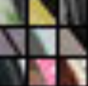
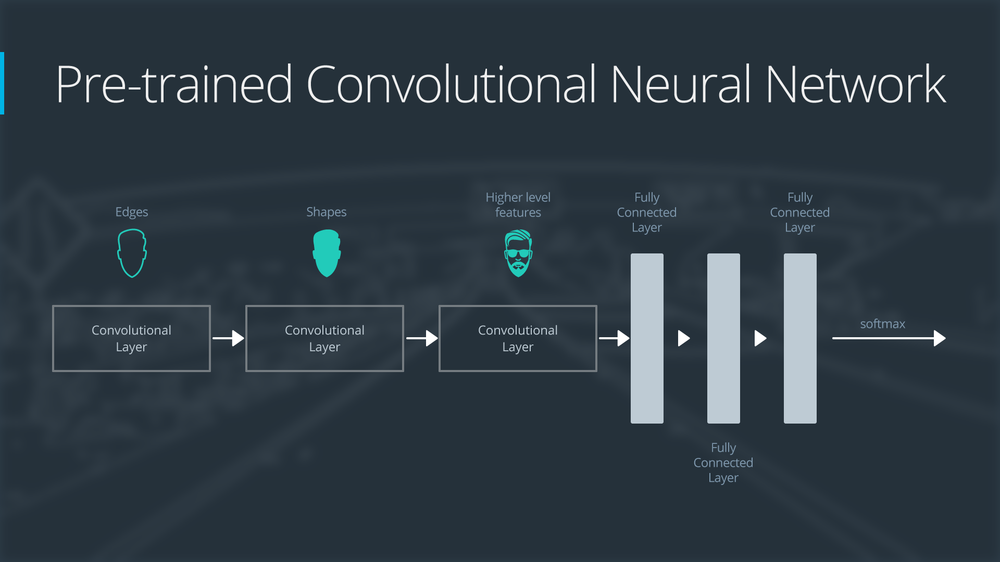
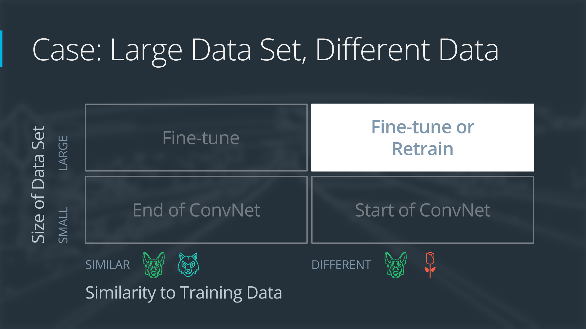

# Convulutional Neural Networks

 * [Bottleneck Features Notebook](bottleneck_features.ipynb)
 * [Cifar 10 Augmentation Notebook](cifar10_augmentation.ipynb)
 * [Cifar 10 CNN Notebook](cifar10_cnn.ipynb)
 * [Cifar 10 MLP Notebook](cifar10_mlp.ipynb)
 * [Convolutional Dimensions](conv-dims.py)
 * [Convolutional Visualization Notebook](conv_visualization.ipynb)
 * [MNIST MLP Notebook](mnist_mlp.ipynb)
 * [Transfer Learning Notebook](transfer_learning.ipynb)

## 2. Applications of CNN's

 * Read about the [WaveNet](https://deepmind.com/blog/wavenet-generative-model-raw-audio/) model.
   * Why train an A.I. to talk, when you can train it to sing ;)? In April 2017, researchers used a variant of the WaveNet model to generate songs. The original paper and demo can be found here.
 * Learn about CNNs [for text classification](http://www.wildml.com/2015/12/implementing-a-cnn-for-text-classification-in-tensorflow/).
   * You might like to sign up for the author's [Deep Learning Newsletter](https://www.getrevue.co/profile/wildml)!
 * Read about [Facebook's novel CNN](https://code.facebook.com/posts/1978007565818999/a-novel-approach-to-neural-machine-translation/) approach for language translation that achieves state-of-the-art accuracy at nine times the speed of RNN models.
 * Play [Atari games](https://deepmind.com/research/dqn/) with a CNN and reinforcement learning. You can [download](https://sites.google.com/a/deepmind.com/dqn/) the code that comes with this paper.
  * If you would like to play around with some beginner code (for deep reinforcement learning), you're encouraged to check out Andrej Karpathy's [post](http://karpathy.github.io/2016/05/31/rl/).
 * Play [pictionary](https://quickdraw.withgoogle.com/#) with a CNN!
  * Also check out all of the other cool implementations on the [A.I. Experiments](https://aiexperiments.withgoogle.com/) website. Be sure not to miss [AutoDraw](https://www.autodraw.com/)!
 * Read more about [AlphaGo](https://deepmind.com/research/alphago/).
  * Check out [this article](https://www.technologyreview.com/s/604273/finding-solace-in-defeat-by-artificial-intelligence/?set=604287), which asks the question: If mastering Go “requires human intuition,” what is it like to have a piece of one’s humanity challenged?
 * Check out these really cool videos with drones that are powered by CNNs.
  * Here's an interview with a startup - [Intelligent Flying Machines (IFM)](https://www.youtube.com/watch?v=AMDiR61f86Y).
  * Outdoor autonomous navigation is typically accomplished through the use of the [global positioning system (GPS)](http://www.droneomega.com/gps-drone-navigation-works/), but here's a demo with a CNN-powered autonomous drone.
 * If you're excited about using CNNs in self-driving cars, you're encouraged to check out:
  * our [Self-Driving Car Engineer Nanodegree](https://www.udacity.com/course/self-driving-car-engineer-nanodegree--nd013), where we classify signs in the [German Traffic Sign](http://benchmark.ini.rub.de/?section=gtsrb&subsection=dataset) dataset in [this project](https://github.com/udacity/CarND-Traffic-Sign-Classifier-Project).
  * our [Machine Learning Engineer Nanodegree](https://www.udacity.com/course/machine-learning-engineer-nanodegree--nd009), where we classify house numbers from the [Street View House Numbers](http://ufldl.stanford.edu/housenumbers/) dataset in [this project](https://github.com/udacity/machine-learning/tree/master/projects/digit_recognition).
  * this [series of blog posts](https://pythonprogramming.net/game-frames-open-cv-python-plays-gta-v/) that details how to train a CNN in Python to produce a self-driving A.I. to play Grand Theft Auto V.
 * Check out some additional applications not mentioned in the video.
  * Some of the world's most famous paintings have been [turned into 3D](http://www.businessinsider.com/3d-printed-works-of-art-for-the-blind-2016-1) for the visually impaired. Although the article does not mention how this was done, we note that it is possible to use a CNN to [predict depth](https://www.cs.nyu.edu/~deigen/depth/) from a single image.
  * Check out [this research](https://research.googleblog.com/2017/03/assisting-pathologists-in-detecting.html) that uses CNNs to localize breast cancer.
  * CNNs are used to [save endangered species](https://blogs.nvidia.com/blog/2016/11/04/saving-endangered-species/?adbsc=social_20170303_70517416)!
  * An app called [FaceApp](http://www.digitaltrends.com/photography/faceapp-neural-net-image-editing/) uses a CNN to make you smile in a picture or change genders.
  
## 5. MLPs for Image Classification

 * Check out the [first research paper](https://www.cs.toronto.edu/~hinton/absps/JMLRdropout.pdf) to propose dropout as a technique for overfitting.
 * Here's the Keras [documentation](https://keras.io/layers/core/#flatten) for the Flatten layer.
 * If you'd like more information on activation functions, check out this [website](http://cs231n.github.io/neural-networks-1/#actfun).

## 6. Categorical Cross-Entropy

 * If you'd like more details about fully connected layers in Keras, check out the [documentation](https://keras.io/layers/core/) for the Dense layer. You can change the way the weights are initialized through supplying values for the kernel_initializer and bias_initializer parameters. Note that the default values are 'glorot_uniform', and 'zeros', respectively. You can read more about how each of these initializers work in the corresponding Keras documentation.
 * There are many different [loss functions](https://keras.io/losses/) in Keras. For this lesson, we will only use categorical_crossentropy.
 * Check out the [list of available optimizers](https://keras.io/optimizers/) in Keras. The optimizer is specified when you compile the model (in Step 7 of the notebook).
  * 'sgd' : SGD
  * 'rmsprop' : RMSprop
  * 'adagrad' : Adagrad
  * 'adadelta' : Adadelta
  * 'adam' : Adam
  * 'adamax' : Adamax
  * 'nadam' : Nadam
  * 'tfoptimizer' : TFOptimizer

```python
# compile the model
model.compile(loss='categorical_crossentropy', optimizer='rmsprop', 
              metrics=['accuracy'])
```

## 7. Model Validation in Keras

There are many callbacks (such as ModelCheckpoint) that you can use to monitor your model during the training process. If you'd like, check out the [details](https://keras.io/callbacks/#modelcheckpoint) here. You're encouraged to begin with learning more about the EarlyStopping callback. If you'd like to see another code example of ModelCheckpoint, check out [this blog](http://machinelearningmastery.com/check-point-deep-learning-models-keras/).
```python
from keras.callbacks import ModelCheckpoint   

# train the model
checkpointer = ModelCheckpoint(filepath='mnist.model.best.hdf5', 
                               verbose=1, save_best_only=True)
hist = model.fit(X_train, y_train, batch_size=128, epochs=10,
          validation_split=0.2, callbacks=[checkpointer],
          verbose=1, shuffle=True)
```

## 14. Convulutional Layers in Keras


To create a convolutional layer in Keras, you must first import the necessary module:

```python
from keras.layers import Conv2D
```

Then, you can create a convolutional layer by using the following format:

```python
Conv2D(filters, kernel_size, strides, padding, activation='relu', input_shape)
```

### Arguments

You must pass the following arguments:

 * *filters* - The number of filters.
 * *kernel_size* - Number specifying both the height and width of the (square) convolution window.
 
There are some additional, optional arguments that you might like to tune:

 * *strides* - The stride of the convolution. If you don't specify anything, `strides` is set to `1`.
 * *padding* - One of `'valid'` or `'same'`. If you don't specify anything, `padding` is set to `'valid'`.
 * *activation* - Typically `'relu'`. If you don't specify anything, no activation is applied. You are **strongly encouraged** to add a ReLU activation function to **every** convolutional layer in your networks.
 
**NOTE**: It is possible to represent both `kernel_size` and `strides` as either a number or a tuple.

When using your convolutional layer as the first layer (appearing after the input layer) in a model, you must provide an additional `input_shape` argument:

 * *input_shape* - Tuple specifying the height, width, and depth (in that order) of the input.
 
**NOTE**: Do not include the `input_shape` argument if the convolutional layer is not the first layer in your network.

There are many other tunable arguments that you can set to change the behavior of your convolutional layers. To read more about these, we recommend persuing the official [documentation](https://keras.io/layers/convolutional/).

### Example #1
Say I'm constructing a CNN, and my input layer accepts grayscale images that are 200 by 200 pixels (corresponding to a 3D array with height 200, width 200, and depth 1). Then, say I'd like the next layer to be a convolutional layer with 16 filters, each with a width and height of 2. When performing the convolution, I'd like the filter to jump two pixels at a time. I also don't want the filter to extend outside of the image boundaries; in other words, I don't want to pad the image with zeros. Then, to construct this convolutional layer, I would use the following line of code:

```python
Conv2D(filters=16, kernel_size=2, strides=2, activation='relu', input_shape=(200, 200, 1))
```

### Example #2
Say I'd like the next layer in my CNN to be a convolutional layer that takes the layer constructed in Example 1 as input. Say I'd like my new layer to have 32 filters, each with a height and width of 3. When performing the convolution, I'd like the filter to jump 1 pixel at a time. I want the convolutional layer to see all regions of the previous layer, and so I don't mind if the filter hangs over the edge of the previous layer when it's performing the convolution. Then, to construct this convolutional layer, I would use the following line of code:

```python
Conv2D(filters=32, kernel_size=3, padding='same', activation='relu')
```

### Example #3
If you look up code online, it is also common to see convolutional layers in Keras in this format:

```python
Conv2D(64, (2,2), activation='relu')
```

In this case, there are 64 filters, each with a size of 2x2, and the layer has a ReLU activation function. The other arguments in the layer use the default values, so the convolution uses a stride of 1, and the padding has been set to 'valid'.

## 15. Dimensionality


Just as with neural networks, we create a CNN in Keras by first creating a `Sequential` model.

We add layers to the network by using the `.add()` method.

Copy and paste the following code into a Python executable named `conv-dims.py`:

```python
from keras.models import Sequential
from keras.layers import Conv2D

model = Sequential()
model.add(Conv2D(filters=16, kernel_size=2, strides=2, padding='valid', 
    activation='relu', input_shape=(200, 200, 1)))
model.summary()
```

We will not train this CNN; instead, we'll use the executable to study how the dimensionality of the convolutional layer changes, as a function of the supplied arguments.

Run `python path/to/conv-dims.py` and look at the output. It should appear as follows:


Do the dimensions of the convolutional layer line up with your expectations?

Feel free to change the values assigned to the arguments (`filters`, `kernel_size`, etc) in your `conv-dims.py` file.

Take note of how the **number of parameters** in the convolutional layer changes. This corresponds to the value under `Param #` in the printed output. In the figure above, the convolutional layer has `80` parameters.

Also notice how the **shape** of the convolutional layer changes. This corresponds to the value under `Output Shape` in the printed output. In the figure above, `None` corresponds to the batch size, and the convolutional layer has a height of *100*, width of *100*, and depth of *16*.

### Formula: Number of Parameters in a Convolutional Layer
The number of parameters in a convolutional layer depends on the supplied values of filters, kernel_size, and input_shape. Let's define a few variables:

 * `K` - the number of filters in the convolutional layer
 * `F` - the height and width of the convolutional filters
 * `D_in` - the depth of the previous layer

Notice that `K` = `filters`, and `F` = `kernel_size`. Likewise, `D_in` is the last value in the `input_shape` tuple.

Since there are `F*F*D_in` weights per filter, and the convolutional layer is composed of `K` filters, the total number of weights in the convolutional layer is `K*F*F*D_in`. Since there is one bias term per filter, the convolutional layer has `K` biases. Thus, the **number of parameters** in the convolutional layer is given by `K*F*F*D_in + K`.

### Formula: Shape of a Convolutional Layer
The shape of a convolutional layer depends on the supplied values of `kernel_size`, `input_shape`, `padding`, and `stride`. Let's define a few variables:

 * `K` - the number of filters in the convolutional layer
 * `F` - the height and width of the convolutional filters
 * `S` - the stride of the convolution
 * `H_in` - the height of the previous layer
 * `W_in` - the width of the previous layer

Notice that `K` = `filters`, `F` = `kernel_size`, and `S` = `stride`. Likewise, `H_in` and `W_in` are the first and second value of the `input_shape` tuple, respectively.

The **depth** of the convolutional layer will always equal the number of filters `K`.

If `padding = 'same'`, then the spatial dimensions of the convolutional layer are the following:

 * **height** = ceil(float(H_in) / float(S))
 * **width** = ceil(float(W_in) / float(S))

If `padding = 'valid'`, then the spatial dimensions of the convolutional layer are the following:

 * **height** = ceil(float(H_in - F + 1) / float(S))
 * **width** = ceil(float(W_in - F + 1) / float(S))

## 16. Image Augmentation in Keras

If you have not yet launched a GPU-enabled server with AWS, you are strongly encouraged to do so before running the notebook from this video. While it is possible to train the notebook on your CPU, an AWS GPU instance will be much faster.

The Jupyter notebook described in the video can be accessed from the `aind2-cnn` GitHub repository. Navigate to the **cifar10-augmentation/** folder and open **cifar10_augmentation.ipynb**.

**Note on** `steps_per_epoch`
Recall that `fit_generator` took many parameters, including

```python
steps_per_epoch = x_train.shape[0] / batch_size
```

where `x_train.shape[0]` corresponds to the number of unique samples in the training dataset `x_train`. By setting `steps_per_epoch` to this value, we ensure that the model sees `x_train.shape[0]` augmented images in each epoch.

### Optional Resources
 * Read this [great blog post](http://machinelearningmastery.com/image-augmentation-deep-learning-keras/) that visualizes augmentations of the MNIST dataset.
 * Check out this [detailed implementation](https://blog.keras.io/building-powerful-image-classification-models-using-very-little-data.html) that uses augmentation to boost performance on a Kaggle dataset.
 * Read the Keras [documentation](https://keras.io/preprocessing/image/) on the ImageDataGenerator class.

## 17. Pooling Layers

Check out the Keras [documentation](https://keras.io/layers/pooling/) on different types of pooling layers!

## 18. Max Pooling Layers


To create a max pooling layer in Keras, you must first import the necessary module:

```python
from keras.layers import MaxPooling2D
```

Then, you can create a convolutional layer by using the following format:

```python
MaxPooling2D(pool_size, strides, padding)
```

### Arguments
You must include the following argument:

 * `pool_size` - Number specifying the height and width of the pooling window.

There are some additional, optional arguments that you might like to tune:

 * `strides` - The vertical and horizontal stride. If you don't specify anything, `strides` will default to `pool_size`.
 * `padding` - One of `'valid'` or `'same'`. If you don't specify anything, `padding` is set to `'valid'`.

**NOTE:** It is possible to represent both `pool_size` and `strides` as either a number or a tuple.

You are also encouraged to read the official [documentation](https://keras.io/layers/pooling/#maxpooling2d).

### Example

Say I'm constructing a CNN, and I'd like to reduce the dimensionality of a convolutional layer by following it with a max pooling layer. Say the convolutional layer has size `(100, 100, 15)`, and I'd like the max pooling layer to have size `(50, 50, 15)`. I can do this by using a 2x2 window in my max pooling layer, with a stride of 2, which could be constructed in the following line of code:

```python
MaxPooling2D(pool_size=2, strides=2)
```

If you'd instead like to use a stride of 1, but still keep the size of the window at 2x2, then you'd use:

```python
MaxPooling2D(pool_size=2, strides=1)
```

### Checking the Dimensionality of Max Pooling Layers

Copy and paste the following code into a Python executable named `pool-dims.py`:

```python
from keras.models import Sequential
from keras.layers import MaxPooling2D

model = Sequential()
model.add(MaxPooling2D(pool_size=2, strides=2, input_shape=(100, 100, 15)))
model.summary()
```

Run `python path/to/pool-dims.py` and look at the output. It should appear as follows:


Feel free to change the arguments in your `pool-dims.py file, and check how the shape of the max pooling layer changes.

## 20. CNNs for Image Classification

Just as with neural networks, we create a CNN in Keras by first creating a `Sequential` model.

```python
from keras.models import Sequential
```

We import several layers, including layers that are familiar from neural networks, and new layers that we learned about in this lesson.

```python
from keras.layers import Conv2D, MaxPooling2D, Flatten, Dense
```

As with neural networks, we add layers to the network by using the `.add()` method:

```python
model = Sequential()
model.add(Conv2D(filters=16, kernel_size=2, padding='same', activation='relu', input_shape=(32, 32, 3)))
model.add(MaxPooling2D(pool_size=2))
model.add(Conv2D(filters=32, kernel_size=2, padding='same', activation='relu'))
model.add(MaxPooling2D(pool_size=2))
model.add(Conv2D(filters=64, kernel_size=2, padding='same', activation='relu'))
model.add(MaxPooling2D(pool_size=2))
model.add(Flatten())
model.add(Dense(500, activation='relu'))
model.add(Dense(10, activation='softmax'))
```

The network begins with a sequence of three convolutional layers, followed by max pooling layers. These first six layers are designed to take the input array of image pixels and convert it to an array where all of the spatial information has been squeezed out, and only information encoding the content of the image remains. The array is then flattened to a vector in the seventh layer of the CNN. It is followed by two dense layers designed to further elucidate the content of the image. The final layer has one entry for each object class in the dataset, and has a softmax activation function, so that it returns probabilities.

**NOTE:** In the video, you might notice that convolutional layers are specified with `Convolution2D` instead of `Conv2D`. Either is fine for Keras 2.0, but `Conv2D` is preferred.

### Things to Remember
 * Always add a ReLU activation function to the `Conv2D` layers in your CNN. With the exception of the final layer in the network, `Dense` layers should also have a ReLU activation function.
 * When constructing a network for classification, the final layer in the network should be a `Dense` layer with a softmax activation function. The number of nodes in the final layer should equal the total number of classes in the dataset.
 * Have fun! If you start to feel discouraged, we recommend that you check out [Andrej Karpathy's tumblr](https://lossfunctions.tumblr.com/) with user-submitted loss functions, corresponding to models that gave their owners some trouble. Recall that the loss is supposed to decrease during training. These plots show very different behavior :).

## 21. CNNs in Keras: Practical Example

If you have not yet launched a GPU-enabled server with AWS, you are strongly encouraged to do so before running the notebooks from this video. While it is possible to train the notebooks on your CPU, an AWS GPU instance will be much faster.

The Jupyter notebooks described in the video can be accessed from the `aind2-cnn` GitHub [repository](https://github.com/udacity/aind2-cnn). Navigate to the **cifar10-classification/** folder and open **cifar10_mlp.ipynb** and **cifar10_cnn.ipynb**.

### A Note on the Validation Set

[Earlier in the lesson](https://github.com/udacity/aind2-cnn/blob/master/mnist-mlp/mnist_mlp.ipynb), we trained a neural network with validation by setting the `validation_split` argument in `model.fit` to 0.2. This removed the final 20% of the training data, which was instead used as validation data. In the notebook for this video, instead of having Keras split off the validation set for us, we hard-code the split ourselves.

### Optional Resources

 * Here's a [cheat sheet](https://s3.amazonaws.com/assets.datacamp.com/blog_assets/Keras_Cheat_Sheet_Python.pdf) for specifying neural networks (including CNNs!) in Keras.
 * Check out the CIFAR-10 Competition's [winning architecture](http://blog.kaggle.com/2015/01/02/cifar-10-competition-winners-interviews-with-dr-ben-graham-phil-culliton-zygmunt-zajac/)!

## 24. Groundbreaking CNN Architecture

 * Check out the [AlexNet](http://papers.nips.cc/paper/4824-imagenet-classification-with-deep-convolutional-neural-networks.pdf) paper!
 * Read more about [VGGNet](https://arxiv.org/pdf/1409.1556.pdf) here.
 * The [ResNet](https://arxiv.org/pdf/1512.03385v1.pdf) paper can be found here.
 * Here's the Keras [documentation](https://keras.io/applications/) for accessing some famous CNN architectures.
 * Read this [detailed treatment](http://neuralnetworksanddeeplearning.com/chap5.html) of the vanishing gradients problem.
 * Here's a GitHub [repository](https://github.com/jcjohnson/cnn-benchmarks) containing benchmarks for different CNN architectures.
 * Visit the [ImageNet Large Scale Visual Recognition Competition (ILSVRC)](http://www.image-net.org/challenges/LSVRC/) website. 

## 25. Visualization CNNs (Part 1)

If you would like to know more about interpreting CNNs and convolutional layers in particular, you are encouraged to check out these resources:

 * Here's a [section](http://cs231n.github.io/understanding-cnn/) from the Stanford's CS231n course on visualizing what CNNs learn.
 * Check out this [demonstration](https://aiexperiments.withgoogle.com/what-neural-nets-see) of a cool [OpenFrameworks](http://openframeworks.cc/) app that visualizes CNNs in real-time, from user-supplied video!
 * Here's a [demonstration](https://www.youtube.com/watch?v=AgkfIQ4IGaM&t=78s) of another visualization tool for CNNs. If you'd like to learn more about how these visualizations are made, check out this [video](https://www.youtube.com/watch?v=ghEmQSxT6tw&t=5s).
 * Here's [another visualization tool](https://medium.com/merantix/picasso-a-free-open-source-visualizer-for-cnns-d8ed3a35cfc5) that seamlessly works with CNNs in Keras and Tensorflow.
 * Read this [Keras blog post](https://blog.keras.io/how-convolutional-neural-networks-see-the-world.html) on visualizing how CNNs see the world. In this post, you can find an accessible introduction to Deep Dreams, along with code for writing your own deep dreams in Keras. When you've read that:
   * Also check out this [music video](https://www.youtube.com/watch?v=XatXy6ZhKZw) that makes use of Deep Dreams (look at 3:15-3:40)!
   * Create your own Deep Dreams (without writing any code!) using this [website](https://deepdreamgenerator.com/).
 * If you'd like to read more about interpretability of CNNs,
   * here's an [article](https://blog.openai.com/adversarial-example-research/) that details some dangers from using deep learning models (that are not yet interpretable) in real-world applications.
   * there's a lot of active research in this area. [These authors](https://arxiv.org/abs/1611.03530) recently made a step in the right direction.

# 26. Visualization CNNs (Part 2)

Let’s look at an example CNN to see how it works in action.

The CNN we will look at is trained on ImageNet as described in [this paper](http://www.matthewzeiler.com/pubs/arxive2013/eccv2014.pdf) by Zeiler and Fergus. In the images below (from the same paper), we’ll see what each layer in this network detects and see how each layer detects more and more complex ideas.


Example patterns that cause activations in the first layer of the network. These range from simple diagonal lines (top left) to green blobs (bottom middle).

The images above are from Matthew Zeiler and Rob Fergus' [deep visualization toolbox](https://www.youtube.com/watch?v=ghEmQSxT6tw), which lets us visualize what each layer in a CNN focuses on.

Each image in the above grid represents a pattern that causes the neurons in the first layer to activate - in other words, they are patterns that the first layer recognizes. The top left image shows a -45 degree line, while the middle top square shows a +45 degree line. These squares are shown below again for reference.


As visualized here, the first layer of the CNN can recognize -45 degree lines.


The first layer of the CNN is also able to recognize +45 degree lines, like the one above.

Let's now see some example images that cause such activations. The below grid of images all activated the -45 degree line. Notice how they are all selected despite the fact that they have different colors, gradients, and patterns.



Example patches that activate the -45 degree line detector in the first layer.

So, the first layer of our CNN clearly picks out very simple shapes and patterns like lines and blobs.

### Layer 2


A visualization of the second layer in the CNN. Notice how we are picking up more complex ideas like circles and stripes. The gray grid on the left represents how this layer of the CNN activates (or "what it sees") based on the corresponding images from the grid on the right.

The second layer of the CNN captures complex ideas.

As you see in the image above, the second layer of the CNN recognizes circles (second row, second column), stripes (first row, second column), and rectangles (bottom right).

**The CNN learns to do this on its own.** There is no special instruction for the CNN to focus on more complex objects in deeper layers. That's just how it normally works out when you feed training data into a CNN.

### Layer 3


A visualization of the third layer in the CNN. The gray grid on the left represents how this layer of the CNN activates (or "what it sees") based on the corresponding images from the grid on the right.

The third layer picks out complex combinations of features from the second layer. These include things like grids, and honeycombs (top left), wheels (second row, second column), and even faces (third row, third column).

We'll skip layer 4, which continues this progression, and jump right to the fifth and final layer of this CNN.

### Layer 5


A visualization of the fifth and final layer of the CNN. The gray grid on the left represents how this layer of the CNN activates (or "what it sees") based on the corresponding images from the grid on the right.

The last layer picks out the highest order ideas that we care about for classification, like dog faces, bird faces, and bicycles.

## 27. Transfer Learning

Transfer learning involves taking a pre-trained neural network and adapting the neural network to a new, different data set.

Depending on both:

 * the size of the new data set, and
 * the similarity of the new data set to the original data set

the approach for using transfer learning will be different. There are four main cases:

 * new data set is small, new data is similar to original training data
 * new data set is small, new data is different from original training data
 * new data set is large, new data is similar to original training data
 * new data set is large, new data is different from original training data


Four Cases when Using Transfer Learning

A large data set might have one million images. A small data could have two-thousand images. The dividing line between a large data set and small data set is somewhat subjective. Overfitting is a concern when using transfer learning with a small data set.

Images of dogs and images of wolves would be considered similar; the images would share common characteristics. A data set of flower images would be different from a data set of dog images.

Each of the four transfer learning cases has its own approach. In the following sections, we will look at each case one by one.

### Demonstration Network
To explain how each situation works, we will start with a generic pre-trained convolutional neural network and explain how to adjust the network for each case. Our example network contains three convolutional layers and three fully connected layers:



General Overview of a Neural Network

Here is an generalized overview of what the convolutional neural network does:

 * the first layer will detect edges in the image
 * the second layer will detect shapes
 * the third convolutional layer detects higher level features
 
Each transfer learning case will use the pre-trained convolutional neural network in a different way.

### Case 1: Small Data Set, Similar Data


Case 1: Small Data Set with Similar Data

If the new data set is small and similar to the original training data:

 * slice off the end of the neural network
 * add a new fully connected layer that matches the number of classes in the new data set
 * randomize the weights of the new fully connected layer; freeze all the weights from the pre-trained network
 * train the network to update the weights of the new fully connected layer

To avoid overfitting on the small data set, the weights of the original network will be held constant rather than re-training the weights.

Since the data sets are similar, images from each data set will have similar higher level features. Therefore most or all of the pre-trained neural network layers already contain relevant information about the new data set and should be kept.

Here's how to visualize this approach:


Neural Network with Small Data Set, Similar Data

### Case 2: Small Data Set, Different Data


Case 2: Small Data Set, Different Data

If the new data set is small and different from the original training data:

 * slice off most of the pre-trained layers near the beginning of the network
 * add to the remaining pre-trained layers a new fully connected layer that matches the number of classes in the new data set
 * randomize the weights of the new fully connected layer; freeze all the weights from the pre-trained network
 * train the network to update the weights of the new fully connected layer

Because the data set is small, overfitting is still a concern. To combat overfitting, the weights of the original neural network will be held constant, like in the first case.

But the original training set and the new data set do not share higher level features. In this case, the new network will only use the layers containing lower level features.

Here is how to visualize this approach:


Neural Network with Small Data Set, Different Data

### Case 3: Large Data Set, Similar Data


Case 3: Large Data Set, Similar Data

If the new data set is large and similar to the original training data:

 * remove the last fully connected layer and replace with a layer matching the number of classes in the new data set
 * randomly initialize the weights in the new fully connected layer
 * initialize the rest of the weights using the pre-trained weights
 * re-train the entire neural network

Overfitting is not as much of a concern when training on a large data set; therefore, you can re-train all of the weights.

Because the original training set and the new data set share higher level features, the entire neural network is used as well.

Here is how to visualize this approach:


Neural Network with Large Data Set, Similar Data

### Case 4: Large Data Set, Different Data



Case 4: Large Data Set, Different Data

If the new data set is large and different from the original training data:

 * remove the last fully connected layer and replace with a layer matching the number of classes in the new data set
 * retrain the network from scratch with randomly initialized weights
 * alternatively, you could just use the same strategy as the "large and similar" data case

Even though the data set is different from the training data, initializing the weights from the pre-trained network might make training faster. So this case is exactly the same as the case with a large, similar data set.

If using the pre-trained network as a starting point does not produce a successful model, another option is to randomly initialize the convolutional neural network weights and train the network from scratch.

Here is how to visualize this approach:


Neural Network with Large Data Set, Different Data

### Optional Resources
 * Check out this [research paper](https://arxiv.org/pdf/1411.1792.pdf) that systematically analyzes the transferability of features learned in pre-trained CNNs.
 * Read the [Nature publication](http://www.nature.com/articles/nature21056.epdf?referrer_access_token=_snzJ5POVSgpHutcNN4lEtRgN0jAjWel9jnR3ZoTv0NXpMHRAJy8Qn10ys2O4tuP9jVts1q2g1KBbk3Pd3AelZ36FalmvJLxw1ypYW0UxU7iShiMp86DmQ5Sh3wOBhXDm9idRXzicpVoBBhnUsXHzVUdYCPiVV0Slqf-Q25Ntb1SX_HAv3aFVSRgPbogozIHYQE3zSkyIghcAppAjrIkw1HtSwMvZ1PXrt6fVYXt-dvwXKEtdCN8qEHg0vbfl4_m&tracking_referrer=edition.cnn.com) detailing Sebastian Thrun's cancer-detecting CNN!

## 28. Transfer Learning in Keras

The Jupyter notebook described in the video can be accessed from the `aind2-cnn` GitHub repository linked [here](https://github.com/udacity/aind2-cnn). Navigate to the **transfer-learning/** folder and open **transfer_learning.ipynb**. If you'd like to learn how to calculate your own bottleneck features, look at **bottleneck_features.ipynb**. (You may have trouble running **bottleneck_features.ipynb** on an AWS GPU instance - if so, feel free to use the notebook on your local CPU/GPU instead!)

### Optional Resources
 * Here's the [first research paper](http://cnnlocalization.csail.mit.edu/Zhou_Learning_Deep_Features_CVPR_2016_paper.pdf) to propose GAP layers for object localization.
 * Check out this [repository](https://github.com/alexisbcook/ResNetCAM-keras) that uses a CNN for object localization.
 * Watch this [video demonstration](https://www.youtube.com/watch?v=fZvOy0VXWAI) of object localization with a CNN.
 * Check out this [repository](https://github.com/alexisbcook/keras_transfer_cifar10) that uses visualization techniques to better understand bottleneck features
 