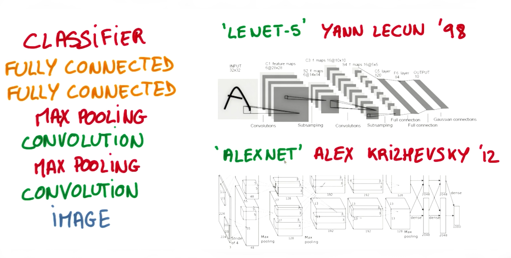

# CNNs in Tensorflow

## 1. Concolutional Layers

The image below is an example of a [convolution](https://en.wikipedia.org/wiki/Convolution) with a 3x3 filter and a stride of 1.


Convolution with 3×3 Filter. [source](http://deeplearning.stanford.edu/wiki/index.php/Feature_extraction_using_convolution)

The convolution for each 3x3 section is calculated against the weight, `[[1, 0, 1], [0, 1, 0], [1, 0, 1]]`, and then a bias is added to create the convolved feature on the right. In this case, the bias is zero.

Convolutional Layers in TensorFlow
Let's examine how to implement a convolutional layer in TensorFlow.

TensorFlow provides the `tf.nn.conv2d()`, `tf.nn.bias_add()`, and `tf.nn.relu()` functions to create your own convolutional layers.

```python
# output depth
k_output = 64

# image dimensions
image_width = 10
image_height = 10
color_channels = 3

# convolution filter dimensions
filter_size_width = 5
filter_size_height = 5

# input/image
input = tf.placeholder(
    tf.float32,
    shape=[None, image_height, image_width, color_channels])

# weight and bias
weight = tf.Variable(tf.truncated_normal(
    [filter_size_height, filter_size_width, color_channels, k_output]))
bias = tf.Variable(tf.zeros(k_output))

# apply convolution
conv_layer = tf.nn.conv2d(input, weight, strides=[1, 2, 2, 1], padding='SAME')
# add bias
conv_layer = tf.nn.bias_add(conv_layer, bias)
# apply activation function
conv_layer = tf.nn.relu(conv_layer)
```

The code above uses the `tf.nn.conv2d()` function to compute the convolution with `weight` as the filter and `[1, 2, 2, 1]` for the strides.

 * TensorFlow uses a stride for each `input dimension`, `[batch, input_height, input_width, input_channels]`.
 * We generally always set the stride for `batch` and `input_channels` (i.e. the first and fourth element in the `strides` array) to be `1`. This ensures that the model uses all batches and input channels. (_It's good practice to remove the batches or channels you want to skip from the data set rather than use a stride to skip them._)
 * You'll focus on changing `input_height` and `input_width` (while setting `batch` and `input_channels` to 1). The `input_height` and `input_width` strides are for striding the filter over `input`. This example code uses a stride of 2 with 5x5 filter over `input`. I've mentioned stride as one number because you usually have a square stride where `height = width`. When someone says they are using a stride of 2, they usually mean `tf.nn.conv2d(x, W, strides=[1, 2, 2, 1])`.

The `tf.nn.bias_add()` function adds a 1-d bias to the last dimension in a matrix. (**Note**: using `tf.add()` doesn't work when the tensors aren't the same shape.)

The `tf.nn.relu()` function applies a ReLU activation function to the layer.

# 4. Max Pooling Layers in Tensorflow

The image below is an example of [max pooling](https://en.wikipedia.org/wiki/Convolutional_neural_network#Pooling_layer) with a 2x2 filter and stride of 2. The four 2x2 colors represent each time the filter was applied to find the maximum value.


By Aphex34 (Own work) [CC BY-SA 4.0 (http://creativecommons.org/licenses/by-sa/4.0)], via Wikimedia Commons

For example, `[[1, 0], [4, 6]]` becomes `6`, because `6` is the maximum value in this set. Similarly, `[[2, 3], [6, 8]]` becomes `8`.

Conceptually, the benefit of the max pooling operation is to reduce the size of the input, and allow the neural network to focus on only the most important elements. Max pooling does this by only retaining the maximum value for each filtered area, and removing the remaining values.

TensorFlow provides the `tf.nn.max_pool()` function to apply [max pooling](https://en.wikipedia.org/wiki/Convolutional_neural_network#Pooling_layer) to your convolutional layers.

```python
...
conv_layer = tf.nn.conv2d(input, weight, strides=[1, 2, 2, 1], padding='SAME')
conv_layer = tf.nn.bias_add(conv_layer, bias)
conv_layer = tf.nn.relu(conv_layer)
# apply max pooling
conv_layer = tf.nn.max_pool(
    conv_layer,
    ksize=[1, 2, 2, 1],
    strides=[1, 2, 2, 1],
    padding='SAME')
```

The `tf.nn.max_pool()` function performs max pooling with the `ksize` parameter as the size of the filter and the `strides` parameter as the length of the stride. 2x2 filters with a stride of 2x2 are common in practice.

The `ksize` and `strides` parameters are structured as 4-element lists, with each element corresponding to a dimension of the input tensor `([batch, height, width, channels])`. For both `ksize` and `strides`, the batch and channel dimensions are typically set to `1`.

## 7. CNNs in Tensorflow

It's time to walk through an example Convolutional Neural Network (CNN) in TensorFlow.



The structure of this network follows the classic structure of CNNs, which is a mix of convolutional layers and max pooling, followed by fully-connected layers.

The code you'll be looking at is similar to what you saw in the segment on **Tensorflow** in the **Neural Networks** lesson, except we restructured the architecture of this network as a CNN.

Just like in that segment, here you'll study the line-by-line breakdown of the code. If you want, you can even [download the code](https://d17h27t6h515a5.cloudfront.net/topher/2017/February/58a61ca1_cnn/cnn.zip) and run it yourself.

Thanks to [Aymeric Damien](https://github.com/aymericdamien/TensorFlow-Examples) for providing the original TensorFlow model on which this segment is based.

Time to dive in!

### Dataset
You've seen this section of code from previous lessons. Here we're importing the MNIST dataset and using a convenient TensorFlow function to batch, scale, and one-hot encode the data.

```python
from tensorflow.examples.tutorials.mnist import input_data
mnist = input_data.read_data_sets(".", one_hot=True, reshape=False)

import tensorflow as tf

# parameters
learning_rate = 0.00001
epochs = 10
batch_size = 128

# number of samples to calculate validation and accuracy
# decrease this if you're running out of memory
test_valid_size = 256

# network Parameters
n_classes = 10  # MNIST total classes (0-9 digits)
dropout = 0.75  # dropout (probability to keep units)
```

### Weights and Biases

In the code below, we will create 3 layers alternating between convolutions and max pooling followed by a fully connected and output layer. We begin by defining the necessary weights and biases.

```python
# store weights & biases
weights = {
    'wc1': tf.Variable(tf.random_normal([5, 5, 1, 32])),
    'wc2': tf.Variable(tf.random_normal([5, 5, 32, 64])),
    'wd1': tf.Variable(tf.random_normal([7*7*64, 1024])),
    'out': tf.Variable(tf.random_normal([1024, n_classes]))}

biases = {
    'bc1': tf.Variable(tf.random_normal([32])),
    'bc2': tf.Variable(tf.random_normal([64])),
    'bd1': tf.Variable(tf.random_normal([1024])),
    'out': tf.Variable(tf.random_normal([n_classes]))}
```

### Convolutional Layers

Recall that TensorFlow provides the `tf.nn.conv2d()`, `tf.nn.bias_add()`, and `tf.nn.relu()` functions to create your own convolutional layers. To simplify our code, we define a useful function below.

```python
def conv2d(x, W, b, strides=1):
    x = tf.nn.conv2d(x, W, strides=[1, strides, strides, 1], padding='SAME')
    x = tf.nn.bias_add(x, b)
    return tf.nn.relu(x)
```

The `conv2d` function computes the convolution against weight `W`, and then adds bias `b`, before applying a ReLU activation function.

### Max Pooling Layers

Recall that TensorFlow provides the `tf.nn.max_pool()` function to apply [max pooling](https://en.wikipedia.org/wiki/Convolutional_neural_network#Pooling_layer) to your convolutional layers. To simplify our code, we define a useful function below.

```python
def maxpool2d(x, k=2):
    return tf.nn.max_pool(
        x,
        ksize=[1, k, k, 1],
        strides=[1, k, k, 1],
        padding='SAME')
```

The `maxpool2d` function applies max pooling to layer `x` using a filter of size `k`.

### Model

The transformation of each layer to new dimensions is shown in the comments. For example, the first layer shapes the images from 28x28x1 to 28x28x32 in the convolution step. The next step applies max pooling, turning each sample into 14x14x32. All the layers are applied from `conv1` to `output`, producing 10 class predictions.

```python
def conv_net(x, weights, biases, dropout):
    # Layer 1 - 28*28*1 to 14*14*32
    conv1 = conv2d(x, weights['wc1'], biases['bc1'])
    conv1 = maxpool2d(conv1, k=2)

    # Layer 2 - 14*14*32 to 7*7*64
    conv2 = conv2d(conv1, weights['wc2'], biases['bc2'])
    conv2 = maxpool2d(conv2, k=2)

    # Fully connected layer - 7*7*64 to 1024
    fc1 = tf.reshape(conv2, [-1, weights['wd1'].get_shape().as_list()[0]])
    fc1 = tf.add(tf.matmul(fc1, weights['wd1']), biases['bd1'])
    fc1 = tf.nn.relu(fc1)
    fc1 = tf.nn.dropout(fc1, dropout)

    # Output Layer - class prediction - 1024 to 10
    out = tf.add(tf.matmul(fc1, weights['out']), biases['out'])
    return out
```

### Session

Now let's run it!

```python
# tf Graph input
x = tf.placeholder(tf.float32, [None, 28, 28, 1])
y = tf.placeholder(tf.float32, [None, n_classes])
keep_prob = tf.placeholder(tf.float32)

# Model
logits = conv_net(x, weights, biases, keep_prob)

# Define loss and optimizer
cost = tf.reduce_mean(\
    tf.nn.softmax_cross_entropy_with_logits(logits=logits, labels=y))
optimizer = tf.train.GradientDescentOptimizer(learning_rate=learning_rate)\
    .minimize(cost)

# Accuracy
correct_pred = tf.equal(tf.argmax(logits, 1), tf.argmax(y, 1))
accuracy = tf.reduce_mean(tf.cast(correct_pred, tf.float32))

# Initializing the variables
init = tf.global_variables_initializer()

# Launch the graph
with tf.Session() as sess:
    sess.run(init)

    for epoch in range(epochs):
        for batch in range(mnist.train.num_examples//batch_size):
            batch_x, batch_y = mnist.train.next_batch(batch_size)
            sess.run(optimizer, feed_dict={
                x: batch_x,
                y: batch_y,
                keep_prob: dropout})

            # Calculate batch loss and accuracy
            loss = sess.run(cost, feed_dict={
                x: batch_x,
                y: batch_y,
                keep_prob: 1.})
            valid_acc = sess.run(accuracy, feed_dict={
                x: mnist.validation.images[:test_valid_size],
                y: mnist.validation.labels[:test_valid_size],
                keep_prob: 1.})

            print('Epoch {:>2}, Batch {:>3} -'
                  'Loss: {:>10.4f} Validation Accuracy: {:.6f}'.format(
                epoch + 1,
                batch + 1,
                loss,
                valid_acc))

    # Calculate Test Accuracy
    test_acc = sess.run(accuracy, feed_dict={
        x: mnist.test.images[:test_valid_size],
        y: mnist.test.labels[:test_valid_size],
        keep_prob: 1.})
    print('Testing Accuracy: {}'.format(test_acc))
```

That's it! That is a CNN in TensorFlow.

## 8. CNNs - Additional Resources

There are many wonderful free resources that allow you to go into more depth around Convolutional Neural Networks. In this course, our goal is to give you just enough intuition to start applying this concept on real world problems so you have enough of an exposure to explore more on your own. We strongly encourage you to explore some of these resources more to reinforce your intuition and explore different ideas.

These are the resources we recommend in particular:

 * Andrej Karpathy's [CS231n Stanford course](http://cs231n.github.io/) on Convolutional Neural Networks.
 * Michael Nielsen's [free book](http://neuralnetworksanddeeplearning.com/) on Deep Learning.
 * Goodfellow, Bengio, and Courville's more advanced [free book](http://deeplearningbook.org/) on Deep Learning.
