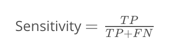
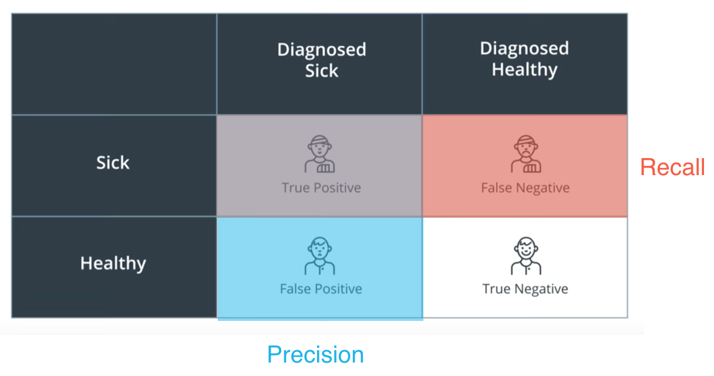

# Deep Learning for Cancer Detection

## 1. Introduction

## 2. Skin Cancer

## 3. Survival Probability of Skin Cancer

## 4. Medical Classification

## 5. The Data

## 6. Image Challenges

### Challenge

Looking at the following images, could you tell the characteristics that determine if a lesion is benign (above) or 
malignant (below)?

## 9. Training the Neural Network

## 12. Validating the Training

## 15. More on Sensitivity and Specificity

Although similar, sensitivity and specificity are not the same as precision and recall. Here are the definitions:

In the cancer example, sensitivity and specificity are the following:

 * Sensitivity: Of all the people **with** cancer, how many were correctly diagnosed?
 * Specificity: Of all the people **without** cancer, how many were correctly diagnosed?

And precision and recall are the following:

 * Recall: Of all the people who **have cancer**, how many did **we diagnose** as having cancer?
 * Precision: Of all the people **we diagnosed** with cancer, how many actually **partpart**?
 
From here we can see that Sensitivity is Recall, and the other two are not the same thing.

Trust me, we also have a hard time remembering which one is which, so here's a little trick. If you remember from 
Luis's Evaluation Metrics section, here is the [confusion matrix](https://classroom.udacity.com/nanodegrees/nd101/parts/73a7fe8e-4354-4362-939d-a8bf2bae870d/modules/e6a4e4a1-98a9-4afe-a744-7ae6a59c01b8/lessons/9ac722df-8191-44df-b7f5-ef1732b2d053/concepts/2034dd12-8ffc-4753-b8f4-c6042487ea5d):

Now, sensitivity and specificity are the rows of this matrix. More specifically, if we label

 * TP: (True Positives) Sick people that we correctly diagnosed as sick.
 * TN: (True Negatives) Healthy people that we correctly diagnosed as healthy.
 * FP: (False Positives) Healthy people that we incorrectly diagnosed as sick.
 * FN: (False Negatives) Sick people that we incorrectly diagnosed as healthy.

then:

and

And precision and recall are the top row and the left column of the matrix:

and

## 17.Solution: Diagnosing Cancer

The graph below is a histogram of the predictions our model gives in a set of images of lesions, as follows:

 * Each point in the horizontal axis is a value pp from 0 to 1.
 * Over each value pp, we locate all the lesions that our classifier predicted to have probability p of being malignant.

Here we have graphed the thresholds at 0.2, 0.5, and 0.8. Notice how:

 * At 0.2, we classify every malignant lesion correctly, yet we also send a lot of benign lesions for more testing.
 * At 0.5, we miss some malignant lesions (bad), and we send a few benign lesions for more testing.
 * At 0.8, we correctly classify most of the benign lesions, but we miss many malignant lesions (very bad).

So in this case, it's arguable that 0.2 is better.

However, for this model, there may even be a better value for the threshold. What would it be?

## 18. Refresh on ROC Curves
