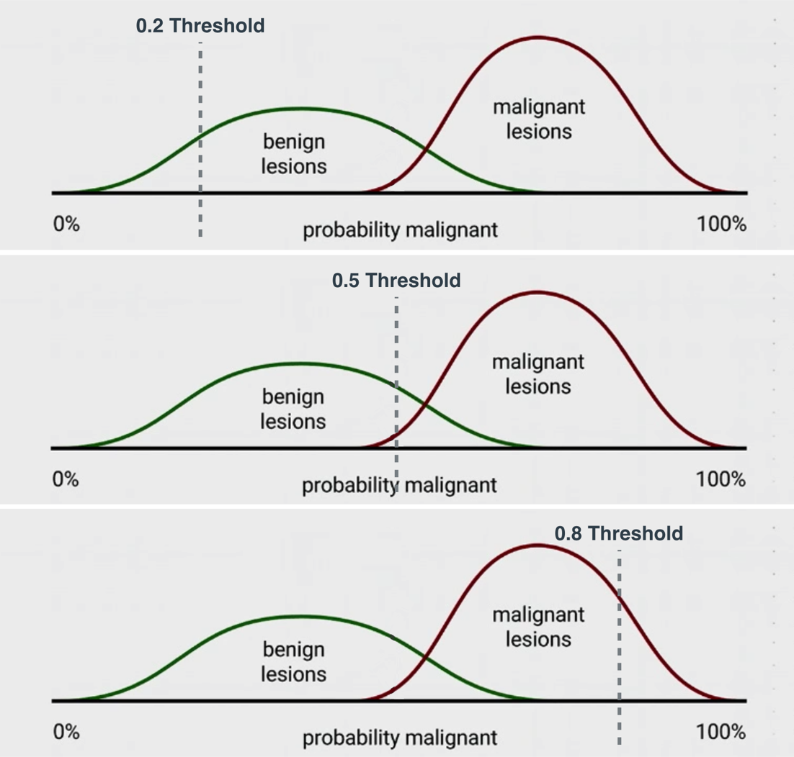
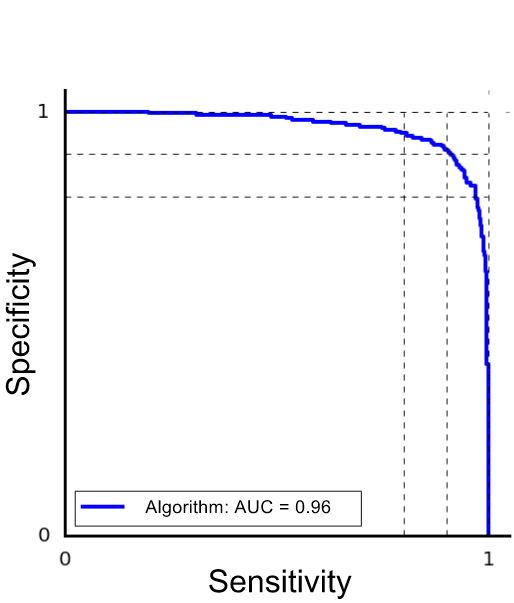
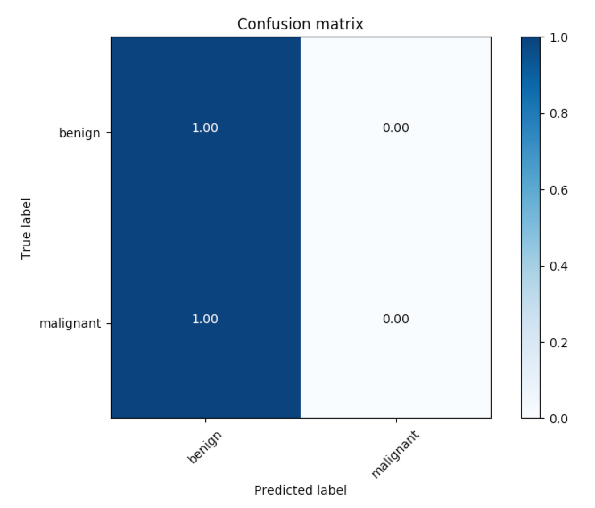

# Deep Learning for Cancer Detection

## 1. Introduction


## 2. Skin Cancer


## 3. Survival Probability of Skin Cancer


## 4. Medical Classification


## 5. The Data


## 6. Image Challenges


### Challenge

Looking at the following images, could you tell the characteristics that determine if a lesion is benign (above) or 
malignant (below)?


## 9. Training the Neural Network


## 12. Validating the Training


## 15. More on Sensitivity and Specificity

Although similar, sensitivity and specificity are not the same as precision and recall. Here are the definitions:

In the cancer example, sensitivity and specificity are the following:

 * Sensitivity: Of all the people **with** cancer, how many were correctly diagnosed?
 * Specificity: Of all the people **without** cancer, how many were correctly diagnosed?

And precision and recall are the following:

 * Recall: Of all the people who **have cancer**, how many did **we diagnose** as having cancer?
 * Precision: Of all the people **we diagnosed** with cancer, how many actually **partpart**?
 
From here we can see that Sensitivity is Recall, and the other two are not the same thing.

Trust me, we also have a hard time remembering which one is which, so here's a little trick. If you remember from 
Luis's Evaluation Metrics section, here is the [confusion matrix](https://classroom.udacity.com/nanodegrees/nd101/parts/73a7fe8e-4354-4362-939d-a8bf2bae870d/modules/e6a4e4a1-98a9-4afe-a744-7ae6a59c01b8/lessons/9ac722df-8191-44df-b7f5-ef1732b2d053/concepts/2034dd12-8ffc-4753-b8f4-c6042487ea5d):


Now, sensitivity and specificity are the rows of this matrix. More specifically, if we label

 * TP: (True Positives) Sick people that we correctly diagnosed as sick.
 * TN: (True Negatives) Healthy people that we correctly diagnosed as healthy.
 * FP: (False Positives) Healthy people that we incorrectly diagnosed as sick.
 * FN: (False Negatives) Sick people that we incorrectly diagnosed as healthy.

then:


and


And precision and recall are the top row and the left column of the matrix:


and


## 17.Solution: Diagnosing Cancer


The graph below is a histogram of the predictions our model gives in a set of images of lesions, as follows:

 * Each point in the horizontal axis is a value pp from 0 to 1.
 * Over each value pp, we locate all the lesions that our classifier predicted to have probability p of being malignant.



Here we have graphed the thresholds at 0.2, 0.5, and 0.8. Notice how:

 * At 0.2, we classify every malignant lesion correctly, yet we also send a lot of benign lesions for more testing.
 * At 0.5, we miss some malignant lesions (bad), and we send a few benign lesions for more testing.
 * At 0.8, we correctly classify most of the benign lesions, but we miss many malignant lesions (very bad).

So in this case, it's arguable that 0.2 is better.

However, for this model, there may even be a better value for the threshold. What would it be?

## 18. Refresh on ROC Curves

If you'd like to refresh your memory on ROC curves, here's the link to the [ROC Curves](../../2.Neural-Networks/4.Evaluation-Metrics/README.md) 
video from Luis's Evaluation Metrics section.

In here, the curves have been introduced as follows, where in the horizontal axis we plot the True Positive Rate, and in the vertical axis we plot the False Positive Rate.


 
However, you'll see that in this section, I will use a different ROC Curve. The one I use looks like I flipped it 
sideways, like this:



And there's a really cool reason why I use this one. And it's because it's the curve we get when we plot the 
sensitivity in the horizontal axis, and the specificity in the vertical axis!

Let me be more specific (yes pun intended). Let's use the same histogram as in the last section.


Recall that the values in the horizontal axis are all the possible thresholds. For any threshold pp between 0 and 1, 
the verdict of the model will be the following: "Any lesion to the left of this threshold will be considered benign, 
and any lesion to the right of this threshold will be considered malignant, and sent for more tests."

Now, for this particular model, we calculate the sensitivity and specificity as follows:

 * Sensitivity: Out of all the malignant lesions, what percentage are to the right of the threshold (correctly 
 classified)?
 * Specificity: Out of all the benign lesions, what percentage are to the left of the threshold (correctly classified)?
 
And we plot that point, where the coordinates are (Sensitivity, Specificity). If we plot all the points corresponding 
to each of the possible thresholds between 0% and 100%, we'll get the ROC curve that I drew above. Therefore, we can also refer to the ROC curve as the Sensitivity-Specificity Curve.

And finally, here's a little animation of the ROC curve getting drawn, as the threshold moves from 0 to 1.

[](http://scrier.myqnapcloud.com:8080/share.cgi?ssid=0MZqBkd&ep=&path=%2FDeep.Learning%2F3.Convulutional-Networks%2F8.Deep-Learning-for-Cancer-Detection%2Freadme&filename=17%20-%20Images.mp4&fid=0MZqBkd&open=normal)

## 19. Quiz: ROC Curve

[](http://scrier.myqnapcloud.com:8080/share.cgi?ssid=0MZqBkd&ep=&path=%2FDeep.Learning%2F3.Convulutional-Networks%2F8.Deep-Learning-for-Cancer-Detection%2Freadme&filename=18%20-%2017%20Quiz%20ROC%20Curve%201%20PT2%20V1.mp4&fid=0MZqBkd&open=normal)

## 20. Solution: ROC Curve

[](http://scrier.myqnapcloud.com:8080/share.cgi?ssid=0MZqBkd&ep=&path=%2FDeep.Learning%2F3.Convulutional-Networks%2F8.Deep-Learning-for-Cancer-Detection%2Freadme&filename=19%20-%20Solution%20ROC%20Curve.mp4&fid=0MZqBkd&open=normal)

## 21. Comparing our Results with Doctors

[](http://scrier.myqnapcloud.com:8080/share.cgi?ssid=0MZqBkd&ep=&path=%2FDeep.Learning%2F3.Convulutional-Networks%2F8.Deep-Learning-for-Cancer-Detection%2Freadme&filename=20%20-%20ROC%20Curve.mp4&fid=0MZqBkd&open=normal)

## 22. Visualization

[](http://scrier.myqnapcloud.com:8080/share.cgi?ssid=0MZqBkd&ep=&path=%2FDeep.Learning%2F3.Convulutional-Networks%2F8.Deep-Learning-for-Cancer-Detection%2Freadme&filename=21%20-%20Visualization.mp4&fid=0MZqBkd&open=normal)

## 23. What is the network looking at?

[](http://scrier.myqnapcloud.com:8080/share.cgi?ssid=0MZqBkd&ep=&path=%2FDeep.Learning%2F3.Convulutional-Networks%2F8.Deep-Learning-for-Cancer-Detection%2Freadme&filename=22%20-%20What%20Is%20The%20Neural%20Network%20Looking%20At.mp4&fid=0MZqBkd&open=normal)

## 24. Refresh on Confusion Matrices

In the Evaluation Metrics section, we learned about confusion matrices (If you need a refresher, here's the [video](https://youtu.be/9GLNjmMUB_4)).

But confusion matrices can be much larger than 2 \times 2 2×2. Here's an example of a larger one. Let's say we have 
three illnesses called A, B, C. And here is a confusion matrix:


As you can see, each entry in the ii-th row and the j j-th column will tell you the probability of the patient having 
illness ii and getting diagnosed with illness j j.

For example, from the entry on the second row and the first column, we can determine that if a patient has illness B, 
the probability of getting diagnosed with illness A is exactly 0.08.

Now, let's test our knowledge with some quizzes.

## 25. Confusion Matrix

[](http://scrier.myqnapcloud.com:8080/share.cgi?ssid=0MZqBkd&ep=&path=%2FDeep.Learning%2F3.Convulutional-Networks%2F8.Deep-Learning-for-Cancer-Detection%2Freadme&filename=23%20-%20Confusion%20Matrix.mp4&fid=0MZqBkd&open=normal)

## 26. Conclusion

[](http://scrier.myqnapcloud.com:8080/share.cgi?ssid=0MZqBkd&ep=&path=%2FDeep.Learning%2F3.Convulutional-Networks%2F8.Deep-Learning-for-Cancer-Detection%2Freadme&filename=24%20-%20Conclusion.mp4&fid=0MZqBkd&open=normal)

## 27. Useful Resources

Here's our publication in [Nature](https://www.nature.com/articles/nature21056.epdf?author_access_token=8oxIcYWf5UNrNpHsUHd2StRgN0jAjWel9jnR3ZoTv0NXpMHRAJy8Qn10ys2O4tuPakXos4UhQAFZ750CsBNMMsISFHIKinKDMKjShCpHIlYPYUHhNzkn6pSnOCt0Ftf6).

Other articles about our work:

 * [Fortune Magazine](http://fortune.com/2017/01/26/stanford-ai-skin-cancer/)
 * [Bloomberg](https://www.bloomberg.com/news/articles/2017-06-29/diagnosing-skin-cancer-with-google-images)
 * [BBC](http://www.bbc.com/news/health-38717928)
 * [Wall Street Journal](https://www.wsj.com/articles/computers-turn-medical-sleuths-and-identify-skin-cancer-1486740634?emailToken=JRrzcPt+aXiegNA9bcw301gwc7UFEfTMWk7NKjXPN0TNv3XR5Pmlyrgph8DyqGWjAEd26tYY7mAuACbSgWwvV8aXkLNl1A74KycC8smailE=)
 * [Forbes](https://www.forbes.com/sites/forbestechcouncil/2017/09/27/what-can-computer-vision-do-in-the-palm-of-your-hand/#4d2c686847a7)
 * [Scientific American](https://www.scientificamerican.com/article/deep-learning-networks-rival-human-vision1/)

## 28. Mini Project Introduction

[](http://scrier.myqnapcloud.com:8080/share.cgi?ssid=0MZqBkd&ep=&path=%2FDeep.Learning%2F3.Convulutional-Networks%2F8.Deep-Learning-for-Cancer-Detection%2Freadme&filename=25%20-%20Mini%20Project%20Introduction.mp4&fid=0MZqBkd&open=normal)

## 29. Mini Project: Dermatologist AI

### Introduction

In this mini project, you will design an algorithm that can visually diagnose [melanoma](http://www.skincancer.org/skin-cancer-information/melanoma), 
the deadliest form of skin cancer. In particular, your algorithm will distinguish this malignant skin tumor from two 
types of benign lesions ([nevi](http://missinglink.ucsf.edu/lm/dermatologyglossary/nevus.html) and [seborrheic keratoses](https://www.aad.org/public/diseases/bumps-and-growths/seborrheic-keratoses)).

The data and objective are pulled from the [2017 ISIC Challenge on Skin Lesion Analysis Towards Melanoma Detection](https://challenge.kitware.com/#challenge/583f126bcad3a51cc66c8d9a). As 
part of the challenge, participants were tasked to design an algorithm to diagnose skin lesion images as one of three 
different skin diseases (melanoma, nevus, or seborrheic keratosis). In this project, you will create a model to 
generate your own predictions.


### Getting Started

 * Clone the [repository](https://github.com/udacity/dermatologist-ai) and create a `data/` folder to hold the dataset of skin images.

```bash
git clone https://github.com/udacity/dermatologist-ai.git
mkdir data; cd data
```

 * Create folders to hold the training, validation, and test images.

```bash
mkdir train; mkdir valid; mkdir test
```

 * Download and unzip the [training data](https://s3-us-west-1.amazonaws.com/udacity-dlnfd/datasets/skin-cancer/train.zip) (5.3 GB).
 * Download and unzip the [validation data](https://s3-us-west-1.amazonaws.com/udacity-dlnfd/datasets/skin-cancer/valid.zip) (824.5 MB).
 * Download and unzip the [test data](https://s3-us-west-1.amazonaws.com/udacity-dlnfd/datasets/skin-cancer/test.zip) (5.1 GB).
 * Place the training, validation, and test images in the `data/` folder, at `data/train/`, `data/valid/`, and 
 `data/test/`, respectively. Each folder should contain three sub-folders (`melanoma/`, `nevus/`, 
 `seborrheic_keratosis/`), each containing representative images from one of the three image classes.

You are free to use any coding environment of your choice to solve this mini project! In order to rank your results, 
you need only use a pipeline that culminates in a CSV file containing your test predictions.

### Create a Model

Use the training and validation data to train a model that can distinguish between the three different image classes. 
(_After training, you will use the test images to gauge the performance of your model._)

If you would like to read more about some of the algorithms that were successful in this competition, please read [this 
article](https://arxiv.org/pdf/1710.05006.pdf) that discusses some of the best approaches. A few of the corresponding 
research papers appear below.

 * Matsunaga K, Hamada A, Minagawa A, Koga H. “[Image Classification of Melanoma, Nevus and Seborrheic Keratosis by 
 Deep Neural Network Ensemble](https://arxiv.org/ftp/arxiv/papers/1703/1703.03108.pdf)”. International Skin Imaging 
 Collaboration (ISIC) 2017 Challenge at the International Symposium on Biomedical Imaging (ISBI).
 * Daz IG. “[Incorporating the Knowledge of Dermatologists to Convolutional Neural Networks for the Diagnosis of Skin 
 Lesions](https://arxiv.org/pdf/1703.01976.pdf)”. International Skin Imaging Collaboration (ISIC) 2017 Challenge at the 
 International Symposium on Biomedical Imaging (ISBI). ([github](https://github.com/igondia/matconvnet-dermoscopy))
 * Menegola A, Tavares J, Fornaciali M, Li LT, Avila S, Valle E. “[RECOD Titans at ISIC Challenge 2017](https://arxiv.org/abs/1703.04819)”. 
 International Skin Imaging Collaboration (ISIC) 2017 Challenge at the International Symposium on Biomedical Imaging 
 (ISBI). ([github](https://github.com/learningtitans/isbi2017-part3))

While the original challenge provided additional data (such as the gender and age of the patients), we only provide the 
image data to you. If you would like to download this additional patient data, you may do so at the competition 
website.

All three of the above teams increased the number of images in the training set with additional data sources. If you'd 
like to expand your training set, you are encouraged to begin with the ISIC Archive.

### Evaluation

Inspired by the ISIC challenge, your algorithm will be ranked according to three separate categories.

#### Category 1: ROC AUC for Melanoma Classification

In the first category, we will gauge the ability of your CNN to distinguish between malignant melanoma and the benign 
skin lesions (nevus, seborrheic keratosis) by calculating the area under the receiver operating characteristic curve 
([ROC AUC](http://scikit-learn.org/stable/modules/generated/sklearn.metrics.roc_auc_score.html)) corresponding to this 
binary classification task.

If you are unfamiliar with ROC (Receiver Operating Characteristic) curves and would like to learn more, you can check 
out the documentation in [scikit-learn](http://scikit-learn.org/stable/auto_examples/model_selection/plot_roc.html#sphx-glr-auto-examples-model-selection-plot-roc-py) 
or read [this Wikipedia article](https://en.wikipedia.org/wiki/Receiver_operating_characteristic).

The top scores (from the ISIC competition) in this category can be found in the image below.


#### Category 2: ROC AUC for Melanocytic Classification

All of the skin lesions that we will examine are caused by abnormal growth of either [melanocytes](https://en.wikipedia.org/wiki/Melanocyte) or [keratinocytes](https://en.wikipedia.org/wiki/Keratinocyte), 
which are two different types of epidermal skin cells. Melanomas and nevi are derived from melanocytes, whereas 
seborrheic keratoses are derived from keratinocytes.

In the second category, we will test the ability of your CNN to distinuish between melanocytic and keratinocytic skin 
lesions by calculating the area under the receiver operating characteristic curve ([ROC AUC](http://scikit-learn.org/stable/modules/generated/sklearn.metrics.roc_auc_score.html)) corresponding to this 
binary classification task.

The top scores in this category (from the ISIC competition) can be found in the image below.


#### Category 3: Mean ROC AUC

In the third category, we will take the average of the ROC AUC values from the first two categories.

The top scores in this category (from the ISIC competition) can be found in the image below.


### Getting your Results

Once you have trained your model, create a CSV file to store your test predictions. Your file should have exactly 600 
rows, each corresponding to a different test image, **plus** a header row. You can find an example submission file 
(`sample_submission.csv`) in the repository.

Your file should have exactly 3 columns:

 * `Id` - the file names of the test images (in the same order as the sample submission file)
 * `task_1` - the model's predicted probability that the image (at the path in Id) depicts melanoma
 * `task_2` - the model's predicted probability that the image (at the path in Id) depicts seborrheic keratosis

Once the CSV file is obtained, you will use the `get_results.py` file to score your submission. To set up the 
environment to run this file, you need to create (and activate) an environment with Python 3.5 and a few 
pip-installable packages:

```python
conda create --name derm-ai python=3.5
source activate derm-ai
pip install -r requirements.txt
```

Once you have set up the environment, run the following command to see how the sample submission performed:

```python
python get_results.py sample_predictions.csv
```

Check the terminal output for the scores obtained in the three categories:

```bash
Category 1 Score: 0.526
Category 2 Score: 0.606
Category 3 Score: 0.566
```

The corresponding **ROC curves** appear in a pop-up window, along with the **confusion matrix** corresponding to melanoma 
classification.




As you can see from the confusion matrix, the sample submission currently predicts that most of the images in the test 
dataset correspond to benign lesions. Let's see if your model can improve these results, towards better detecting 
cancer!

The code for generating the confusion matrix assumes that the threshold for classifying melanoma is set to 0.5. To 
change this threshold, you need only supply an additional command-line argument when calling the get_results.py file. 
For instance, to set the threshold at 0.4, you need only run:

```bash
python get_results.py sample_predictions.csv 0.4
```

To test **your own** submission, change the code to instead include the path to **your** CSV file.

## 30. Share your Results!

If you arrive at an implementation that you're proud of, please share the GitHub repository with your code in the #cnns 
channel in the nd101 slack! Keeping track of your work in a GitHub repository is an excellent way to share your 
knowledge with the world and attract potential employers.

You can also reach out to the slack channel to ask questions, get implementation hints, share ideas, or find 
collaborators! (You are welcome (and encouraged!) to collaborate with other students.)
