# Recurrent Neural Networks

## 2. RNN Introduction

Hi! I am Ortal, your instructor for this lesson!

In this lesson we will learn about **Recurrent Neural Networks (RNNs)**.

The neural network architectures you've seen so far were trained using the current inputs only. We did not consider 
previous inputs when generating the current output. In other words, our systems did not have any memory elements. RNNs 
address this very basic and important issue by using **memory** (i.e. past inputs to the network) when producing the 
current output.

[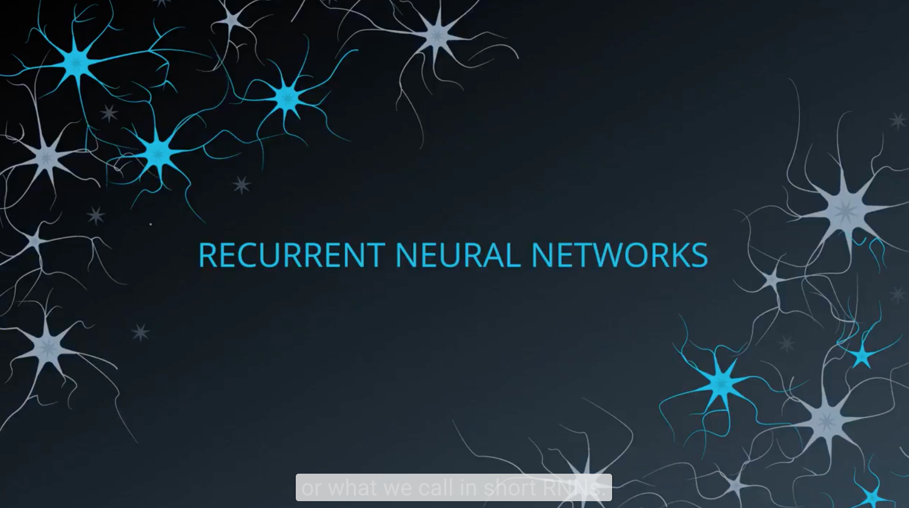](http://scrier.myqnapcloud.com:8080/share.cgi?ssid=0MZqBkd&ep=&path=%2FDeep.Learning%2F4.Recurrent-Networks%2F1.Recurrent-Neural-Networks%2Freadme&filename=2_-_01_RNN_Intro_V6_Final.mp4&fid=0MZqBkd&open=normal)

## 3. RNN History

How did the theory behind RNN evolve? Where were we a few years ago and where are we now?

[]

As mentioned in this video, RNNs have a key flaw, as capturing relationships that span more than 8 or 10 steps back is 
practically impossible. This flaw stems from the "**vanishing gradient**" problem in which the contribution of information 
decays geometrically over time.

What does this mean?

As you may recall, while training our network we use **backpropagation**. In the backpropagation process we adjust our 
weight matrices with the use of a **gradient**. In the process, gradients are calculated by continuous multiplications of 
derivatives. The value of these derivatives may be so small, that these continuous multiplications may cause the 
gradient to practically "vanish".

**LSTM** is one option to overcome the Vanishing Gradient problem in RNNs.

Please use these resources if you would like to read more about the [Vanishing Gradient](https://en.wikipedia.org/wiki/Vanishing_gradient_problem) problem or understand further 
the concept of a [Geometric Series](https://socratic.org/algebra/exponents-and-exponential-functions/geometric-sequences-and-exponential-functions) and how its values may exponentially decrease.

If you are still curious, for more information on the important milestones mentioned here, please take a peek at the 
following links:

 * [TDNN](https://en.wikipedia.org/wiki/Time_delay_neural_network)
 * Here is the original [Elman Network](http://onlinelibrary.wiley.com/doi/10.1207/s15516709cog1402_1/abstract) publication from 1990. This link is provided here as it's a significant milestone 
in the world on RNNs. To simplify things a bit, you can take a look at the following [additional info](https://en.wikipedia.org/wiki/Recurrent_neural_network#Elman_networks_and_Jordan_networks).
 * In this [LSTM](http://www.bioinf.jku.at/publications/older/2604.pdf) link you will find the original paper written by [Sepp Hochreiter](https://en.wikipedia.org/wiki/Sepp_Hochreiter) and [Jürgen Schmidhuber](http://people.idsia.ch/~juergen/). Don't get into 
all the details just yet. We will cover all of this later!

As mentioned in the video, Long Short-Term Memory Cells (LSTMs) and Gated Recurrent Units (GRUs) give a solution to 
the vanishing gradient problem, by helping us apply networks that have temporal dependencies. In this lesson we will 
focus on RNNs and continue with LSTMs. We will not be focusing on GRUs. More information about GRUs can be found in 
the following [blog](https://deeplearning4j.org/lstm.html). Focus on the overview titled: **GRUs**.

## 4. RNN Applications

The world's leading tech companies are all using RNNs, particularly LSTMs, in their applications. Let's take a look at a few.

[]

There are so many interesting applications, let's look at a few more!

 * Are you into gaming and bots? Check out the [DotA 2 bot by Open AI](https://blog.openai.com/dota-2/)
 * How about [automatically adding sounds to silent movies?](https://www.youtube.com/watch?time_continue=1&v=0FW99AQmMc8)
 * Here is a cool tool for [automatic handwriting generation](http://www.cs.toronto.edu/~graves/handwriting.cgi?text=My+name+is+Luka&style=&bias=0.15&samples=3)
 * Amazon's voice to text using high quality speech recognition, [Amazon Lex](https://aws.amazon.com/lex/faqs/).
 * Facebook uses RNN and LSTM technologies for [building language models](https://code.facebook.com/posts/1827693967466780/building-an-efficient-neural-language-model-over-a-billion-words/)
 * Netflix also uses RNN models - [here is an interesting read](https://arxiv.org/pdf/1511.06939.pdf)

## 5. Feedforward Neural Networks - Reminder

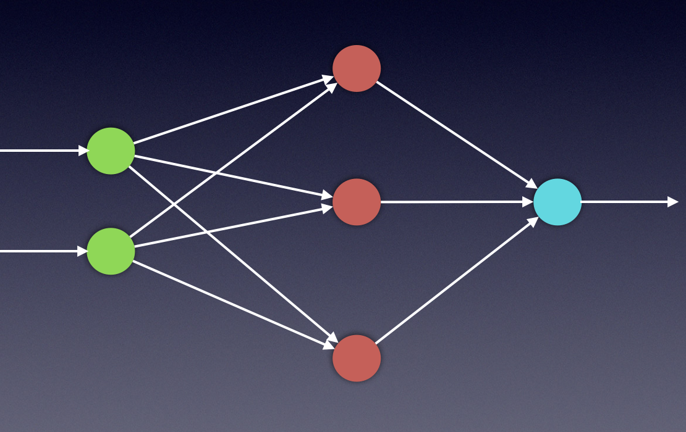

The mathematical calculations needed for training RNN systems are fascinating. To deeply understand the process, we 
first need to feel confident with the vanilla FFNN system. We need to thoroughly understand the feedforward process, 
as well as the backpropagation process used in the training phases of such systems. The next few videos will cover 
these topics, which you are already familiar with. We will address the feedforward process as well as backpropagation, 
using specific examples. These examples will serve as extra content to help further understand RNNs later in this 
lesson.

The following couple of videos will give you a brief overview of the **Feedforward Neural Network (FFNN)**.

[]

OK, you can take a small break now. We will continue with FFNN when you come back!

[]

As mentioned before, when working with neural networks we have 2 primary phases:

**Training**

and

**Evaluation**.

During the **training** phase, we take the data set (also called the _training_ set), which includes many pairs of 
inputs and their corresponding targets (outputs). Our goal is to find a set of weights that would best map the inputs 
to the desired outputs. In the **evaluation** phase, we use the network that was created in the training phase, apply 
our new inputs and expect to obtain the desired outputs.

The training phase will include two steps:

**Feedforward**

and

**Backpropagation**

We will repeat these steps as many times as we need until we decide that our system has reached the best set of 
weights, giving us the best possible outputs.

The next two videos will focus on the feedforward process.

You will notice that in these videos I use subscripts as well as superscript as a numeric notation for the weight 
matrix.

For example:

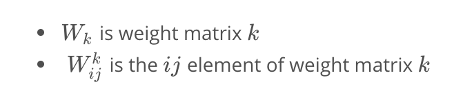

## 6.The Feedforward Process

In this section we will look closely at the math behind the feedforward process. With the use of basic Linear Algebra 
tools, these calculations are pretty simple!

If you are not feeling confident with linear combinations and matrix multiplications, you can use the following links 
as a refresher:

 * [Linear Combination](http://linear.ups.edu/html/section-LC.html)
 * [Matrix Multiplication](https://en.wikipedia.org/wiki/Matrix_multiplication)

Assuming that we have a single hidden layer, we will need two steps in our calculations. The first will be calculating 
the value of the hidden states and the latter will be calculating the value of the outputs.

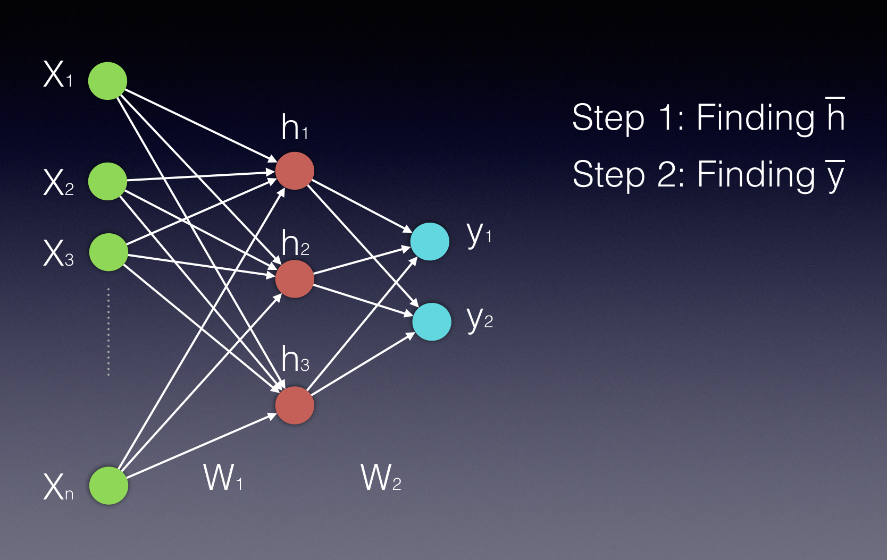

Notice that both the hidden layer and the output layer are displayed as vectors, as they are both represented by more 
than a single neuron.

Our first video will help you understand the first step- **Calculating the value of the hidden states**.

[]

As you saw in the video above, vector h' of the hidden layer will be calculated by multiplying the input vector with 
the weight matrix W1 the following way:

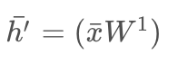

Using vector by matrix multiplication, we can look at this computation the following way:

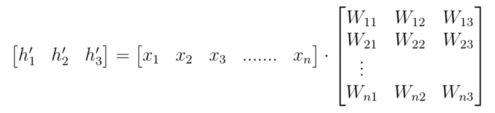

After finding h′, we need an activation function (Φ) to finalize the computation of the hidden layer's values. 
This activation function can be a Hyperbolic Tangent, a Sigmoid or a ReLU function. We can use the following two 
equations to express the final hidden vector h bar:

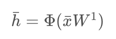

or

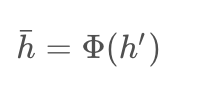

Since Wij represents the weight component in the weight matrix, connecting neuron **i** from the input to neuron **j** 
in the hidden layer, we can also write these calculations in the following way: (notice that in this example we have n 
inputs and only 3 hidden neurons)

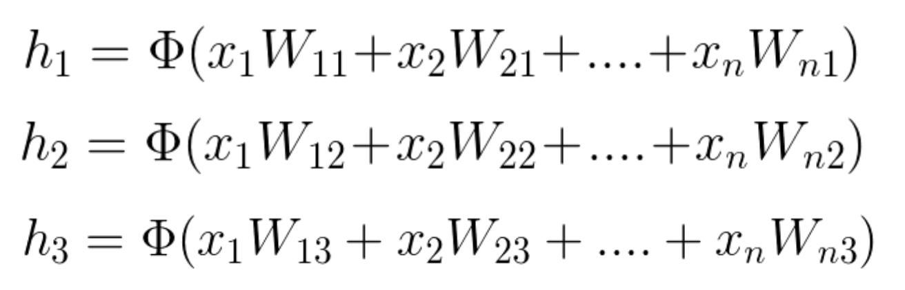

More information on the activation functions and how to use them can be found [here](https://github.com/Kulbear/deep-learning-nano-foundation/wiki/ReLU-and-Softmax-Activation-Functions)

This next video will help you understand the second step- **Calculating the values of the Outputs**.

[]

As you've seen in the video above, the process of calculating the output vector is mathematically similar to that of 
calculating the vector of the hidden layer. We use, again, a vector by matrix multiplication, which can be followed by 
an activation function. The vector is the newly calculated hidden layer and the matrix is the one connecting the hidden 
layer to the output.

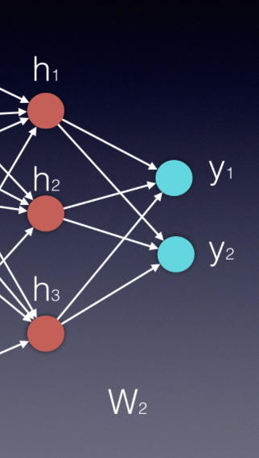

Essentially, each new layer in an neural network is calculated by a vector by matrix multiplication, where the vector 
represents the inputs to the new layer and the matrix is the one connecting these new inputs to the next layer.

In our example, the input vector is _h_ and the matrix is _W2_, therefore 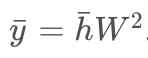. In some 
applications it can be beneficial to use a softmax function (if we want all output values to be between zero and 1, 
and their sum to be 1).

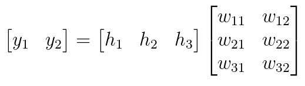

The two error functions that are most commonly used are the [Mean Squared Error (MSE)](https://en.wikipedia.org/wiki/Mean_squared_error) 
(usually used in regression problems) and the [cross entropy](https://www.ics.uci.edu/~pjsadows/notes.pdf) (usually used in classification problems).

In the above calculations we used a variation of the MSE.

The next few videos will focus on the backpropagation process, or what we also call stochastic gradient decent with the 
use of the chain rule.

## 8. Backpropagation Theory
