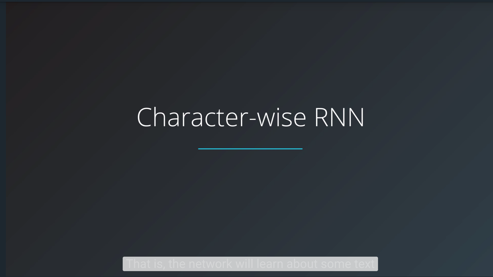
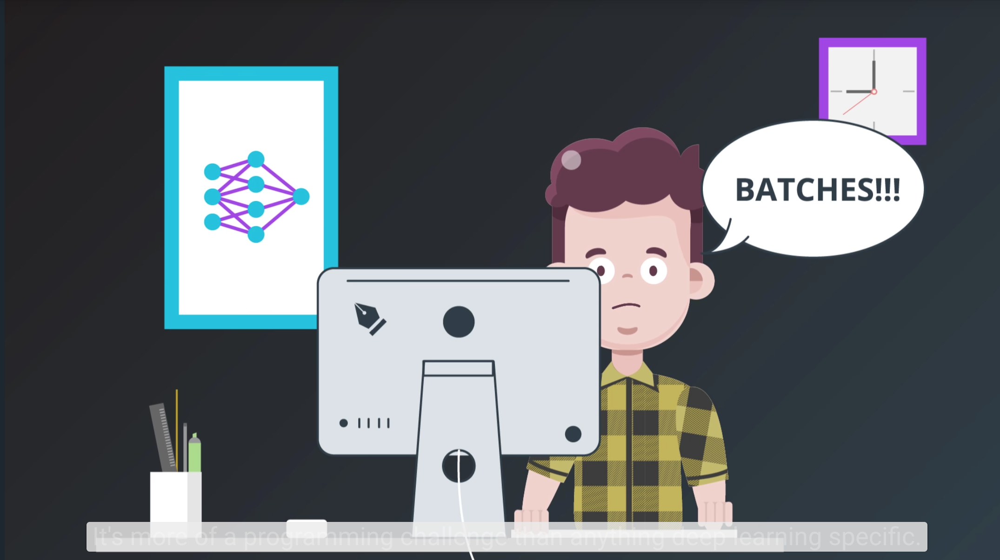
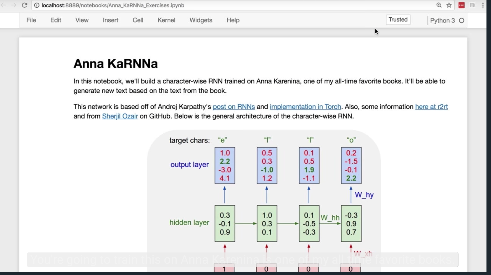
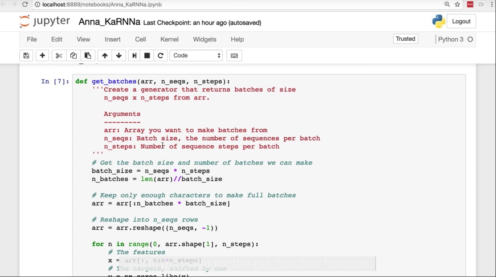
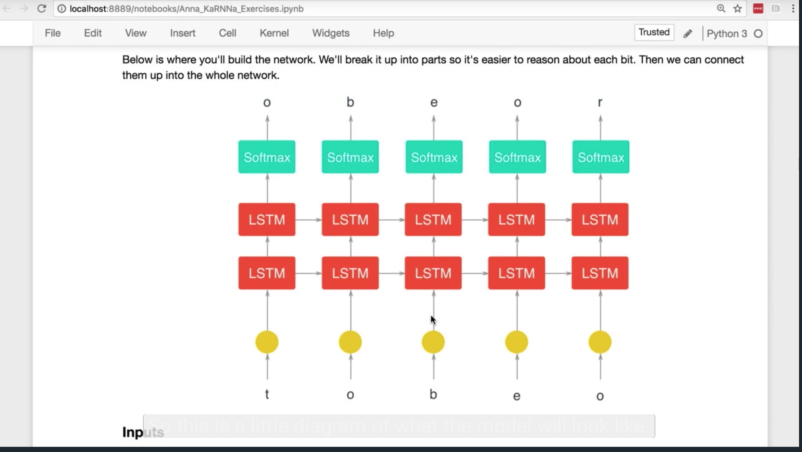
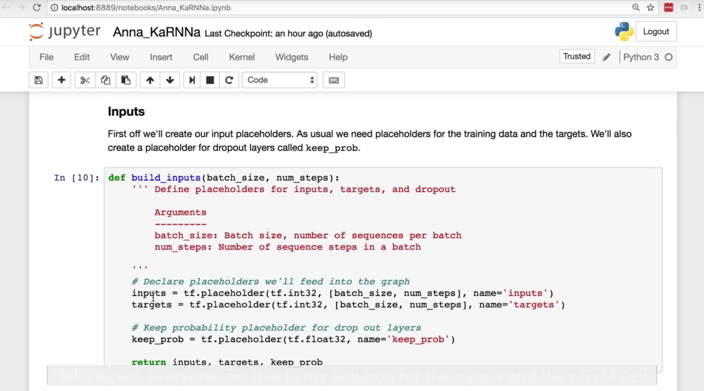
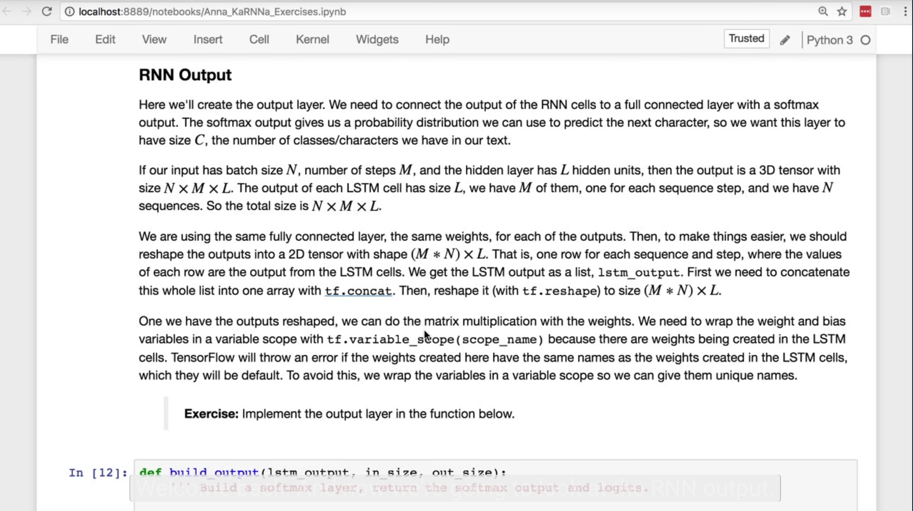
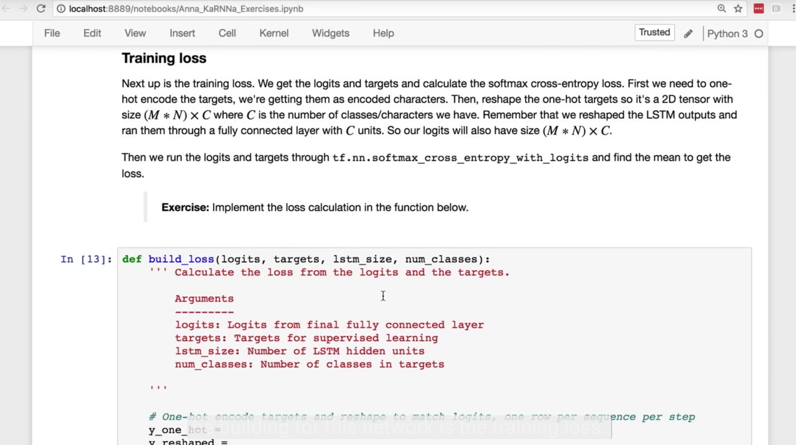
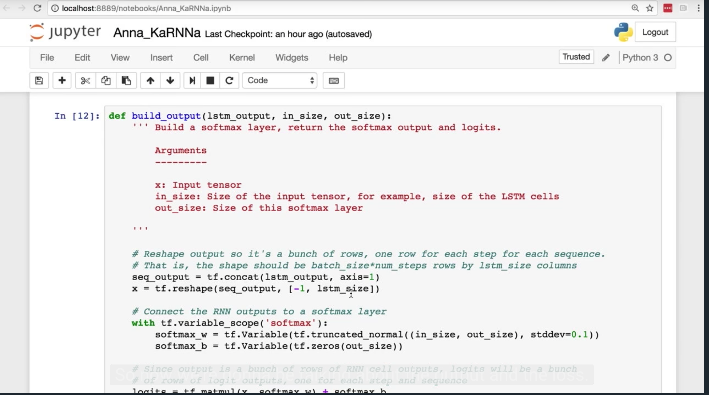
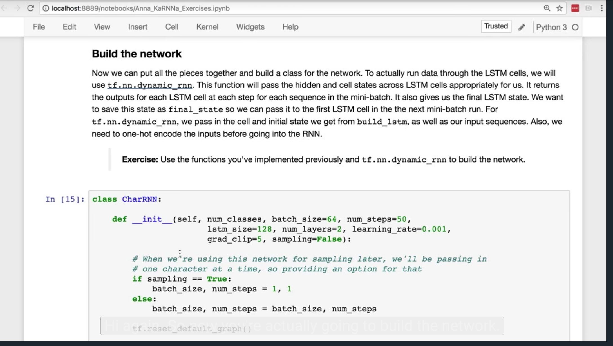

# Implementation of RNN and LSTM

## 2. Character-wise RNNs

[](http://scrier.myqnapcloud.com:8080/share.cgi?ssid=0MZqBkd&ep=&path=%2FDeep.Learning%2F4.Recurrent-Networks%2F3.Implementation-of-RNN-and-LSTM%2Freadme&filename=1_-_Character-Wise_RNN.mp4&fid=0MZqBkd&open=normal)

## 3. Sequence Batching

[](http://scrier.myqnapcloud.com:8080/share.cgi?ssid=0MZqBkd&ep=&path=%2FDeep.Learning%2F4.Recurrent-Networks%2F3.Implementation-of-RNN-and-LSTM%2Freadme&filename=2_-_Sequence-Batching.mp4&fid=0MZqBkd&open=normal)

## 4. Character-wise RNN Notebook

You can get the notebook with the character-wise RNN from our [public GitHub repo](https://github.com/udacity/deep-learning/tree/master/intro-to-rnns) in the `intro-to-rnns` folder.

To clone the entire repository to your machine:

```bash
git clone https://github.com/udacity/deep-learning.git
```

This code requires TensorFlow 1.0, so make sure you upgrade if you're using an older version. Play with the network, 
improve it, train it on your own text. This thing is for you to build off of.

If you find ways to improve it, make a pull request and we'll add it in.

## 5. Implementing a Character.wise RNN

[](http://scrier.myqnapcloud.com:8080/share.cgi?ssid=0MZqBkd&ep=&path=%2FDeep.Learning%2F4.Recurrent-Networks%2F3.Implementation-of-RNN-and-LSTM%2Freadme&filename=3_-_Implementing_a_Character-wise_RNN.mp4&fid=0MZqBkd&open=normal)

## 6. Batching Data Solution

[](http://scrier.myqnapcloud.com:8080/share.cgi?ssid=0MZqBkd&ep=&path=%2FDeep.Learning%2F4.Recurrent-Networks%2F3.Implementation-of-RNN-and-LSTM%2Freadme&filename=4_-_Batching_Data_Solution.mp4&fid=0MZqBkd&open=normal)

## 7. LSTM Cell

[](http://scrier.myqnapcloud.com:8080/share.cgi?ssid=0MZqBkd&ep=&path=%2FDeep.Learning%2F4.Recurrent-Networks%2F3.Implementation-of-RNN-and-LSTM%2Freadme&filename=5_-_LSTM_Cell.mp4&fid=0MZqBkd&open=normal)

## 8. LSTM Cell Solution

[](http://scrier.myqnapcloud.com:8080/share.cgi?ssid=0MZqBkd&ep=&path=%2FDeep.Learning%2F4.Recurrent-Networks%2F3.Implementation-of-RNN-and-LSTM%2Freadme&filename=6_-_LSTM_Cell_Solution.mp4&fid=0MZqBkd&open=normal)

## 9. RNN Output

[](http://scrier.myqnapcloud.com:8080/share.cgi?ssid=0MZqBkd&ep=&path=%2FDeep.Learning%2F4.Recurrent-Networks%2F3.Implementation-of-RNN-and-LSTM%2Freadme&filename=7_-_RNN_Output.mp4&fid=0MZqBkd&open=normal)

## 10. Network Loss

[](http://scrier.myqnapcloud.com:8080/share.cgi?ssid=0MZqBkd&ep=&path=%2FDeep.Learning%2F4.Recurrent-Networks%2F3.Implementation-of-RNN-and-LSTM%2Freadme&filename=8_-_Network_Loss.mp4&fid=0MZqBkd&open=normal)

## 11. Output and Loss Solutions

[](http://scrier.myqnapcloud.com:8080/share.cgi?ssid=0MZqBkd&ep=&path=%2FDeep.Learning%2F4.Recurrent-Networks%2F3.Implementation-of-RNN-and-LSTM%2Freadme&filename=9_-_Output_And_Loss_Solutions.mp4&fid=0MZqBkd&open=normal)

## 12. Build the Network

[](http://scrier.myqnapcloud.com:8080/share.cgi?ssid=0MZqBkd&ep=&path=%2FDeep.Learning%2F4.Recurrent-Networks%2F3.Implementation-of-RNN-and-LSTM%2Freadme&filename=10_-_Build_The_Network.mp4&fid=0MZqBkd&open=normal)

## 13. Build the Network Solution

[](http://scrier.myqnapcloud.com:8080/share.cgi?ssid=0MZqBkd&ep=&path=%2FDeep.Learning%2F4.Recurrent-Networks%2F3.Implementation-of-RNN-and-LSTM%2Freadme&filename=11_-_Build_The_Network_And_Results.mp4&fid=0MZqBkd&open=normal)
