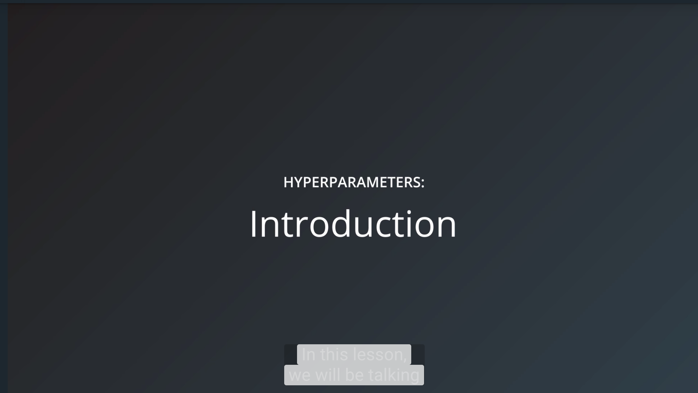
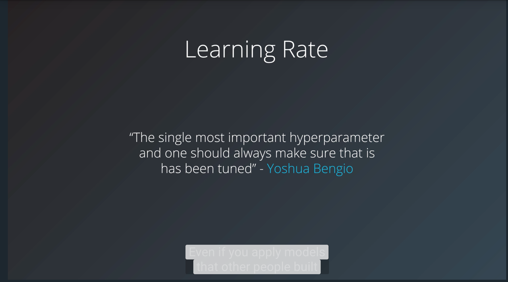
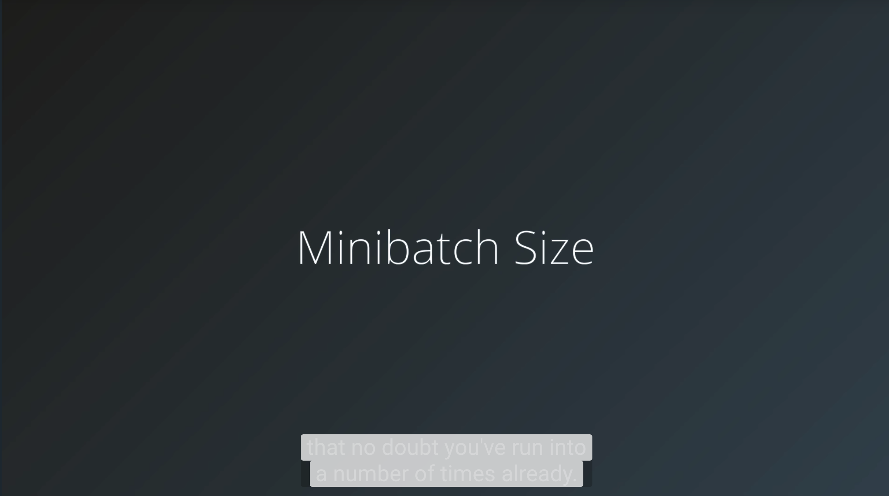
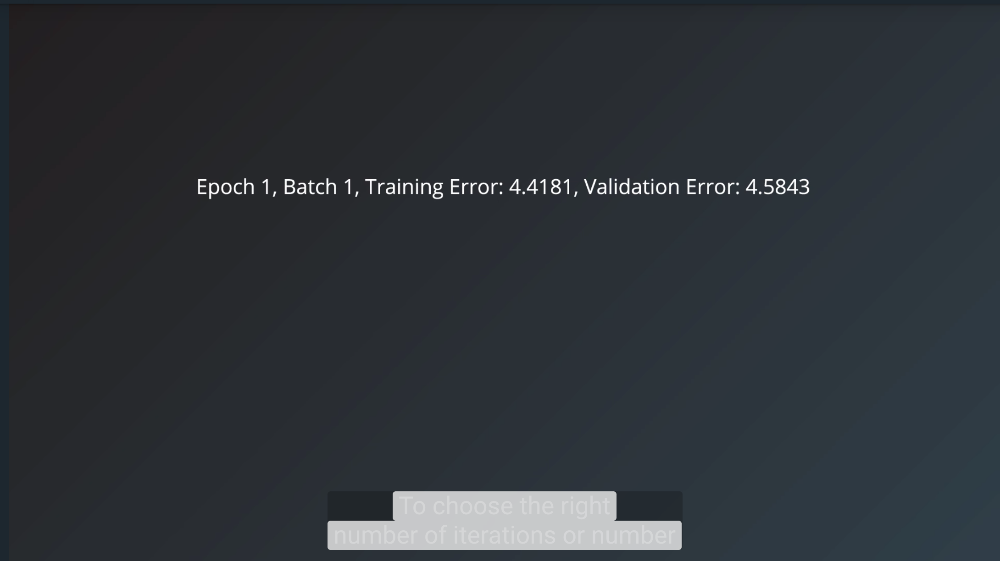
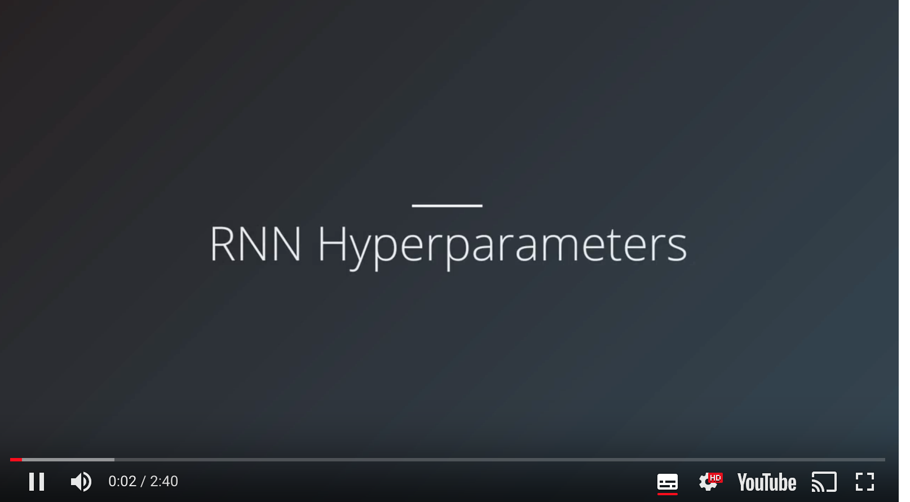

# Hyperparameters

## 2.Introduction

[](http://scrier.myqnapcloud.com:8080/share.cgi?ssid=0MZqBkd&ep=&path=%2FDeep.Learning%2F4.Recurrent-Networks%2F4.Hyperparameters%2Freadme&filename=1_-_Introduction.mp4&fid=0MZqBkd&open=normal)

## 3. Learning Rate

[](http://scrier.myqnapcloud.com:8080/share.cgi?ssid=0MZqBkd&ep=&path=%2FDeep.Learning%2F4.Recurrent-Networks%2F4.Hyperparameters%2Freadme&filename=2_-_Learning_Rate.mp4&fid=0MZqBkd&open=normal)

[Exponential Decay](https://www.tensorflow.org/api_docs/python/tf/train/exponential_decay) in TensorFlow.

### Adaptive Learning Optimizers

 * [AdamOptimizer](https://www.tensorflow.org/api_docs/python/tf/train/AdamOptimizer)
 * [AdagradOptimizer](https://www.tensorflow.org/api_docs/python/tf/train/AdagradOptimizer)

## 4. Quiz: Learning Rate

<object data="http://scrier.myqnapcloud.com:8080/share.cgi/part4-4-4.pdf?ssid=0MZqBkd&fid=0MZqBkd&path=%2FDeep.Learning%2F4.Recurrent-Networks%2F4.Hyperparameters%2Freadme&filename=part4-4-4.pdf&openfolder=normal&ep=" type="application/pdf" width="700px" height="700px">
    <embed src="http://scrier.myqnapcloud.com:8080/share.cgi/part4-4-4.pdf?ssid=0MZqBkd&fid=0MZqBkd&path=%2FDeep.Learning%2F4.Recurrent-Networks%2F4.Hyperparameters%2Freadme&filename=part4-4-4.pdf&openfolder=normal&ep=">
        This browser does not support PDFs. Please download the PDF to view it: <a href="http://scrier.myqnapcloud.com:8080/share.cgi/part4-4-4.pdf?ssid=0MZqBkd&fid=0MZqBkd&path=%2FDeep.Learning%2F4.Recurrent-Networks%2F4.Hyperparameters%2Freadme&filename=part4-4-4.pdf&openfolder=normal&ep=">Download PDF</a>.</p>
    </embed>
</object>

## 5. Minitbatch Size

[](http://scrier.myqnapcloud.com:8080/share.cgi?ssid=0MZqBkd&ep=&path=%2FDeep.Learning%2F4.Recurrent-Networks%2F4.Hyperparameters%2Freadme&filename=3_-_Minibatch_Size.mp4&fid=0MZqBkd&open=normal)

[Systematic evaluation of CNN advances on the ImageNet](https://arxiv.org/abs/1606.02228) by Dmytro Mishkin, Nikolay Sergievskiy, Jiri Matas

## 6. Number of Training Iterations / Epochs

[](http://scrier.myqnapcloud.com:8080/share.cgi?ssid=0MZqBkd&ep=&path=%2FDeep.Learning%2F4.Recurrent-Networks%2F4.Hyperparameters%2Freadme&filename=4_-_Number_Of_Iterations.mp4&fid=0MZqBkd&open=normal)

The number of training iterations is a hyperparameter we can optimize automatically using a technique called early 
stopping (also "early termination").

### ValidationMonitor (Deprecated)

In tensorflow, we can use a [ValidationMonitor with tf.contrib.learn](https://www.tensorflow.org/get_started/monitors#early_stopping_with_validationmonitor) 
to not only monitor the progress of training, but to also stop the training when certain conditions are met.

The following example from the ValidationMonitor documentation shows how to set it up. Note that the last three 
parameters indicate which metric we're optimizing.

```python
validation_monitor = tf.contrib.learn.monitors.ValidationMonitor(
  test_set.data,
  test_set.target,
  every_n_steps=50,
  metrics=validation_metrics,
  early_stopping_metric="loss",
  early_stopping_metric_minimize=True,
  early_stopping_rounds=200)
```

The last parameter indicates to ValidationMonitor that it should stop the training process if the loss did not decrease 
in 200 steps (rounds) of training.

The validation_monitor is then passed to tf.contrib.learn's "fit" method which runs the training process:

```python
classifier = tf.contrib.learn.DNNClassifier(
  feature_columns=feature_columns,
  hidden_units=[10, 20, 10],
  n_classes=3,
  model_dir="/tmp/iris_model",
  config=tf.contrib.learn.RunConfig(save_checkpoints_secs=1))

classifier.fit(x=training_set.data,
           y=training_set.target,
           steps=2000,
           monitors=[validation_monitor])
```

### SessionRunHook

More recent versions of TensorFlow deprecated monitors in favor of [SessionRunHooks](https://www.tensorflow.org/api_docs/python/tf/train/SessionRunHook). SessionRunHooks are an evolving 
part of tf.train, and going forward appear to be the proper place where you'd implement early stopping.

At the time of writing, two pre-defined stopping monitors exist as a part of tf.train's [training hooks](https://www.tensorflow.org/api_guides/python/train#Training_Hooks):

 * [StopAtStepHook](https://www.tensorflow.org/api_docs/python/tf/train/StopAtStepHook): A monitor to request the training stop after a certain number of steps
 * [NanTensorHook](https://www.tensorflow.org/api_docs/python/tf/train/NanTensorHook): a monitor that monitor's loss and stops training if it encounters a NaN loss

## 7. Number of Hidden Units / Layers

[](http://scrier.myqnapcloud.com:8080/share.cgi?ssid=0MZqBkd&ep=&path=%2FDeep.Learning%2F4.Recurrent-Networks%2F4.Hyperparameters%2Freadme&filename=5_-_Number_Of_Hidden_Units_Layers.mp4&fid=0MZqBkd&open=normal)

"in practice it is often the case that 3-layer neural networks will outperform 2-layer nets, but going even deeper 
(4,5,6-layer) rarely helps much more. This is in stark contrast to Convolutional Networks, where depth has been found 
to be an extremely important component for a good recognition system (e.g. on order of 10 learnable layers)." ~ Andrej 
Karpathy in [https://cs231n.github.io/neural-networks-1/](https://cs231n.github.io/neural-networks-1/)

### More on Capacity

A more detailed discussion on a model's capacity appears in the [Deep Learning book, chapter 5.2](http://www.deeplearningbook.org/contents/ml.html) (pages 110-120).

## 8. RNN Hyperparameters

[](http://scrier.myqnapcloud.com:8080/share.cgi?ssid=0MZqBkd&ep=&path=%2FDeep.Learning%2F4.Recurrent-Networks%2F4.Hyperparameters%2Freadme&filename=6_-_RNN_Hyperparameters.mp4&fid=0MZqBkd&open=normal)

### LSTM Vs GRU

"These results clearly indicate the advantages of the gating units over the more traditional recurrent units. 
Convergence is often faster, and the final solutions tend to be better. However, our results are not conclusive in 
comparing the LSTM and the GRU, which suggests that the choice of the type of gated recurrent unit may depend heavily 
on the dataset and corresponding task."

[Empirical Evaluation of Gated Recurrent Neural Networks on Sequence Modeling](https://arxiv.org/abs/1412.3555) by Junyoung Chung, Caglar Gulcehre, 
KyungHyun Cho, Yoshua Bengio

"The GRU outperformed the LSTM on all tasks with the exception of language modelling"

[An Empirical Exploration of Recurrent Network Architectures](An Empirical Exploration of Recurrent Network Architectures) by Rafal Jozefowicz, Wojciech Zaremba, Ilya Sutskever

"Our consistent finding is that depth of at least two is beneficial. However, between two and three layers our results 
are mixed. Additionally, the results are mixed between the LSTM and the GRU, but both significantly outperform the RNN."

[Visualizing and Understanding Recurrent Networks](https://arxiv.org/abs/1506.02078) by Andrej Karpathy, Justin Johnson, Li Fei-Fei

"Which of these variants is best? Do the differences matter? [Greff, et al. (2015)](https://arxiv.org/pdf/1503.04069.pdf) do a nice comparison of popular 
variants, finding that they’re all about the same. [Jozefowicz, et al. (2015)](http://proceedings.mlr.press/v37/jozefowicz15.pdf) tested more than ten thousand RNN 
architectures, finding some that worked better than LSTMs on certain tasks."

[Understanding LSTM Networks](https://colah.github.io/posts/2015-08-Understanding-LSTMs/) by Chris Olah

"In our [Neural Machine Translation] experiments, LSTM cells consistently outperformed GRU cells. Since the 
computational bottleneck in our architecture is the softmax operation we did not observe large difference in training 
speed between LSTM and GRU cells. Somewhat to our surprise, we found that the vanilla decoder is unable to learn nearly 
as well as the gated variant."

[Massive Exploration of Neural Machine Translation Architectures](https://arxiv.org/abs/1703.03906v2) by Denny Britz, Anna Goldie, Minh-Thang Luong, Quoc 
Le

### Example RNN Architectures

| Application	      | Cell	| Layers	| Size	| Vocabulary	| Embedding Size	| Learning Rate	| Docs |
| ------------------- | ----- | --------- | ----- | ------------- | ----------------- | ------------- | ---- |
| Speech Recognition (large vocabulary) | LSTM | 5, 7 | 600, 1000 | 82K, 500K | -- | -- | [paper](https://arxiv.org/abs/1610.09975) |
| Speech Recognition | LSTM	| 1, 3, 5 | 250 | -- | -- | 0.001 | [paper](https://arxiv.org/abs/1303.5778) |
| Machine Translation (seq2seq) | LSTM | 4 | 1000 | Source: 160K, Target: 80K | 1,000 | -- | [paper](https://arxiv.org/abs/1409.3215) |
| Image Captioning | LSTM | -- | 512 | -- | 512 | (fixed) | [paper](https://arxiv.org/abs/1411.4555) |
| Image Generation | LSTM | -- | 256, 400, 800 | -- | -- | -- | [paper](https://arxiv.org/abs/1502.04623) |
| Question Answering | LSTM | 2 | 500 | -- | 300 | -- | [pdf](http://www.aclweb.org/anthology/P15-2116) |
| Text Summarization | GRU | -- | 200 | Source: 119K, Target: 68K | 100 | 0.001 | [pdf](https://pdfs.semanticscholar.org/3fbc/45152f20403266b02c4c2adab26fb367522d.pdf) |

## 9. Quiz: RNN Hyperparameters

<object data="http://scrier.myqnapcloud.com:8080/share.cgi/part4-4-9.pdf?ssid=0MZqBkd&fid=0MZqBkd&path=%2FDeep.Learning%2F4.Recurrent-Networks%2F4.Hyperparameters%2Freadme&filename=part4-4-9.pdf&openfolder=normal&ep=" type="application/pdf" width="700px" height="700px">
    <embed src="http://scrier.myqnapcloud.com:8080/share.cgi/part4-4-9.pdf?ssid=0MZqBkd&fid=0MZqBkd&path=%2FDeep.Learning%2F4.Recurrent-Networks%2F4.Hyperparameters%2Freadme&filename=part4-4-9.pdf&openfolder=normal&ep=">
        This browser does not support PDFs. Please download the PDF to view it: <a href="http://scrier.myqnapcloud.com:8080/share.cgi/part4-4-9.pdf?ssid=0MZqBkd&fid=0MZqBkd&path=%2FDeep.Learning%2F4.Recurrent-Networks%2F4.Hyperparameters%2Freadme&filename=part4-4-9.pdf&openfolder=normal&ep=">Download PDF</a>.</p>
    </embed>
</object>

## 10. Sources & References

If you want to learn more about hyperparameters, these are some great resources on the topic:

 * [Practical recommendations for gradient-based training of deep architectures](https://arxiv.org/abs/1206.5533) by Yoshua Bengio
 * [Deep Learning book - chapter 11.4: Selecting Hyperparameters](http://www.deeplearningbook.org/contents/guidelines.html) by Ian Goodfellow, Yoshua Bengio, Aaron Courville
 * [Neural Networks and Deep Learning book - Chapter 3: How to choose a neural network's hyper-parameters](http://neuralnetworksanddeeplearning.com/chap3.html#how_to_choose_a_neural_network's_hyper-parameters)? by Michael Nielsen
 * [Efficient BackProp (pdf)](http://yann.lecun.com/exdb/publis/pdf/lecun-98b.pdf) by Yann LeCun

More specialized sources:

 * [How to Generate a Good Word Embedding](https://arxiv.org/abs/1507.05523)? by Siwei Lai, Kang Liu, Liheng Xu, Jun Zhao
 * [Systematic evaluation of CNN advances on the ImageNet](https://arxiv.org/abs/1606.02228) by Dmytro Mishkin, Nikolay Sergievskiy, Jiri Matas
 * [Visualizing and Understanding Recurrent Networks](https://arxiv.org/abs/1506.02078) by Andrej Karpathy, Justin Johnson, Li Fei-Fei
