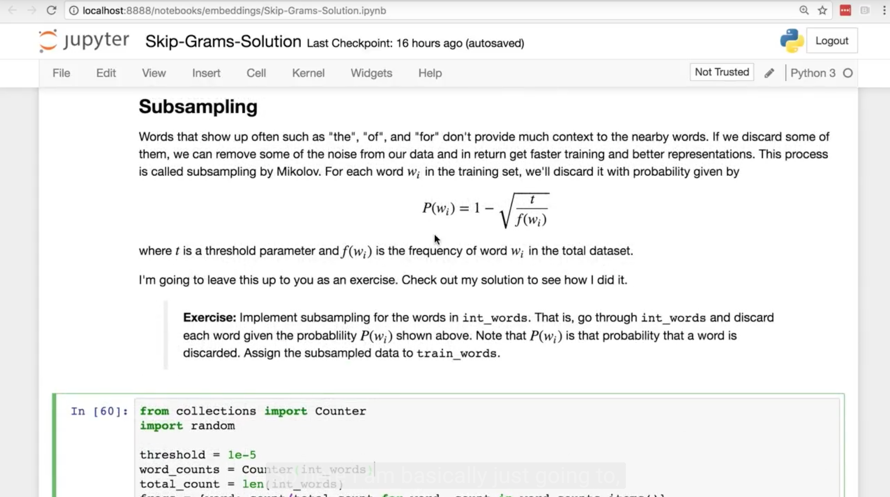
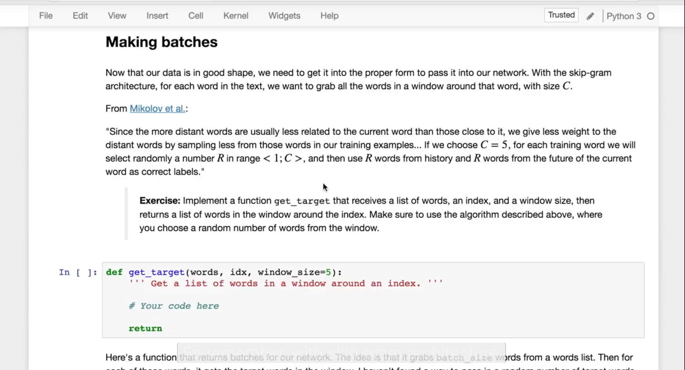
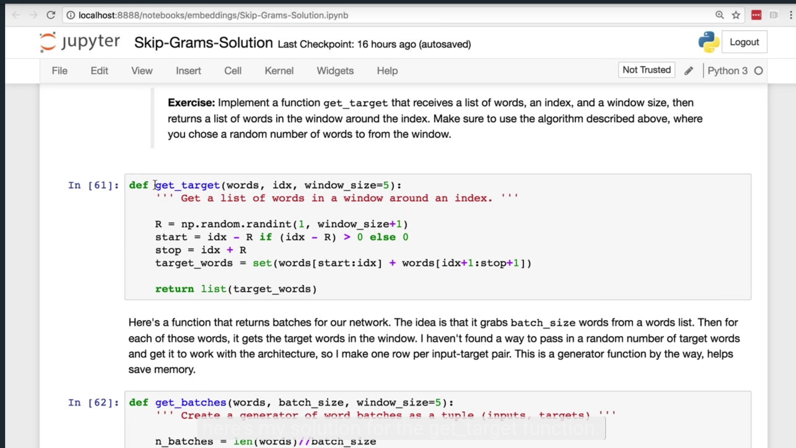
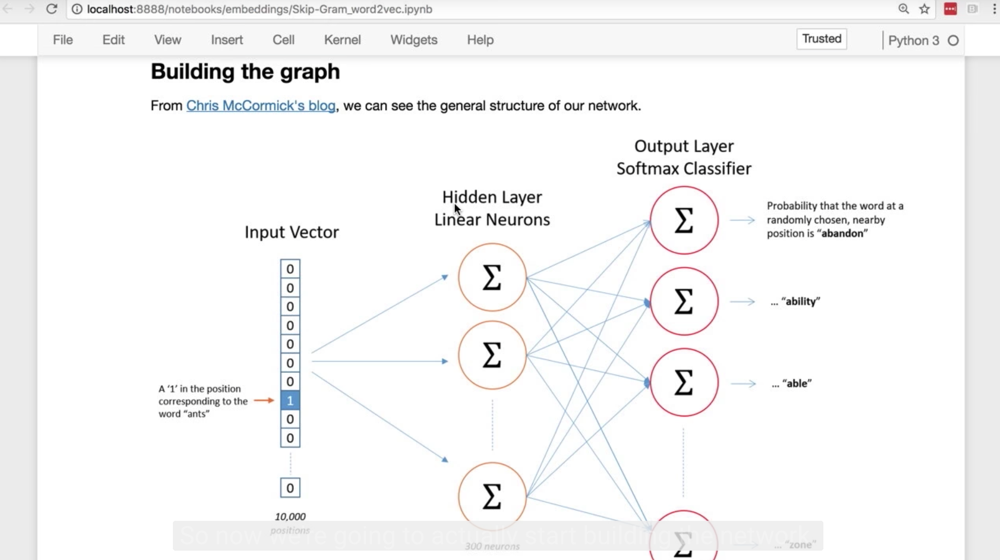
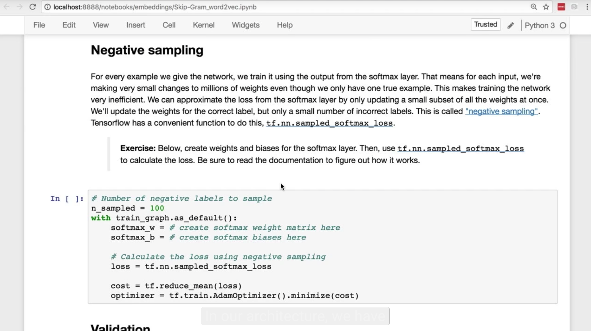
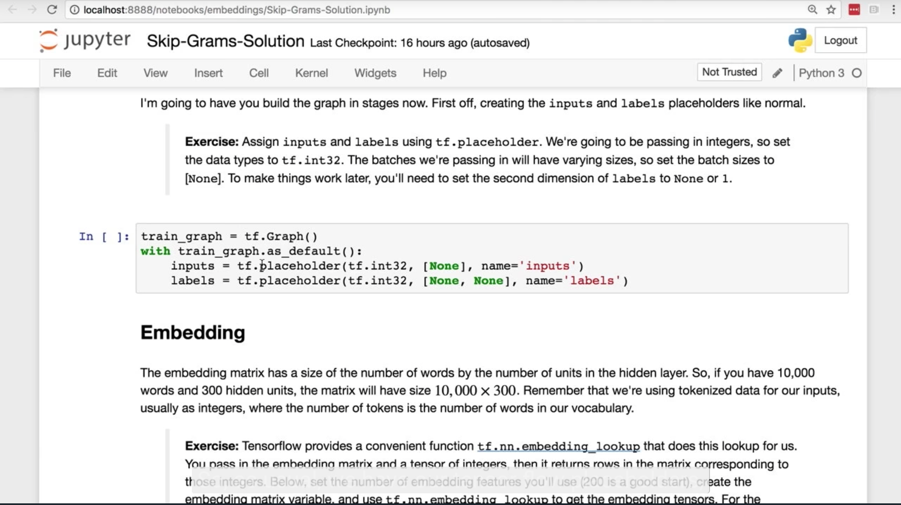
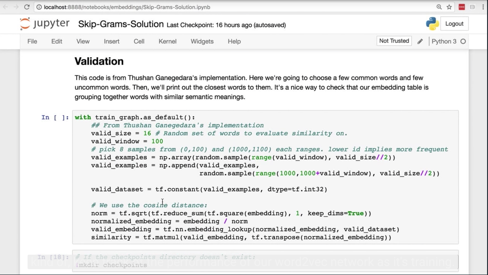

# Embeddings and Word2vec

## 1. Embeddings Intro

### Word Embeddings

This week, we'll be covering embeddings. This is a deep neural network method for representing data with a huge number 
of classes more efficiently. Embeddings greatly improve the ability of networks to learn from data of this sort by 
representing the data with lower dimensional vectors.

Word embeddings in particular are interesting because the networks are able to learn semantic relationships between 
words. For example, the embeddings will know that the male equivalent of a queen is a king.

These word embeddings are learned using a model called [Word2vec](https://en.wikipedia.org/wiki/Word2vec). In this lesson, you'll implement Word2vec yourself.

We've built a notebook with exercises and also provided our solutions. You can find the notebooks in our [GitHub repo](https://github.com/udacity/deep-learning/tree/master/embeddings) 
in the `embeddings` folder.

> **Requirements**: You'll need Numpy, Matplotlib, Scikit-learn, tqdm, and **TensorFlow 1.0** to run this code.

Next up, I'll walk you through implementing the Word2Vec model.

## 2. Implementing Word2Vec

## 3. Subsampling Solution

## 4. Making Batches

## 5. Batches Solution

## 6. Building the Network

## 7. Negative Sampling

## 8. Building the Network Solution

## 9. Training Results

