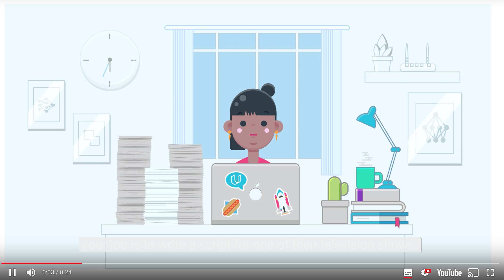

# Generate TV Scripts

## 1. Introduction

[](http://scrier.myqnapcloud.com:8080/share.cgi?ssid=0MZqBkd&ep=&path=%2FDeep.Learning%2F4.Recurrent-Networks%2F7.Generate-TV-Scripts%2Freadme&filename=1_-_Project-3-Intro.mp4&fid=0MZqBkd&open=normal)

## 2. Project: Generate TV Scripts

### Introduction

In this project, you'll generate your own Simpsons TV scripts using RNNs. You'll be using part of the Simpsons dataset 
of scripts from 27 seasons. The Neural Network you'll build will generate a new TV script for a scene at Moe's Tavern.

### Getting the project files

The project files can be found in our [public GitHub repo](https://github.com/udacity/deep-learning), in the 
`tv-script-generation` folder. You can download the files from there, but it's better to clone the repository to your 
computer

```bash
git clone https://github.com/udacity/deep-learning.git
```

This way you can stay up to date with any changes we make by pulling the changes to your local repository with 
`git pull`.

### Submission
 1. Ensure you've passed all the unit tests in the notebook.
 1. Ensure you pass all points on [the rubric](https://review.udacity.com/#!/rubrics/725/view).
 1. When you're done with the project, please save the notebook as an HTML file. You can do this by going to the 
 **File** menu in the notebook and choosing "Download as" > HTML. **Ensure you submit both the Jupyter Notebook and it's 
 HTML version together**.
 1. Package the "dlnd_tv_script_generation.ipynb", "helper.py", "problem_unittests.py", and the HTML file into a zip 
 archive, or push the files from your GitHub repo.
 1. Hit Submit Project below!

### Advanced Projects

After completing this project, try applying what you learned to one of these problems.

 * Generate your own Bach music using like [DeepBach](https://arxiv.org/pdf/1612.01010.pdf).
 * Predict seizures in intracranial EEG recordings on [Kaggle](https://www.kaggle.com/c/seizure-prediction).
 