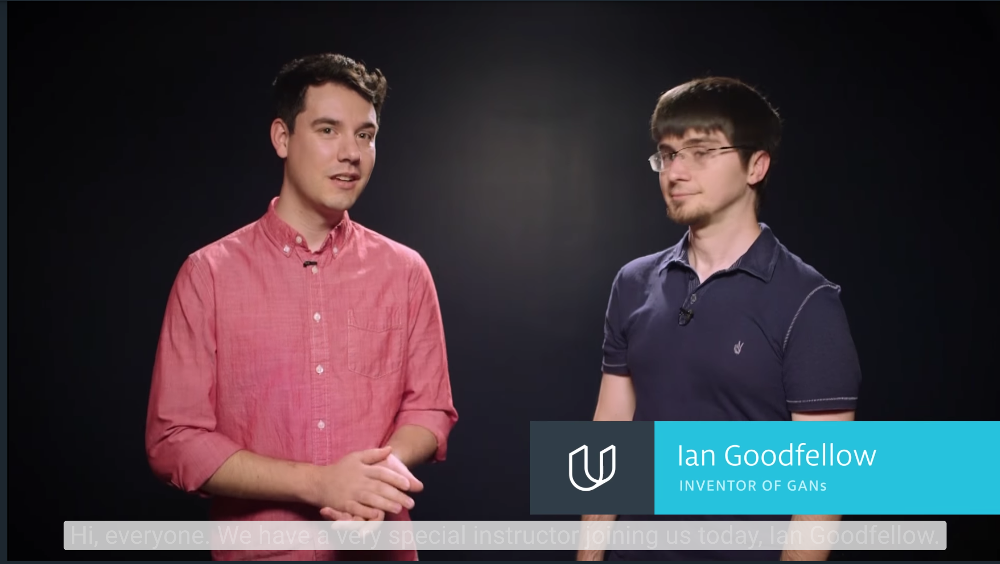
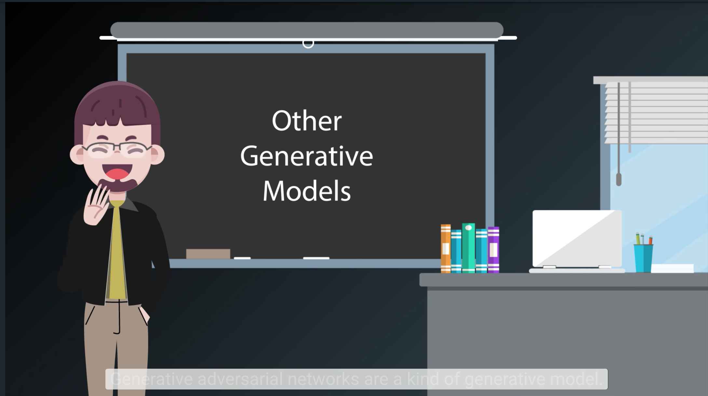
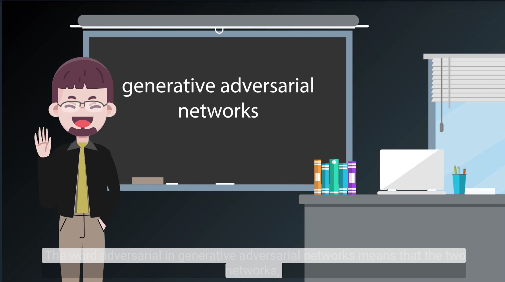

# Generative Adversarial Networks

# 1. Introducing Ian Goodfellow

[](http://scrier.myqnapcloud.com:8080/share.cgi?ssid=0MZqBkd&ep=&path=%2FDeep.Learning%2F5.Generative-Adversial-Networks%2F1.Generative-Adversarial-Networks%2Freadme&filename=1_-_GANs_Intro.mp4&fid=0MZqBkd&open=normal)

# 2. What can you do with GANs?

[](http://scrier.myqnapcloud.com:8080/share.cgi?ssid=0MZqBkd&ep=&path=%2FDeep.Learning%2F5.Generative-Adversial-Networks%2F1.Generative-Adversarial-Networks%2Freadme&filename=2_-_Cool_Things_To_Do_With_GANs.mp4&fid=0MZqBkd&open=normal)

# 3. How GANs work

[](http://scrier.myqnapcloud.com:8080/share.cgi?ssid=0MZqBkd&ep=&path=%2FDeep.Learning%2F5.Generative-Adversial-Networks%2F1.Generative-Adversarial-Networks%2Freadme&filename=3_-_Other_Generative_Models,_How_GANs_Work.mp4&fid=0MZqBkd&open=normal)

You can find more information on the graph in the video in Figure 1 of [https://arxiv.org/pdf/1406.2661.pdf](https://arxiv.org/pdf/1406.2661.pdf).

# 4. Games and Equilibria

[](http://scrier.myqnapcloud.com:8080/share.cgi?ssid=0MZqBkd&ep=&path=%2FDeep.Learning%2F5.Generative-Adversial-Networks%2F1.Generative-Adversarial-Networks%2Freadme&filename=4_-_Games,_Equilibrium,_GANs_Solution_Render.mp4&fid=0MZqBkd&open=normal)

# 5. Practical tips and tricks for training GANs
 
[](http://scrier.myqnapcloud.com:8080/share.cgi?ssid=0MZqBkd&ep=&path=%2FDeep.Learning%2F5.Generative-Adversial-Networks%2F1.Generative-Adversarial-Networks%2Freadme&filename=5_-_GANs_Architecture_.mp4&fid=0MZqBkd&open=normal)

# 6. Build a GAN

Together with Ian, we've built a notebook that will lead you through building your own GAN and train it on MNIST. 
You'll build the generator and discriminator networks, as well as set up the losses and optimizers which requires 
 new since we need to train the networks in parallel. We've included a notebook with exercises where you'll implement 
 the network and another notebook with solutions.

### Getting the Notebooks
As usual, the notebooks are available from our [public GitHub repo](https://github.com/udacity/deep-learning) in the `gan_mnist` directory. To get the new notebooks, 
use `git pull` in your cloned repository.

If you don't have the repo yet, clone it with Git

```bash
git clone https://github.com/udacity/deep-learning.git
```

# 7. Get started with a GAN


