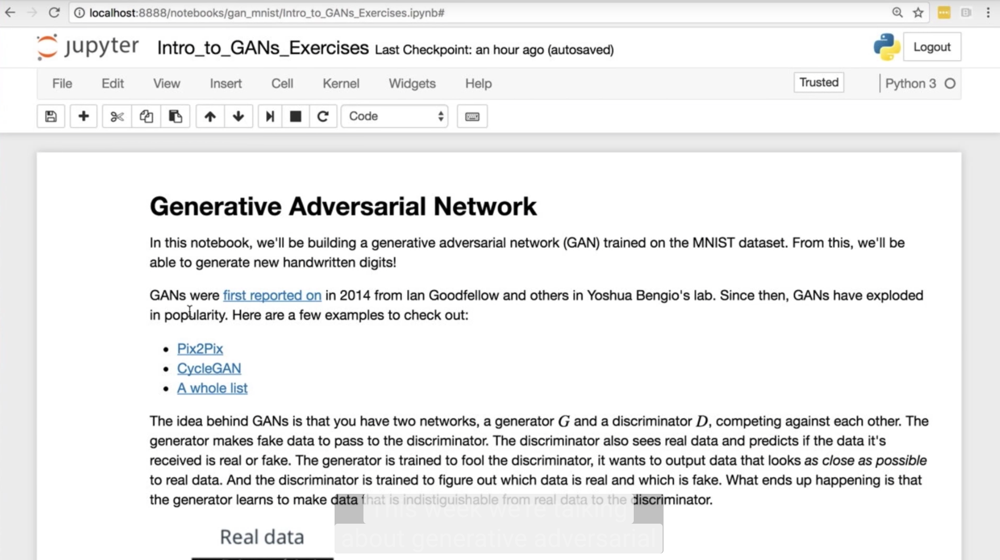
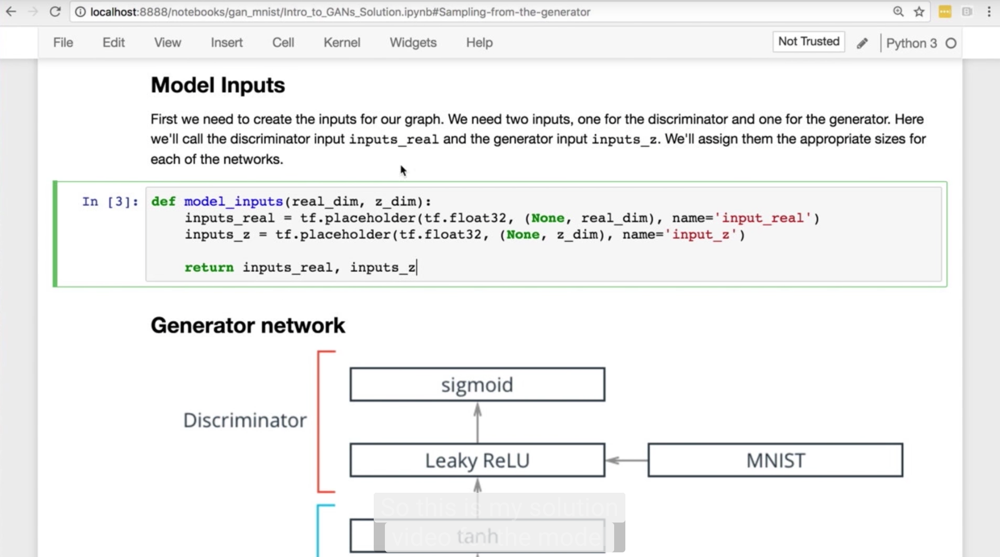
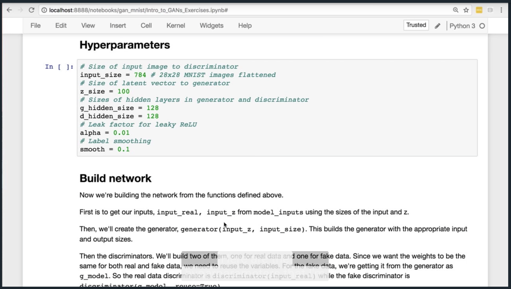
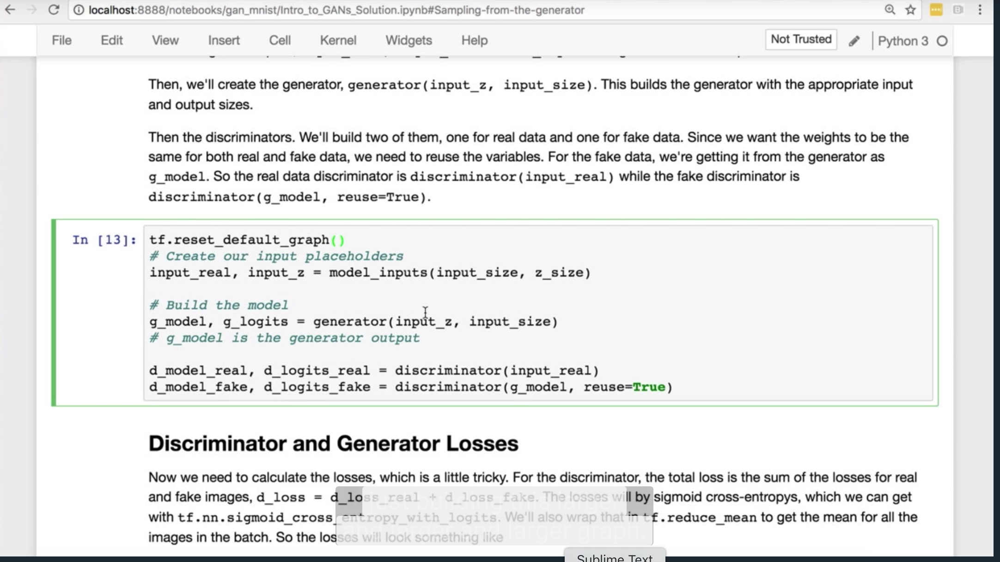
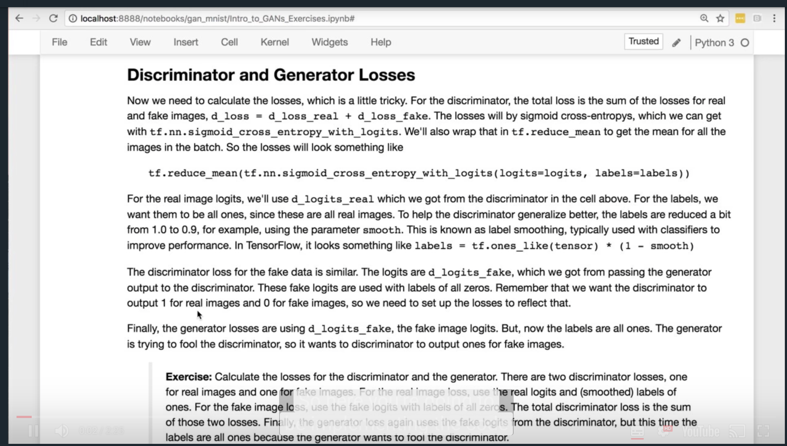
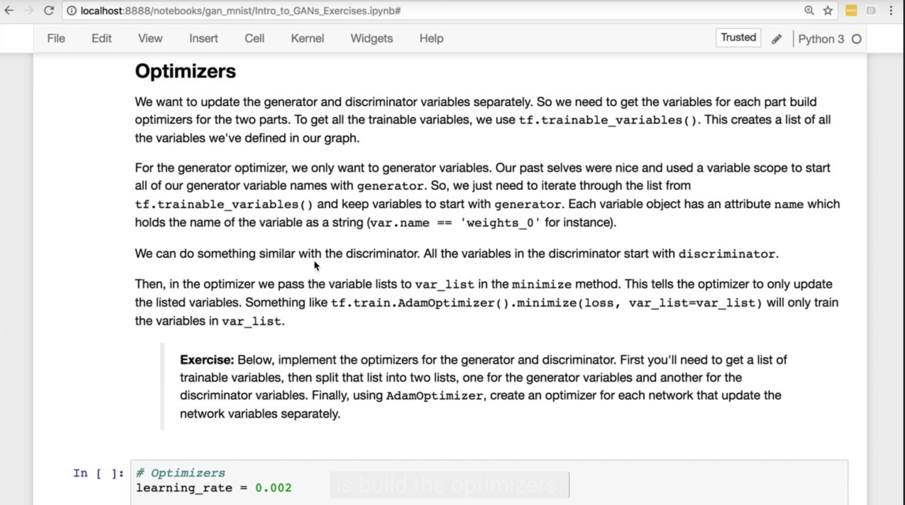
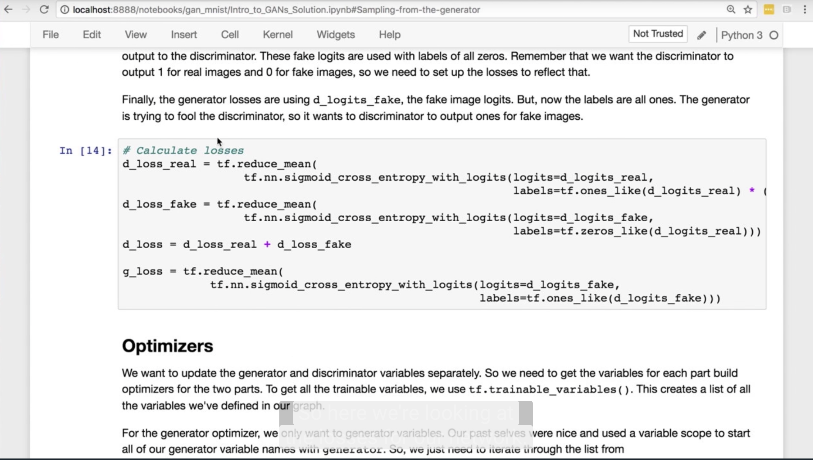
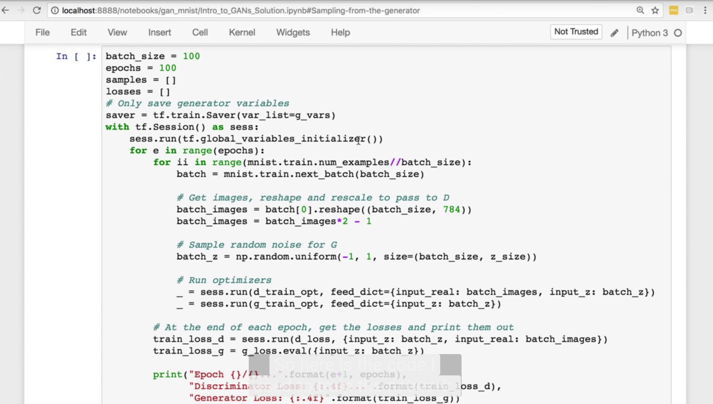
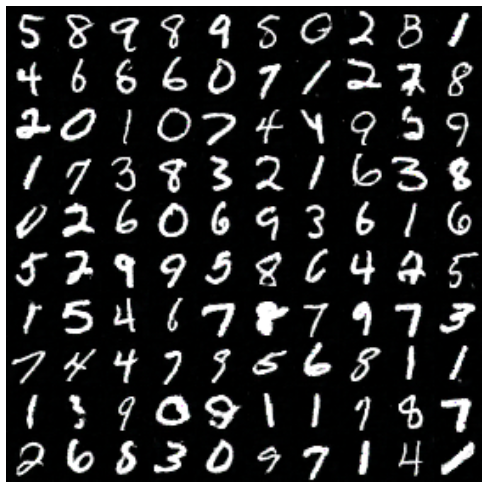

# Generative Adversarial Networks

## 1. Introducing Ian Goodfellow

[](http://scrier.myqnapcloud.com:8080/share.cgi?ssid=0MZqBkd&ep=&path=%2FDeep.Learning%2F5.Generative-Adversial-Networks%2F1.Generative-Adversarial-Networks%2Freadme&filename=1_-_GANs_Intro.mp4&fid=0MZqBkd&open=normal)

## 2. What can you do with GANs?

[](http://scrier.myqnapcloud.com:8080/share.cgi?ssid=0MZqBkd&ep=&path=%2FDeep.Learning%2F5.Generative-Adversial-Networks%2F1.Generative-Adversarial-Networks%2Freadme&filename=2_-_Cool_Things_To_Do_With_GANs.mp4&fid=0MZqBkd&open=normal)

## 3. How GANs work

[](http://scrier.myqnapcloud.com:8080/share.cgi?ssid=0MZqBkd&ep=&path=%2FDeep.Learning%2F5.Generative-Adversial-Networks%2F1.Generative-Adversarial-Networks%2Freadme&filename=3_-_Other_Generative_Models,_How_GANs_Work.mp4&fid=0MZqBkd&open=normal)

You can find more information on the graph in the video in Figure 1 of [https://arxiv.org/pdf/1406.2661.pdf](https://arxiv.org/pdf/1406.2661.pdf).

## 4. Games and Equilibria

[](http://scrier.myqnapcloud.com:8080/share.cgi?ssid=0MZqBkd&ep=&path=%2FDeep.Learning%2F5.Generative-Adversial-Networks%2F1.Generative-Adversarial-Networks%2Freadme&filename=4_-_Games,_Equilibrium,_GANs_Solution_Render.mp4&fid=0MZqBkd&open=normal)

## 5. Practical tips and tricks for training GANs
 
[](http://scrier.myqnapcloud.com:8080/share.cgi?ssid=0MZqBkd&ep=&path=%2FDeep.Learning%2F5.Generative-Adversial-Networks%2F1.Generative-Adversarial-Networks%2Freadme&filename=5_-_GANs_Architecture_.mp4&fid=0MZqBkd&open=normal)

## 6. Build a GAN

Together with Ian, we've built a notebook that will lead you through building your own GAN and train it on MNIST. 
You'll build the generator and discriminator networks, as well as set up the losses and optimizers which requires 
 new since we need to train the networks in parallel. We've included a notebook with exercises where you'll implement 
 the network and another notebook with solutions.

### Getting the Notebooks
As usual, the notebooks are available from our [public GitHub repo](https://github.com/udacity/deep-learning) in the `gan_mnist` directory. To get the new notebooks, 
use `git pull` in your cloned repository.

If you don't have the repo yet, clone it with Git

```bash
git clone https://github.com/udacity/deep-learning.git
```

## 7. Get started with a GAN

[](http://scrier.myqnapcloud.com:8080/share.cgi?ssid=0MZqBkd&ep=&path=%2FDeep.Learning%2F5.Generative-Adversial-Networks%2F1.Generative-Adversarial-Networks%2Freadme&filename=6_-_Getting_Started_with_GANs.mp4&fid=0MZqBkd&open=normal)

## 8. Generator Network

[](http://scrier.myqnapcloud.com:8080/share.cgi?ssid=0MZqBkd&ep=&path=%2FDeep.Learning%2F5.Generative-Adversial-Networks%2F1.Generative-Adversarial-Networks%2Freadme&filename=7_-_Generator_Network.mp4&fid=0MZqBkd&open=normal)

## 9. Discriminator Network

[](http://scrier.myqnapcloud.com:8080/share.cgi?ssid=0MZqBkd&ep=&path=%2FDeep.Learning%2F5.Generative-Adversial-Networks%2F1.Generative-Adversarial-Networks%2Freadme&filename=8_-_Discriminator_Network.mp4&fid=0MZqBkd&open=normal)

## 10. Generator and Discrinator Solutions

[](http://scrier.myqnapcloud.com:8080/share.cgi?ssid=0MZqBkd&ep=&path=%2FDeep.Learning%2F5.Generative-Adversial-Networks%2F1.Generative-Adversarial-Networks%2Freadme&filename=9_-_Generator_and_Discriminator_Solutions.mp4&fid=0MZqBkd&open=normal)

## 11. Building the Network

[](http://scrier.myqnapcloud.com:8080/share.cgi?ssid=0MZqBkd&ep=&path=%2FDeep.Learning%2F5.Generative-Adversial-Networks%2F1.Generative-Adversarial-Networks%2Freadme&filename=10_-_Building_the_Network.mp4&fid=0MZqBkd&open=normal)

## 12. Building the Network Solution

[](http://scrier.myqnapcloud.com:8080/share.cgi?ssid=0MZqBkd&ep=&path=%2FDeep.Learning%2F5.Generative-Adversial-Networks%2F1.Generative-Adversarial-Networks%2Freadme&filename=11_-_Building_the_Network_Solution.mp4&fid=0MZqBkd&open=normal)

## 13. Training Losses

[](http://scrier.myqnapcloud.com:8080/share.cgi?ssid=0MZqBkd&ep=&path=%2FDeep.Learning%2F5.Generative-Adversial-Networks%2F1.Generative-Adversarial-Networks%2Freadme&filename=12_-_Training_Losses.mp4&fid=0MZqBkd&open=normal)

## 14. Optimizers

[](http://scrier.myqnapcloud.com:8080/share.cgi?ssid=0MZqBkd&ep=&path=%2FDeep.Learning%2F5.Generative-Adversial-Networks%2F1.Generative-Adversarial-Networks%2Freadme&filename=13_-_Training_Optimizers.mp4&fid=0MZqBkd&open=normal)

## 15. Training Losses and Optimizers Solution

[](http://scrier.myqnapcloud.com:8080/share.cgi?ssid=0MZqBkd&ep=&path=%2FDeep.Learning%2F5.Generative-Adversial-Networks%2F1.Generative-Adversarial-Networks%2Freadme&filename=14_-_Training_Losses_and_Optimizers_Solutions.mp4&fid=0MZqBkd&open=normal)

## 16. A Trained GAN

[](http://scrier.myqnapcloud.com:8080/share.cgi?ssid=0MZqBkd&ep=&path=%2FDeep.Learning%2F5.Generative-Adversial-Networks%2F1.Generative-Adversarial-Networks%2Freadme&filename=15_-_A_Trained_GAN.mp4&fid=0MZqBkd&open=normal)

## 17. Doing More With Your GAN

The GAN I showed you used only one hidden layer in the generator and discriminator. The results of this GAN were pretty 
impressive, but there were still a lot of noisy images and images that didn't really look like numbers. But, it's 
completely possible to have the generator make images indistinguishable from the MNIST dataset.


MNIST images generated from a trained GAN ([https://arxiv.org/pdf/1606.03498.pdf](https://arxiv.org/pdf/1606.03498.pdf))

This is from a paper called [Improved Techniques for Training GANs](https://arxiv.org/pdf/1606.03498.pdf). So, how did 
they make such nice looking images?

As with most neural networks, using more layers will improve performance. Instead of just one layer, try two or three. Try larger layers with more units. See how that affects your results.

### Batch Normalization
Just as a heads up, you probably won't get it to work with three layers. The networks become really sensitive to the 
initial values of the weights and will fail to train. We can solve this problem using [batch normalization](https://arxiv.org/abs/1502.03167). The idea is 
pretty simple. Just like what we do with the inputs to our networks, we can normalize the inputs to each layer. That 
is, scale the layer inputs to have zero mean and standard deviations of 1. It's been found that batch normalization is 
necessary to make deep GANs.

We'll cover batch normalization in next week's lesson, as well as using convolutional networks for the generator and 
discriminator.
