# Project: Generate Faces

## 1. One Project Away!

## 2. Project Introduction

## 3. Project: Generate Faces

### Introduction

In this project, you'll use generative adversarial networks to generate new images of faces.

### Getting the project files

The project files can be found in our [public GitHub repo](https://github.com/udacity/deep-learning/tree/master/), in the `face_generation` folder. You can download the files 
from there, but it's better to clone the repository to your computer

This way you can stay up to date with any changes we make by pulling the changes to your local repository with `git pull`.

### Submission

 1. Ensure you've passed all the unit tests in the notebook.
 1. Ensure you pass all points on [the rubric](https://review.udacity.com/#!/rubrics/891/view).
 1. When you're done with the project, please save the notebook as an HTML file. You can do this by going to the 
 **File** menu in the notebook and choosing "Download as" > HTML. **Ensure you submit both the Jupyter Notebook and it's 
 HTML version together**.
 1. Package the "dlnd_face_generation.ipynb", "helper.py", "problem_unittests.py", and the HTML file into a zip 
 archive, or push the files from your GitHub repo.
 1. Hit Submit Project below!
 
 ### Results
 
| gen impl | disc impl | alpha | batch size | z dim | learning rate | beta 1 | Number Output | Celeb Output |
| -------- | --------- | ----- | ---------- | ----- | ------------- | ------ | ------------- | ------------ |
| 1        | 1         | 0.2   | 128        | 100   | 0.0005        | 0.5    | 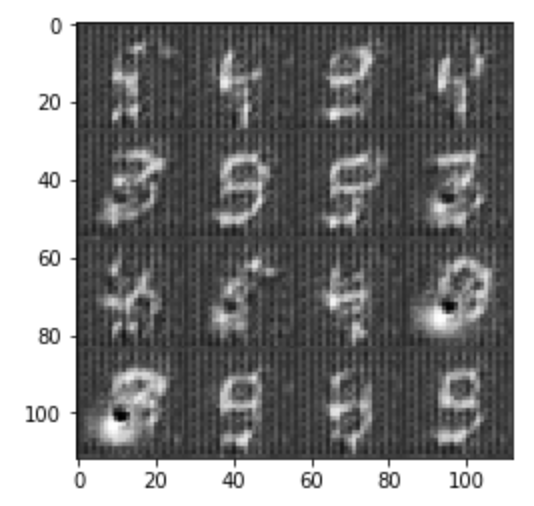 | 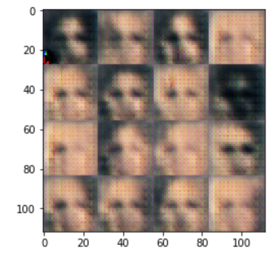 |
| 1        | 1         | 0.1   | 128        | 100   | 0.0001        | 0.5    | 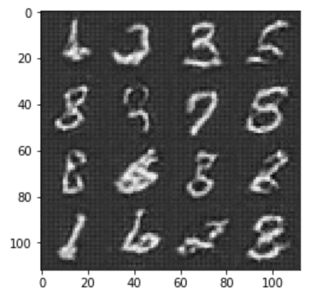 | 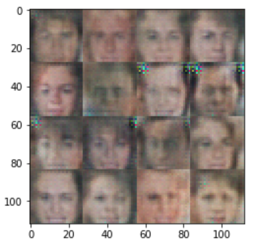 |
| 1        | 1         | 0.05  | 128        | 100   | 0.00005       | 0.5    | 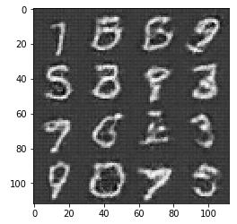 | 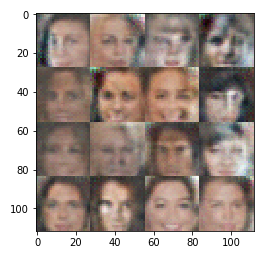 |
| 1        | 1         | 0.05  | 128        | 100   | 0.00005       | 0.8    |  | 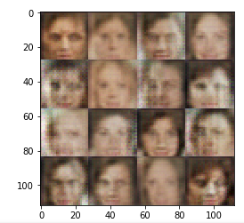 |
| 1        | 1         | 0.05  | 128        | 100   | 0.00001       | 0.8    | 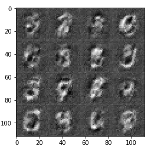 |  |
| 1        | 1         | 0.05  | 128        | 100   | 0.00001       | 0.5    | 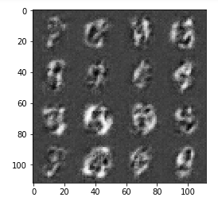 |  |
| 1        | 1         | 0.05  | 128        | 200   | 0.00005       | 0.5    | 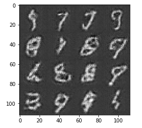 | 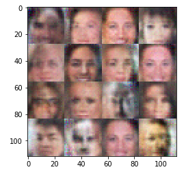 |
| 1        | 1         | 0.05  | 128        | 400   | 0.00005       | 0.5    | 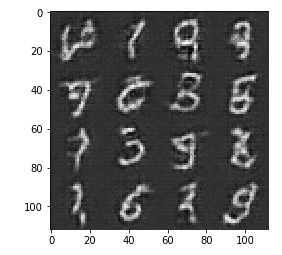 |  |
| 1        | 1         | 0.05  | 128        | 400   | 0.00005       | 0.9    |  | 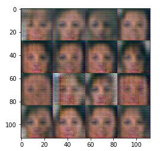 |
| 1        | 1         | 0.05  | 128        | 400   | 0.00005       | 0.7    | 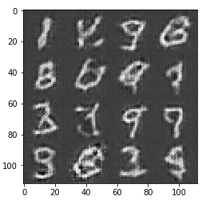 |  |
| 1        | 1         | 0.05  | 128        | 400   | 0.00005       | 0.3    |  |  |
| 2        | 1         | 0.05  | 128        | 400   | 0.00005       | 0.5    | 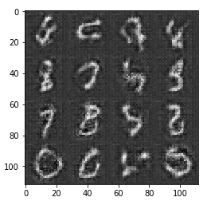 | 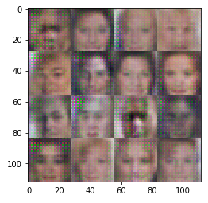 |
| 2        | 2         | 0.05  | 128        | 400   | 0.00005       | 0.5    | 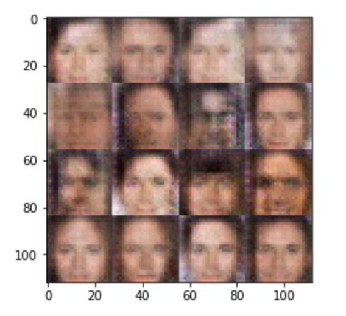 | 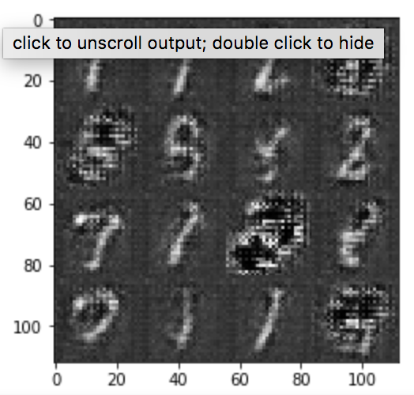 |
| 2        | 2         | 0.05  | 256        | 400   | 0.0001        | 0.5    | 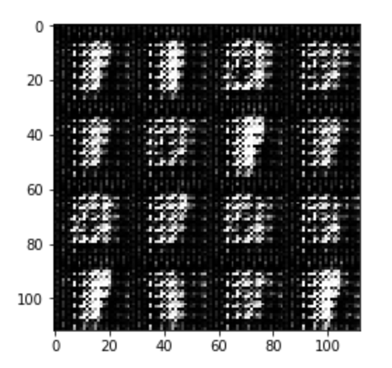 | 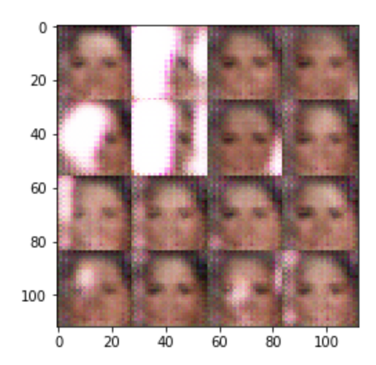 |
| 2        | 2         | 0.05  | 128        | 400   | 0.0001        | 0.5    |  |  |
| 2        | 2         | 0.05  | 128        | 400   | 0.00001       | 0.5    | 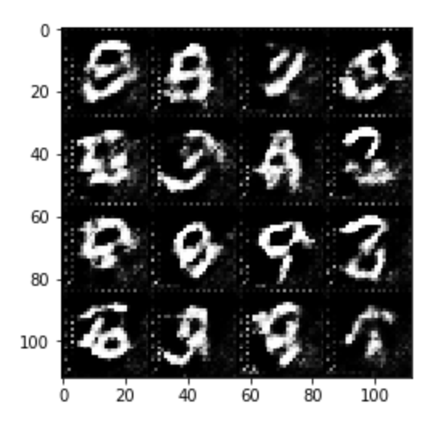 | 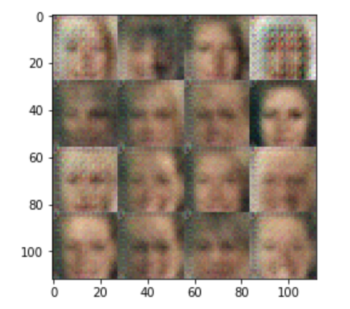 |
| 3        | 2         | 0.05  | 128        | 400   | 0.00005       | 0.5    |  |  |
| 3        | 2         | 0.05  | 128        | 400   | 0.0005        | 0.8    | 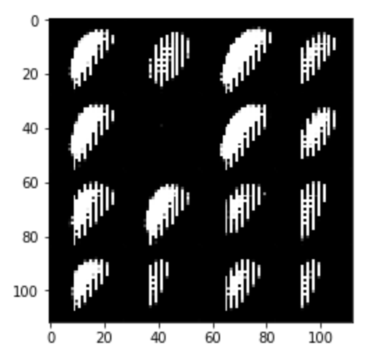 | 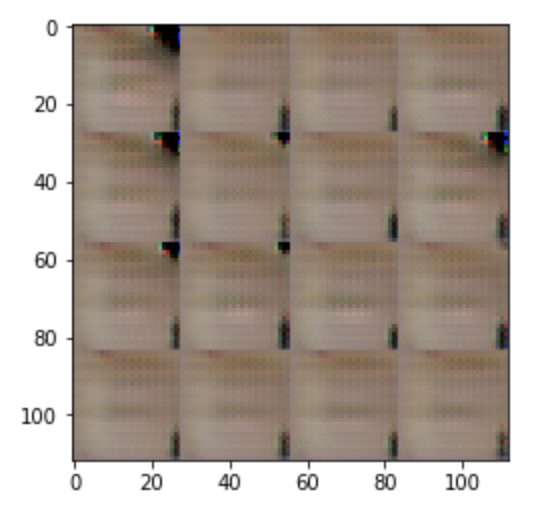 |
| 3        | 2         | 0.05  | 128        | 400   | 0.0005        | 0.2    | 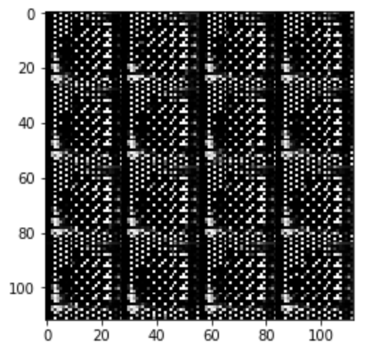 | 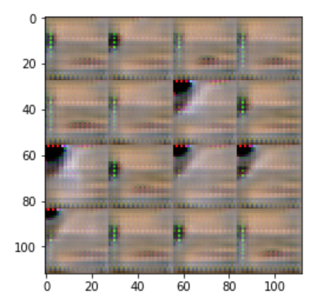 |
| 3        | 2         | 0.05  | 128        | 400   | 0.0001        | 0.5    |  |  |
