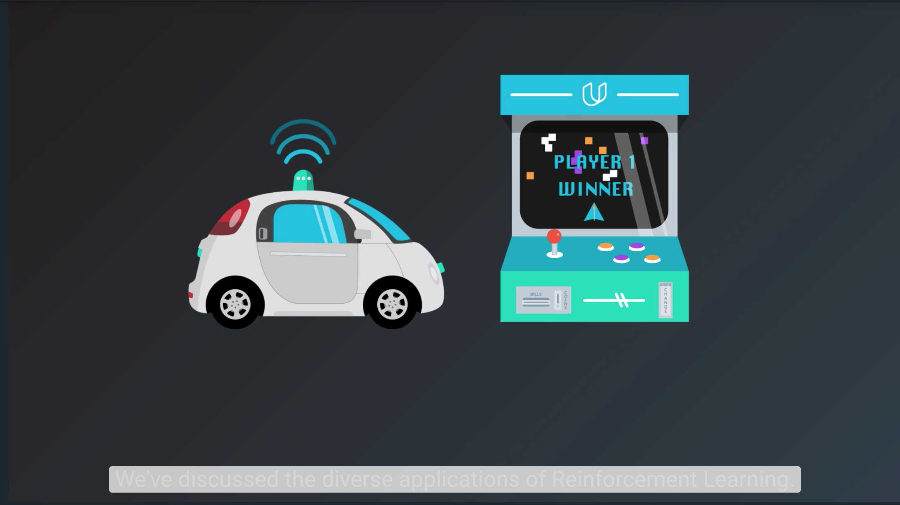

# The RL Framework: The Problem

## 1. Introduction

This lesson covers material in Chapter 3 (especially 3.1-3.3) of the [textbook](http://go.udacity.com/rl-textbook).

## 2. The Setting, Revisited

## 3. Episodic vs. Continuing Tasks

## 4. Quiz: Test Your Intuition

<object data="http://scrier.myqnapcloud.com:8080/share.cgi/part6-2-4.pdf?ssid=0MZqBkd&fid=0MZqBkd&path=%2FDeep.Learning%2F6.Reinforcement-Learning%2F2.The-RL-Framework-the-problem%2Freadme&filename=part6-2-4.pdf&openfolder=normal&ep=" type="application/pdf" width="700px" height="700px">
    <embed src="http://scrier.myqnapcloud.com:8080/share.cgi/part6-2-4.pdf?ssid=0MZqBkd&fid=0MZqBkd&path=%2FDeep.Learning%2F6.Reinforcement-Learning%2F2.The-RL-Framework-the-problem%2Freadme&filename=part6-2-4.pdf&openfolder=normal&ep=">
        This browser does not support PDFs. Please download the PDF to view it: <a href="http://scrier.myqnapcloud.com:8080/share.cgi/part6-2-4.pdf?ssid=0MZqBkd&fid=0MZqBkd&path=%2FDeep.Learning%2F6.Reinforcement-Learning%2F2.The-RL-Framework-the-problem%2Freadme&filename=part6-2-4.pdf&openfolder=normal&ep=">Download PDF</a>.

    </embed>
</object>

## 5. Quiz: Episodic or Continuing

<object data="http://scrier.myqnapcloud.com:8080/share.cgi/part6-2-5.pdf?ssid=0MZqBkd&fid=0MZqBkd&path=%2FDeep.Learning%2F6.Reinforcement-Learning%2F2.The-RL-Framework-the-problem%2Freadme&filename=part6-2-5.pdf&openfolder=normal&ep=" type="application/pdf" width="700px" height="700px">
    <embed src="http://scrier.myqnapcloud.com:8080/share.cgi/part6-2-5.pdf?ssid=0MZqBkd&fid=0MZqBkd&path=%2FDeep.Learning%2F6.Reinforcement-Learning%2F2.The-RL-Framework-the-problem%2Freadme&filename=part6-2-5.pdf&openfolder=normal&ep=">
        This browser does not support PDFs. Please download the PDF to view it: <a href="http://scrier.myqnapcloud.com:8080/share.cgi/part6-2-5.pdf?ssid=0MZqBkd&fid=0MZqBkd&path=%2FDeep.Learning%2F6.Reinforcement-Learning%2F2.The-RL-Framework-the-problem%2Freadme&filename=part6-2-5.pdf&openfolder=normal&ep=">Download PDF</a>.

    </embed>
</object>

## 6. The Reward Hypothesis

