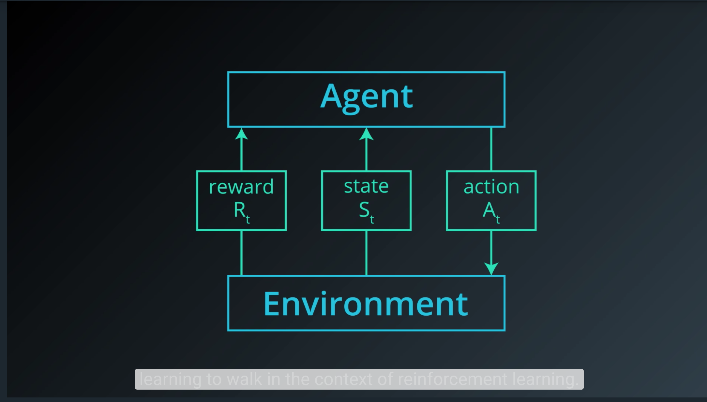
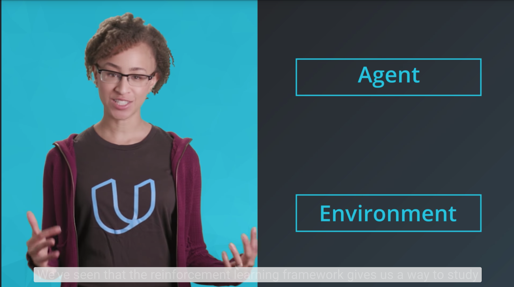
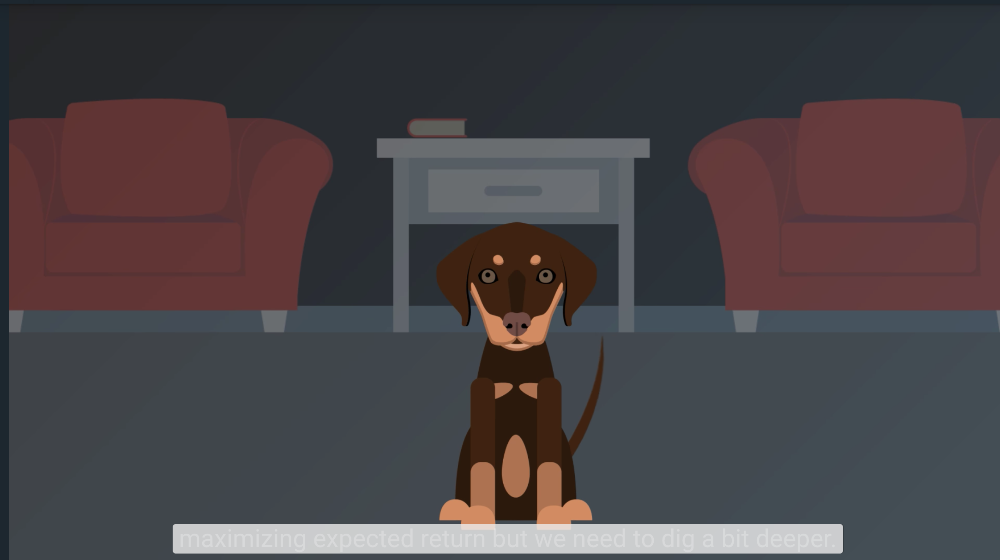

# The RL Framework: The Problem

## 1. Introduction

This lesson covers material in Chapter 3 (especially 3.1-3.3) of the [textbook](http://go.udacity.com/rl-textbook).

## 2. The Setting, Revisited

## 3. Episodic vs. Continuing Tasks

## 4. Quiz: Test Your Intuition

<object data="http://scrier.myqnapcloud.com:8080/share.cgi/part6-2-4.pdf?ssid=0MZqBkd&fid=0MZqBkd&path=%2FDeep.Learning%2F6.Reinforcement-Learning%2F2.The-RL-Framework-the-problem%2Freadme&filename=part6-2-4.pdf&openfolder=normal&ep=" type="application/pdf" width="700px" height="700px">
    <embed src="http://scrier.myqnapcloud.com:8080/share.cgi/part6-2-4.pdf?ssid=0MZqBkd&fid=0MZqBkd&path=%2FDeep.Learning%2F6.Reinforcement-Learning%2F2.The-RL-Framework-the-problem%2Freadme&filename=part6-2-4.pdf&openfolder=normal&ep=">
        This browser does not support PDFs. Please download the PDF to view it: <a href="http://scrier.myqnapcloud.com:8080/share.cgi/part6-2-4.pdf?ssid=0MZqBkd&fid=0MZqBkd&path=%2FDeep.Learning%2F6.Reinforcement-Learning%2F2.The-RL-Framework-the-problem%2Freadme&filename=part6-2-4.pdf&openfolder=normal&ep=">Download PDF</a>.

    </embed>
</object>

## 5. Quiz: Episodic or Continuing

<object data="http://scrier.myqnapcloud.com:8080/share.cgi/part6-2-5.pdf?ssid=0MZqBkd&fid=0MZqBkd&path=%2FDeep.Learning%2F6.Reinforcement-Learning%2F2.The-RL-Framework-the-problem%2Freadme&filename=part6-2-5.pdf&openfolder=normal&ep=" type="application/pdf" width="700px" height="700px">
    <embed src="http://scrier.myqnapcloud.com:8080/share.cgi/part6-2-5.pdf?ssid=0MZqBkd&fid=0MZqBkd&path=%2FDeep.Learning%2F6.Reinforcement-Learning%2F2.The-RL-Framework-the-problem%2Freadme&filename=part6-2-5.pdf&openfolder=normal&ep=">
        This browser does not support PDFs. Please download the PDF to view it: <a href="http://scrier.myqnapcloud.com:8080/share.cgi/part6-2-5.pdf?ssid=0MZqBkd&fid=0MZqBkd&path=%2FDeep.Learning%2F6.Reinforcement-Learning%2F2.The-RL-Framework-the-problem%2Freadme&filename=part6-2-5.pdf&openfolder=normal&ep=">Download PDF</a>.

    </embed>
</object>

## 6. The Reward Hypothesis

## 7. Goals and Rewards, Part 1

## 8. Goals and Rewards, Part 2

If you'd like to learn more about the research that was done at [DeepMind](https://deepmind.com/), please check out [this link](https://deepmind.com/blog/producing-flexible-behaviours-simulated-environments/). The research 
paper can be accessed [here](https://arxiv.org/pdf/1707.02286.pdf). Also, check out this cool [video](https://www.youtube.com/watch?v=hx_bgoTF7bs&feature=youtu.be)!

## 9. Quiz: Goals and Rewards

<object data="http://scrier.myqnapcloud.com:8080/share.cgi/part6-2-9.pdf?ssid=0MZqBkd&fid=0MZqBkd&path=%2FDeep.Learning%2F6.Reinforcement-Learning%2F2.The-RL-Framework-the-problem%2Freadme&filename=part6-2-9.pdf&openfolder=normal&ep=" type="application/pdf" width="700px" height="700px">
    <embed src="http://scrier.myqnapcloud.com:8080/share.cgi/part6-2-9.pdf?ssid=0MZqBkd&fid=0MZqBkd&path=%2FDeep.Learning%2F6.Reinforcement-Learning%2F2.The-RL-Framework-the-problem%2Freadme&filename=part6-2-9.pdf&openfolder=normal&ep=">
        This browser does not support PDFs. Please download the PDF to view it: <a href="http://scrier.myqnapcloud.com:8080/share.cgi/part6-2-9.pdf?ssid=0MZqBkd&fid=0MZqBkd&path=%2FDeep.Learning%2F6.Reinforcement-Learning%2F2.The-RL-Framework-the-problem%2Freadme&filename=part6-2-9.pdf&openfolder=normal&ep=">Download PDF</a>.

    </embed>
</object>

## 10. Cumulative Reward

## 11. Discounted Return

<object data="http://scrier.myqnapcloud.com:8080/share.cgi/part6-2-11.pdf?ssid=0MZqBkd&fid=0MZqBkd&path=%2FDeep.Learning%2F6.Reinforcement-Learning%2F2.The-RL-Framework-the-problem%2Freadme&filename=part6-2-11.pdf&openfolder=normal&ep=" type="application/pdf" width="700px" height="700px">
    <embed src="http://scrier.myqnapcloud.com:8080/share.cgi/part6-2-11.pdf?ssid=0MZqBkd&fid=0MZqBkd&path=%2FDeep.Learning%2F6.Reinforcement-Learning%2F2.The-RL-Framework-the-problem%2Freadme&filename=part6-2-11.pdf&openfolder=normal&ep=">
        This browser does not support PDFs. Please download the PDF to view it: <a href="http://scrier.myqnapcloud.com:8080/share.cgi/part6-2-11.pdf?ssid=0MZqBkd&fid=0MZqBkd&path=%2FDeep.Learning%2F6.Reinforcement-Learning%2F2.The-RL-Framework-the-problem%2Freadme&filename=part6-2-11.pdf&openfolder=normal&ep=">Download PDF</a>.

    </embed>
</object>

## 12. Quiz: Pole-Balancing

<object data="http://scrier.myqnapcloud.com:8080/share.cgi/part6-2-12.pdf?ssid=0MZqBkd&fid=0MZqBkd&path=%2FDeep.Learning%2F6.Reinforcement-Learning%2F2.The-RL-Framework-the-problem%2Freadme&filename=part6-2-12.pdf&openfolder=normal&ep=" type="application/pdf" width="700px" height="700px">
    <embed src="http://scrier.myqnapcloud.com:8080/share.cgi/part6-2-12.pdf?ssid=0MZqBkd&fid=0MZqBkd&path=%2FDeep.Learning%2F6.Reinforcement-Learning%2F2.The-RL-Framework-the-problem%2Freadme&filename=part6-2-12.pdf&openfolder=normal&ep=">
        This browser does not support PDFs. Please download the PDF to view it: <a href="http://scrier.myqnapcloud.com:8080/share.cgi/part6-2-12.pdf?ssid=0MZqBkd&fid=0MZqBkd&path=%2FDeep.Learning%2F6.Reinforcement-Learning%2F2.The-RL-Framework-the-problem%2Freadme&filename=part6-2-12.pdf&openfolder=normal&ep=">Download PDF</a>.

    </embed>
</object>
