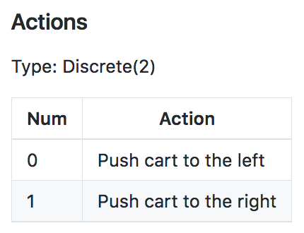

# The RL Framework: The Problem

## 1. Introduction

This lesson covers material in Chapter 3 (especially 3.1-3.3) of the [textbook](http://go.udacity.com/rl-textbook).

## 2. The Setting, Revisited

## 3. Episodic vs. Continuing Tasks

## 4. Quiz: Test Your Intuition

<object data="http://scrier.myqnapcloud.com:8080/share.cgi/part6-2-4.pdf?ssid=0MZqBkd&fid=0MZqBkd&path=%2FDeep.Learning%2F6.Reinforcement-Learning%2F2.The-RL-Framework-the-problem%2Freadme&filename=part6-2-4.pdf&openfolder=normal&ep=" type="application/pdf" width="700px" height="700px">
    <embed src="http://scrier.myqnapcloud.com:8080/share.cgi/part6-2-4.pdf?ssid=0MZqBkd&fid=0MZqBkd&path=%2FDeep.Learning%2F6.Reinforcement-Learning%2F2.The-RL-Framework-the-problem%2Freadme&filename=part6-2-4.pdf&openfolder=normal&ep=">
        This browser does not support PDFs. Please download the PDF to view it: <a href="http://scrier.myqnapcloud.com:8080/share.cgi/part6-2-4.pdf?ssid=0MZqBkd&fid=0MZqBkd&path=%2FDeep.Learning%2F6.Reinforcement-Learning%2F2.The-RL-Framework-the-problem%2Freadme&filename=part6-2-4.pdf&openfolder=normal&ep=">Download PDF</a>.

    </embed>
</object>

## 5. Quiz: Episodic or Continuing

<object data="http://scrier.myqnapcloud.com:8080/share.cgi/part6-2-5.pdf?ssid=0MZqBkd&fid=0MZqBkd&path=%2FDeep.Learning%2F6.Reinforcement-Learning%2F2.The-RL-Framework-the-problem%2Freadme&filename=part6-2-5.pdf&openfolder=normal&ep=" type="application/pdf" width="700px" height="700px">
    <embed src="http://scrier.myqnapcloud.com:8080/share.cgi/part6-2-5.pdf?ssid=0MZqBkd&fid=0MZqBkd&path=%2FDeep.Learning%2F6.Reinforcement-Learning%2F2.The-RL-Framework-the-problem%2Freadme&filename=part6-2-5.pdf&openfolder=normal&ep=">
        This browser does not support PDFs. Please download the PDF to view it: <a href="http://scrier.myqnapcloud.com:8080/share.cgi/part6-2-5.pdf?ssid=0MZqBkd&fid=0MZqBkd&path=%2FDeep.Learning%2F6.Reinforcement-Learning%2F2.The-RL-Framework-the-problem%2Freadme&filename=part6-2-5.pdf&openfolder=normal&ep=">Download PDF</a>.

    </embed>
</object>

## 6. The Reward Hypothesis

## 7. Goals and Rewards, Part 1

## 8. Goals and Rewards, Part 2

If you'd like to learn more about the research that was done at [DeepMind](https://deepmind.com/), please check out [this link](https://deepmind.com/blog/producing-flexible-behaviours-simulated-environments/). The research 
paper can be accessed [here](https://arxiv.org/pdf/1707.02286.pdf). Also, check out this cool [video](https://www.youtube.com/watch?v=hx_bgoTF7bs&feature=youtu.be)!

## 9. Quiz: Goals and Rewards

<object data="http://scrier.myqnapcloud.com:8080/share.cgi/part6-2-9.pdf?ssid=0MZqBkd&fid=0MZqBkd&path=%2FDeep.Learning%2F6.Reinforcement-Learning%2F2.The-RL-Framework-the-problem%2Freadme&filename=part6-2-9.pdf&openfolder=normal&ep=" type="application/pdf" width="700px" height="700px">
    <embed src="http://scrier.myqnapcloud.com:8080/share.cgi/part6-2-9.pdf?ssid=0MZqBkd&fid=0MZqBkd&path=%2FDeep.Learning%2F6.Reinforcement-Learning%2F2.The-RL-Framework-the-problem%2Freadme&filename=part6-2-9.pdf&openfolder=normal&ep=">
        This browser does not support PDFs. Please download the PDF to view it: <a href="http://scrier.myqnapcloud.com:8080/share.cgi/part6-2-9.pdf?ssid=0MZqBkd&fid=0MZqBkd&path=%2FDeep.Learning%2F6.Reinforcement-Learning%2F2.The-RL-Framework-the-problem%2Freadme&filename=part6-2-9.pdf&openfolder=normal&ep=">Download PDF</a>.

    </embed>
</object>

## 10. Cumulative Reward

## 11. Discounted Return

<object data="http://scrier.myqnapcloud.com:8080/share.cgi/part6-2-11.pdf?ssid=0MZqBkd&fid=0MZqBkd&path=%2FDeep.Learning%2F6.Reinforcement-Learning%2F2.The-RL-Framework-the-problem%2Freadme&filename=part6-2-11.pdf&openfolder=normal&ep=" type="application/pdf" width="700px" height="700px">
    <embed src="http://scrier.myqnapcloud.com:8080/share.cgi/part6-2-11.pdf?ssid=0MZqBkd&fid=0MZqBkd&path=%2FDeep.Learning%2F6.Reinforcement-Learning%2F2.The-RL-Framework-the-problem%2Freadme&filename=part6-2-11.pdf&openfolder=normal&ep=">
        This browser does not support PDFs. Please download the PDF to view it: <a href="http://scrier.myqnapcloud.com:8080/share.cgi/part6-2-11.pdf?ssid=0MZqBkd&fid=0MZqBkd&path=%2FDeep.Learning%2F6.Reinforcement-Learning%2F2.The-RL-Framework-the-problem%2Freadme&filename=part6-2-11.pdf&openfolder=normal&ep=">Download PDF</a>.

    </embed>
</object>

## 12. Quiz: Pole-Balancing

<object data="http://scrier.myqnapcloud.com:8080/share.cgi/part6-2-12.pdf?ssid=0MZqBkd&fid=0MZqBkd&path=%2FDeep.Learning%2F6.Reinforcement-Learning%2F2.The-RL-Framework-the-problem%2Freadme&filename=part6-2-12.pdf&openfolder=normal&ep=" type="application/pdf" width="700px" height="700px">
    <embed src="http://scrier.myqnapcloud.com:8080/share.cgi/part6-2-12.pdf?ssid=0MZqBkd&fid=0MZqBkd&path=%2FDeep.Learning%2F6.Reinforcement-Learning%2F2.The-RL-Framework-the-problem%2Freadme&filename=part6-2-12.pdf&openfolder=normal&ep=">
        This browser does not support PDFs. Please download the PDF to view it: <a href="http://scrier.myqnapcloud.com:8080/share.cgi/part6-2-12.pdf?ssid=0MZqBkd&fid=0MZqBkd&path=%2FDeep.Learning%2F6.Reinforcement-Learning%2F2.The-RL-Framework-the-problem%2Freadme&filename=part6-2-12.pdf&openfolder=normal&ep=">Download PDF</a>.

    </embed>
</object>

## 13. MDPs, Part 1

<object data="http://scrier.myqnapcloud.com:8080/share.cgi/part6-2-13.pdf?ssid=0MZqBkd&fid=0MZqBkd&path=%2FDeep.Learning%2F6.Reinforcement-Learning%2F2.The-RL-Framework-the-problem%2Freadme&filename=part6-2-13.pdf&openfolder=normal&ep=" type="application/pdf" width="700px" height="700px">
    <embed src="http://scrier.myqnapcloud.com:8080/share.cgi/part6-2-13.pdf?ssid=0MZqBkd&fid=0MZqBkd&path=%2FDeep.Learning%2F6.Reinforcement-Learning%2F2.The-RL-Framework-the-problem%2Freadme&filename=part6-2-13.pdf&openfolder=normal&ep=">
        This browser does not support PDFs. Please download the PDF to view it: <a href="http://scrier.myqnapcloud.com:8080/share.cgi/part6-2-13.pdf?ssid=0MZqBkd&fid=0MZqBkd&path=%2FDeep.Learning%2F6.Reinforcement-Learning%2F2.The-RL-Framework-the-problem%2Freadme&filename=part6-2-13.pdf&openfolder=normal&ep=">Download PDF</a>.

    </embed>
</object>

## 14. MDPs, Part 2

## 15. Quiz: One-Step Dynamics, Part 1

<object data="http://scrier.myqnapcloud.com:8080/share.cgi/part6-2-15.pdf?ssid=0MZqBkd&fid=0MZqBkd&path=%2FDeep.Learning%2F6.Reinforcement-Learning%2F2.The-RL-Framework-the-problem%2Freadme&filename=part6-2-15.pdf&openfolder=normal&ep=" type="application/pdf" width="700px" height="700px">
    <embed src="http://scrier.myqnapcloud.com:8080/share.cgi/part6-2-15.pdf?ssid=0MZqBkd&fid=0MZqBkd&path=%2FDeep.Learning%2F6.Reinforcement-Learning%2F2.The-RL-Framework-the-problem%2Freadme&filename=part6-2-15.pdf&openfolder=normal&ep=">
        This browser does not support PDFs. Please download the PDF to view it: <a href="http://scrier.myqnapcloud.com:8080/share.cgi/part6-2-15.pdf?ssid=0MZqBkd&fid=0MZqBkd&path=%2FDeep.Learning%2F6.Reinforcement-Learning%2F2.The-RL-Framework-the-problem%2Freadme&filename=part6-2-15.pdf&openfolder=normal&ep=">Download PDF</a>.

    </embed>
</object>

## 16. Quiz: One-Step Dynamics, Part 2

<object data="http://scrier.myqnapcloud.com:8080/share.cgi/part6-2-16.pdf?ssid=0MZqBkd&fid=0MZqBkd&path=%2FDeep.Learning%2F6.Reinforcement-Learning%2F2.The-RL-Framework-the-problem%2Freadme&filename=part6-2-16.pdf&openfolder=normal&ep=" type="application/pdf" width="700px" height="700px">
    <embed src="http://scrier.myqnapcloud.com:8080/share.cgi/part6-2-16.pdf?ssid=0MZqBkd&fid=0MZqBkd&path=%2FDeep.Learning%2F6.Reinforcement-Learning%2F2.The-RL-Framework-the-problem%2Freadme&filename=part6-2-16.pdf&openfolder=normal&ep=">
        This browser does not support PDFs. Please download the PDF to view it: <a href="http://scrier.myqnapcloud.com:8080/share.cgi/part6-2-16.pdf?ssid=0MZqBkd&fid=0MZqBkd&path=%2FDeep.Learning%2F6.Reinforcement-Learning%2F2.The-RL-Framework-the-problem%2Freadme&filename=part6-2-16.pdf&openfolder=normal&ep=">Download PDF</a>.

    </embed>
</object>

## 17. MDPs, Part 3

## 18. Finite MDPs

Please use [this link](https://github.com/openai/gym/wiki/Table-of-environments) to peruse the available environments in OpenAI Gym.

The environments are indexed by **Environment Id**, and each environment has corresponding **Observation Space**, **Action 
Space**, **Reward Range**, **tStepL**, **Trials** and **rThresh**.

### CartPole-v0

Find the line in the table that corresponds to the **CartPole-v0** environment. Take note of the corresponding **Observation 
Space** (`Box(4,)`) and **Action Space** (`Discrete(2)`).

As described in the [OpenAI Gym documentation](https://gym.openai.com/docs/),

> Every environment comes with first-class `Space` objects that describe the valid actions and observations.
> * The `Discrete` space allows a fixed range of non-negative numbers.
> * The `Box` space represents an n-dimensional box, so valid actions or observations will be an array of n numbers.

### Observation Space

The observation space for the CartPole-v0 environment has type `Box(4,)`. Thus, the observation (or state) at each 
time point is an array of 4 numbers. You can look up what each of these numbers represents in [this document](https://github.com/openai/gym/wiki/CartPole-v0). After 
opening the page, scroll down to the description of the observation space.

Notice the minimum (-Inf) and maximum (Inf) values for both **Cart Velocity** and the **Pole Velocity at Tip**.

Since the entry in the array corresponding to each of these indices can be any real number, the state space 
_S+_ is infinite!

### Action Space

The action space for the CartPole-v0 environment has type `Discrete(2)`. Thus, at any time point, there are only two 
actions available to the agent. You can look up what each of these numbers represents in [this document](https://github.com/openai/gym/wiki/CartPole-v0) (note that it 
is the same document you used to look up the observation space!). After opening the page, scroll down to the 
description of the action space.

In this case, the action space _A_ is a finite set containing only two elements.

### Finite MDPs

Recall from the previous concept that in a finite MDP, the state space _S_ (or _S+_, in the case of an episodic task) 
and action space _A_ must both be finite.

Thus, while the CartPole-v0 environment does specify an MDP, it does not specify a **finite** MDP. In this course, 
we will focus on solution methods for finite MDPs.

The environments that you'll solve in this course are:

 * [FrozenLake-v0](https://github.com/openai/gym/blob/master/gym/envs/toy_text/frozen_lake.py)
 * [Blackjack-v0](https://github.com/openai/gym/blob/master/gym/envs/toy_text/blackjack.py) 
 * [CliffWalking-v0](https://github.com/openai/gym/blob/master/gym/envs/toy_text/cliffwalking.py) (note: this environment may not be listed in the table of environments)
 * [Taxi-v2](https://github.com/openai/gym/blob/master/gym/envs/toy_text/taxi.py)

If you like, feel free to take the time now to learn more about each of these environments. Check that each 
specifies a **finite** MDP.

## 19. Summary

<object data="http://scrier.myqnapcloud.com:8080/share.cgi/part6-2-19.pdf?ssid=0MZqBkd&fid=0MZqBkd&path=%2FDeep.Learning%2F6.Reinforcement-Learning%2F2.The-RL-Framework-the-problem%2Freadme&filename=part6-2-19.pdf&openfolder=normal&ep=" type="application/pdf" width="700px" height="700px">
    <embed src="http://scrier.myqnapcloud.com:8080/share.cgi/part6-2-19.pdf?ssid=0MZqBkd&fid=0MZqBkd&path=%2FDeep.Learning%2F6.Reinforcement-Learning%2F2.The-RL-Framework-the-problem%2Freadme&filename=part6-2-19.pdf&openfolder=normal&ep=">
        This browser does not support PDFs. Please download the PDF to view it: <a href="http://scrier.myqnapcloud.com:8080/share.cgi/part6-2-19.pdf?ssid=0MZqBkd&fid=0MZqBkd&path=%2FDeep.Learning%2F6.Reinforcement-Learning%2F2.The-RL-Framework-the-problem%2Freadme&filename=part6-2-19.pdf&openfolder=normal&ep=">Download PDF</a>.

    </embed>
</object>
