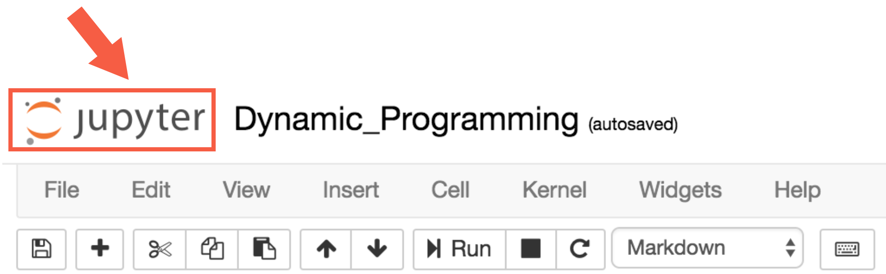

# Dynamic Programming

## 1. Introduction

[](http://scrier.myqnapcloud.com:8080/share.cgi?ssid=0MZqBkd&ep=&path=%2FDeep.Learning%2F6.Reinforcement-Learning%2F4.Dynamic-Programming%2Freadme&filename=1_-_Introduction.mp4&fid=0MZqBkd&open=normal)

In the **dynamic programming** setting, the agent has full knowledge of the Markov decision process (MDP) that 
characterizes the environment. (This is much easier than the **reinforcement learning** setting, where the agent initially 
knows nothing about how the environment decides state and reward and must learn entirely from interaction how to 
select actions.)

This lesson covers material in **Chapter 4** (especially 4.1-4.4) of the [textbook](http://go.udacity.com/rl-textbook).

## 2. OpenAI Gym: FrozenLakeEnv

In this lesson, you will write your own Python implementations of all of the algorithms that we discuss. While your 
algorithms will be designed to work with any OpenAI Gym environment, you will test your code with the FrozenLake 
environment.

[http://eskipaper.com/images/frozen-lake-6.jpg](readme/part4-2-1.jpg)

In the FrozenLake environment, the agent navigates a 4x4 gridworld. You can read more about the environment in its 
corresponding [GitHub file](https://github.com/openai/gym/blob/master/gym/envs/toy_text/frozen_lake.py), by reading the commented block in the `FrozenLakeEnv` class. For clarity, we have also 
pasted the description of the environment below:

    """
    Winter is here. You and your friends were tossing around a frisbee at the park
    when you made a wild throw that left the frisbee out in the middle of the lake.
    The water is mostly frozen, but there are a few holes where the ice has melted.
    If you step into one of those holes, you'll fall into the freezing water.
    At this time, there's an international frisbee shortage, so it's absolutely imperative that
    you navigate across the lake and retrieve the disc.
    However, the ice is slippery, so you won't always move in the direction you intend.
    The surface is described using a grid like the following
        SFFF
        FHFH
        FFFH
        HFFG
    S : starting point, safe
    F : frozen surface, safe
    H : hole, fall to your doom
    G : goal, where the frisbee is located
    The episode ends when you reach the goal or fall in a hole.
    You receive a reward of 1 if you reach the goal, and zero otherwise.

    """"

### The Dynamic Programming Setting

Environments in OpenAI Gym are designed with the reinforcement learning setting in mind. For this reason, OpenAI Gym 
does not allow easy access to the underlying one-step dynamics of the Markov decision process (MDP).

Towards using the FrozenLake environment for the dynamic programming setting, we had to first download the [file](https://github.com/openai/gym/blob/master/gym/envs/toy_text/frozen_lake.py) 
containing the FrozenLakeEnv class. Then, we added a single line of code to share the one-step dynamics of the MDP 
with the agent.

```python
# obtain one-step dynamics for dynamic programming setting
self.P = P
```

The new `FrozenLakeEnv` class was then saved in a Python file **frozenlake.py**, which we will use (instead of the 
original OpenAI Gym file) to create an instance of the environment.

### Your Workspace

You will write all of your implementations within the classroom, using an interface identical to the one shown below. 
Your Workspace contains five files:

 * **frozenlake.py** - contains the `FrozenLakeEnv` class
 * **Dynamic_Programming.ipynb** - the mini project notebook where you will write all of your implementations (this is the only file that you will modify!)
 * **Dynamic_Programming_Solution.ipynb** - the instructor solutions corresponding to the mini project notebook
 * **check_test.py** - contains unit tests that you will use to verify that your implementations are correct
 * **plot_utils.py** - contains a plotting function for visualizing state-value functions

The **Dynamic_Programming.ipynb** notebook can be found below. Note that it is broken into parts, which are designed 
to be completed at different parts of the lesson.

Please do not write or execute any code just yet. We'll get started with coding within the Workspace in a few concepts!



To peruse the other files, you need only click on "jupyter" in the top left corner to return to the Notebook dashboard.